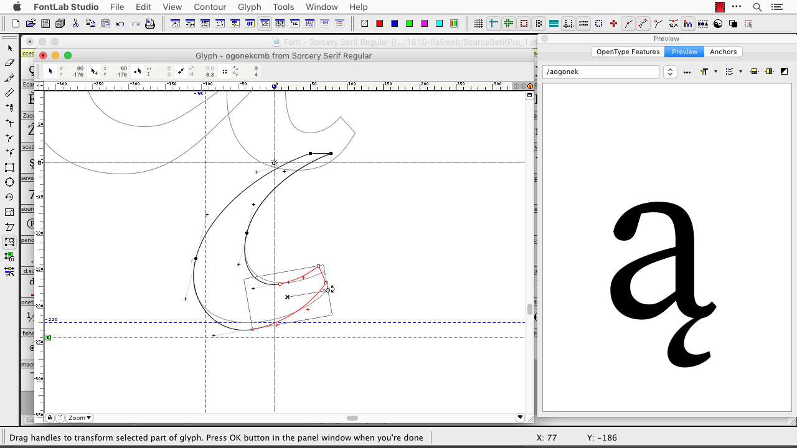

{.illu-thumb }

FontLab Studio 5.2.1 for Windows shipped in December 2013. It builds on the 5.2 foundation with new tools and hundreds of bug fixes.

<!-- more -->

### What’s new

- **65,535-glyph OpenType fonts**: We raised the glyph count ceiling. You can now pack full Unicode coverage into a single font file.
- **FEA syntax 2.5**: The OpenType feature code editor supports the improved Adobe FEA specification.
- **Interpolated nodes**: Edit outlines faster with new node interpolation tools.
- **OpenType layout features in Metrics Window**: Preview OpenType substitution and positioning rules directly while you space your fonts.
- **Class kerning overlay preview**: See a visual overlay of kerning class coverage while you edit class kerning.
- **Change weight and clean up paths**: Adjust weight and clean up paths with new outline operations.
- **MM glyph blend preview**: Preview Multiple Master blends for interpolated glyph design.
- **Canvas notes**: Add freeform annotations directly on the glyph canvas.
- **Python 2.7**: We updated the scripting engine.

This release is a free upgrade for all Windows users of FontLab Studio 5 and AsiaFont Studio.

[Read more →](https://help.fontlab.com/pdf/FLS5WinManual.pdf){ .fl-help-cta }
