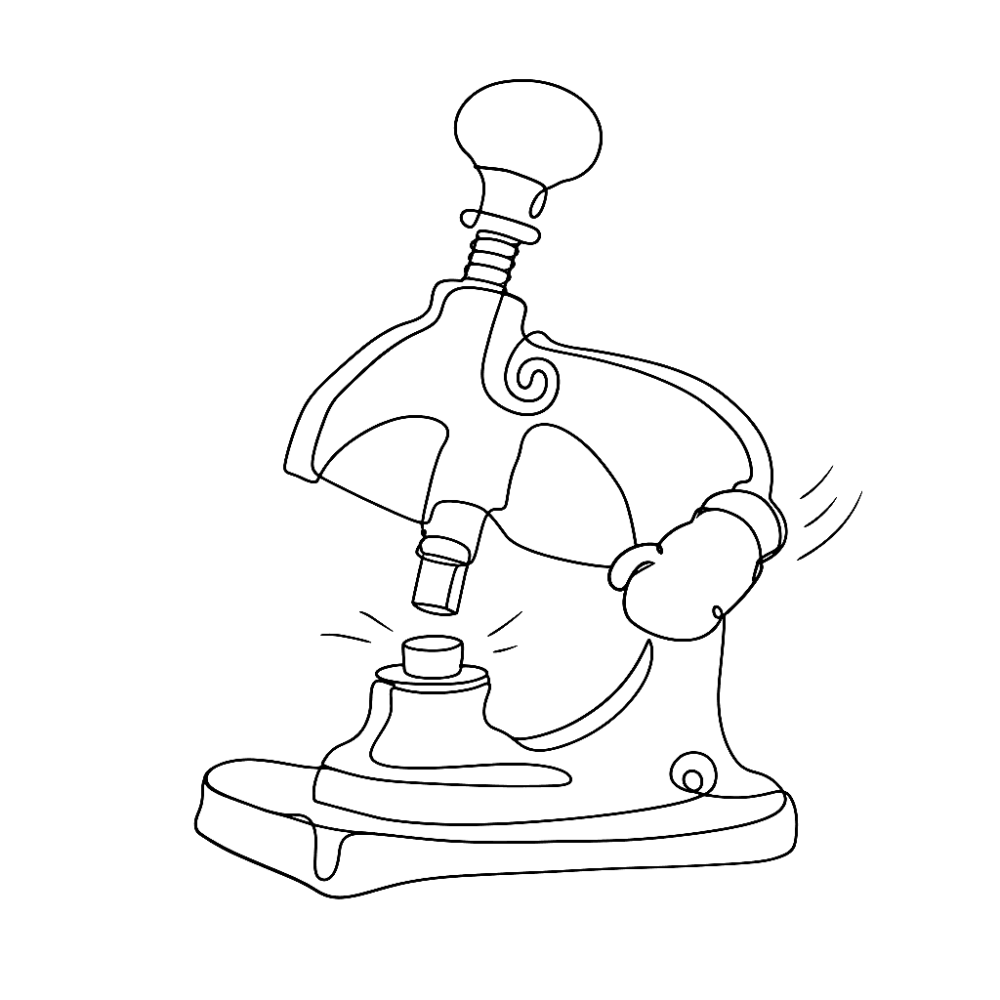
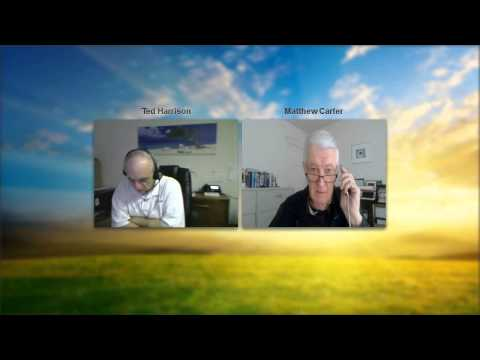

{.illu-thumb }

In February 2014, FontLab hosted a live webinar with Matthew Carter, a key figure in digital type design.

<!-- more -->

Carter’s career covers the entire evolution of type technology. He started by cutting punches for metal type at the Enschedé foundry in the 1950s. He then moved through the phototypesetting era and into digital design. In 1981, he co-founded Bitstream, the first digital type foundry.

His typefaces shape how we read every day:

* **Bell Centennial**: Engineered for AT&T in the late 1970s to survive phone book constraints like small sizes, poor paper, and high-speed presses.
* **Verdana and Georgia**: Designed for Microsoft in the mid-1990s specifically for low-resolution screen rendering. They anticipated the pixel grid constraints that defined early web typography.
* **Snell Roundhand**: Brought a copperplate script into digital form.
* **Carter Sans**: Balanced legibility with humanist warmth.
* **Galliard**: Drew on the sixteenth-century types of Robert Granjon.

The webinar featured an interview and Q&A. Carter discussed his working methods and his views on how technical constraints shape design decisions. He also shared insights on the transition from metal type to digital font production.

[Watch the recording →](https://www.youtube.com/watch?v=ibJhxbsbqJ4){ .fl-help-cta }
