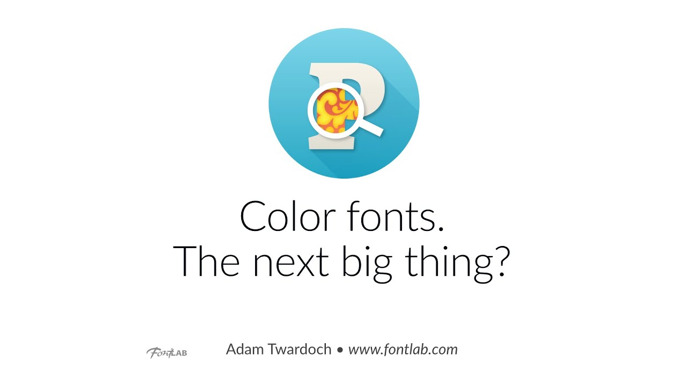

In 2014, color fonts were an emerging frontier — and this 103-minute tutorial with Adam Twardoch was one of the first in-depth explorations of how to actually create them. It covers the technical standards, font editor workflows, and the promise of full-color type at a moment when emoji and display typography were pushing the format into the mainstream.

<!-- more -->

Traditional fonts render in a single color chosen by the application. Color fonts break that constraint by embedding layered outlines, bitmaps, or SVG artwork directly in the font file — letting a single glyph display multiple colors, gradients, or photographic detail.

This tutorial walks through the color font formats available in 2014 (Apple's `sbix`, Microsoft's `COLR`/`CPAL`, Google/Mozilla's SVG-in-OpenType, and Adobe/Mozilla's OpenType-SVG), explains how browsers and operating systems supported them, and demonstrates building color glyphs inside FontLab Studio. Twardoch covers fallback outlines for non-supporting environments, file size trade-offs, and the tooling landscape of the time.

Watching it now is also a useful historical document. Many of the format conflicts described here eventually resolved in favor of `COLR`/`CPAL` (and later COLRv1), and tooling has matured considerably — but the design thinking behind color glyph construction remains directly relevant.

Watch on [FontLab TV](https://www.youtube.com/watch?v=Yit1ZpClwAk).
