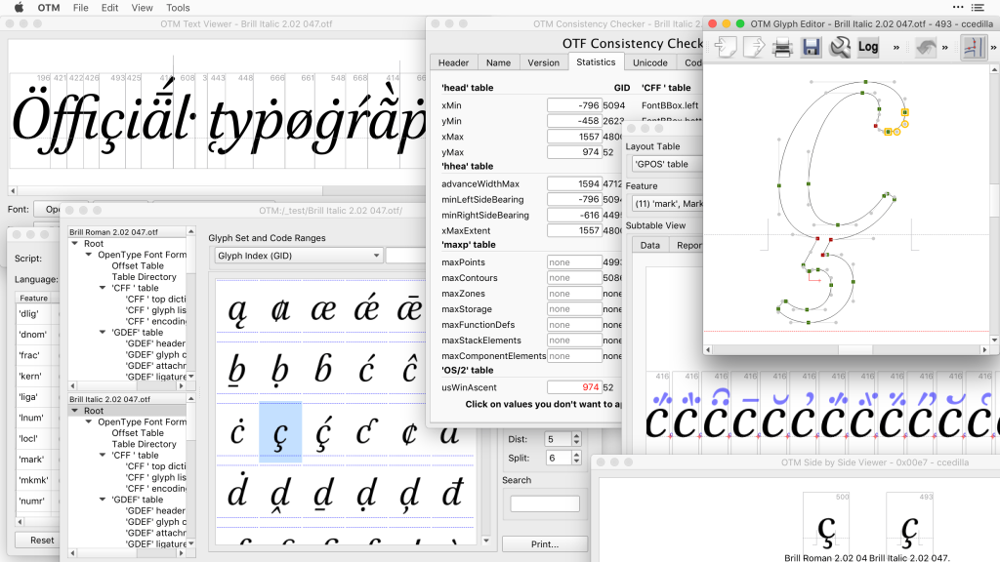

{.illu-thumb}

December 2014 brought a major update to DTL OTMaster, plus two new free tools.
We released a command-line UFO converter and an updated color font typesetter.

<!-- more -->

Here is what shipped in this release:

* **DTL OTMaster 5.0**: A technical OpenType font editor from the Dutch Type Library.
  It gives you low-level access to the binary structure of OpenType fonts.
  You can edit tables, records, and individual fields directly.
  This skips the visual design interface entirely.
  Version 5.0 marked a massive upgrade from the 4.x series.
* **vfb2ufo**: A free command-line tool for two-way conversion.
  It translates between VFB (FontLab Studio’s native binary format) and UFO (Unified
  Font Object, the open XML-based interchange format).
  This gives FontLab Studio users a direct path to UFO-based workflows.
  You don’t need to open the GUI to convert files.
* **FontLab Pad 1.1**: A free app for Mac OS X and Windows.
  It lets you set text in color fonts.
  You can use bitmap color, SVG color, and layered color OpenType formats.
  The app renders the results correctly, something most operating systems and apps
  couldn’t do back then.
  Version 1.1 brought updates to both Mac and Windows builds.

[Read more →](https://www.fontlab.com/font-utility/dtl-otmaster/){ .fl-help-cta }
