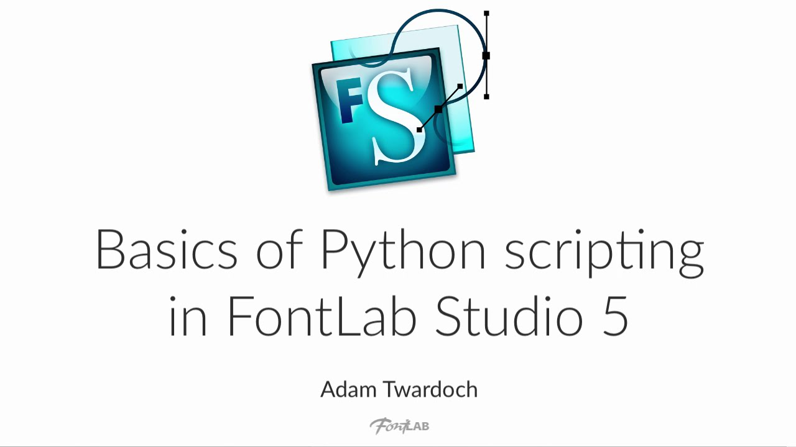

{.illu-thumb .illu-index}

Automation unlocks the real power of a professional font editor. In this 70-minute tutorial, Adam Twardoch introduces Python scripting inside FontLab Studio 5.

<!-- more -->

You get a clear look at the scripting environment, the FontLab object model, and practical examples that go well beyond “hello world.”

FontLab Studio 5 opened its internals through a rich Python API. Type designers use it to write scripts and automate repetitive tasks. You can batch-transform glyphs, generate metrics, manipulate anchors, or build entire font families from a single master. This tutorial walks you through that API from the ground up.

Adam starts with the built-in macro editor and the Python console. He then moves through the object hierarchy:

* **Application object**
* **Font objects**
* **Glyph objects**
* **Layers, contours, and nodes**

Each level comes with short scripts you can run immediately. The video works as both a conceptual overview and a practical reference.

The scripting model shown here laid the groundwork for the FontLab 7 scripting API. Many of the patterns carry over directly. Iterating over glyphs, reading and writing metrics, and working with contour nodes all work similarly today. This makes the tutorial useful even if you use the current version of FontLab.

Watch on [FontLab TV](https://www.youtube.com/watch?v=QCSKRYZ1Qko).

[Read more →](https://help.fontlab.com/fontlab/7/manual/Scripting-with-Python/){ .fl-help-cta }
