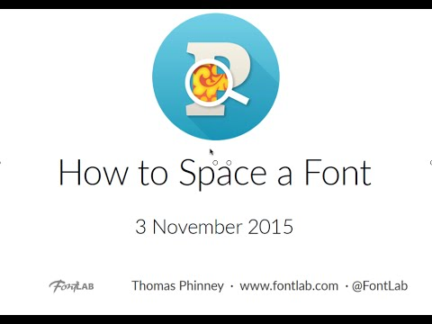

Spacing is where type design lives or dies.
This 53-minute tutorial with Thomas Phinney is one of the clearest explanations of the
craft ever recorded.
Phinney, a type designer and font technologist with decades of experience, walks through
sidebearings, optical principles, and the practical workflow inside FontLab Studio 5.

<!-- more -->

Spacing is not just about numbers.
It is about the visual texture a font creates when set at reading size.
Getting it wrong makes even well-drawn letterforms look awkward.
Phinney begins with first principles:

* What **sidebearings** actually control.
* How **optical spacing** differs from metric spacing.
* Why the **spacing string** method works.

The tutorial then moves through a systematic workflow.
You will learn how to establish reference characters (n, o, H, O) and use them to
calibrate the spacing of related glyphs.
You will also see how to check results in the metrics window at various sizes and text
settings. Phinney explains when to trust your eyes over the numbers and how to handle
inevitable edge cases like diagonal letters, narrow glyphs, and punctuation.

The FontLab Studio 5 interface shown here is older, but the principles apply unchanged
to FontLab 8 and any other font editor.
The spacing workflow Phinney describes is the exact same one professional type designers
use today.

Watch on [FontLab TV](https://www.youtube.com/watch?v=tbc_O7bNROs).

[Read more →](https://help.fontlab.com/fontlab/spacing-and-kerning/){ .fl-help-cta }
