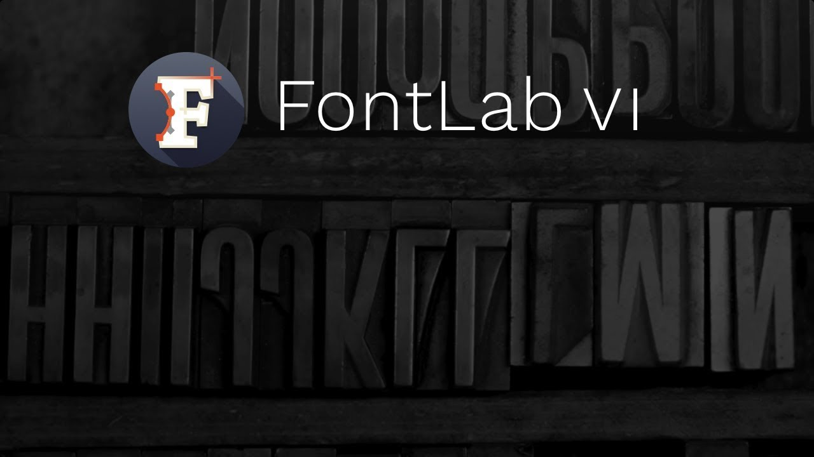

# FontLab VI is here

FontLab Studio 5 was a workhorse.
It shipped in 2004 and carried a generation of type designers through the OpenType
transition. The app aged gracefully, right up until it didn’t. On 7 December 2017, we
replaced it.

<!-- more -->

**FontLab VI** is a complete rebuild for macOS and Windows.
It is 64-bit, native, and built around a drawing model that reflects how type designers
work. Here is what you get on day one:

* **Sketchboard**: A freeform canvas where you can sketch and develop letterforms before
  they become glyphs. You can combine vector and bitmap artwork in one place.
* **Smart corners**: A corner component system that lets you design a serif or ink trap
  once and apply it parametrically across an entire typeface.
  Change the master and every glyph updates.
* **Point reduction and optimization**: Clean up imported or traced outlines in one
  step. FontLab removes redundant nodes while preserving the curve’s shape.
* **Color fonts**: Full support for OpenType SVG, COLR/CPAL, and sbix color font
  formats. All are editable directly in the glyph window.
* **Variable font design**: Built-in multi-master editing with axis support.
  It is ready for the OpenType Font Variations format that shipped in browsers and
  operating systems the same year.
* **Elements and auto layers**: A reusable component system that goes beyond traditional
  composites. Elements carry their own outlines and can be scaled, rotated, or flipped
  independently per glyph.
* **FontAudit**: A live quality checker that flags potential problems like open
  contours, missing extrema, or wrong direction as you draw.
  It does this without interrupting your workflow.

FontLab VI opens and exports UFO, VFB (FontLab Studio 5 format), OpenType PS and TT,
Variable OpenType, SVG, and more.
The 30-day trial is fully functional.

## Watch the announcement

The two-minute announcement video previews fluid Bézier editing, real-time variable font
preview, color font handling, the new glyph window, the Power Brush and Rapid pen, and
live corner operations.

Download FontLab VI from the
[FontLab product page](https://www.fontlab.com/font-editor/fontlab/), and start with the
[FontLab Help Center](https://help.fontlab.com/) for documentation.

[Read more →](https://help.fontlab.com/){ .fl-help-cta }
