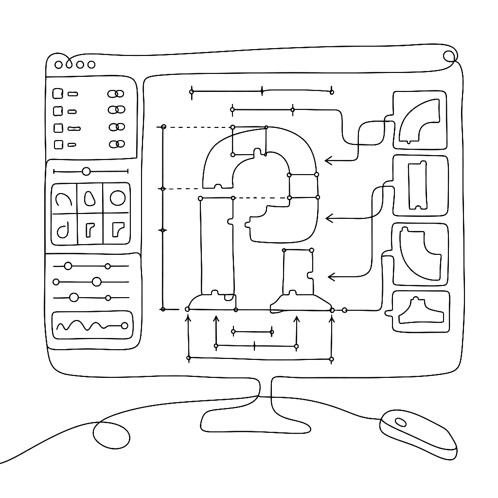

{.illu-thumb .illu-index}

FontLab VI 6.1 arrived in October 2018. It added standards-compliant components, a Font window sidebar for glyph filtering, and linked metrics expressions. These features gave designers new ways to structure and navigate their work. This was a free update for all FontLab VI users.

<!-- more -->

FontLab VI 6.1 shipped across four point releases between October 2018 and April 2019 (6.1.0 through 6.1.4). Each release refined the core features.

Here is what we added:

* **Standards-compliant components:** Build glyphs from other glyphs using proper OpenType component references instead of just element references. Edit the base glyph, and the composite updates automatically.
* **Nonspacing components and elements:** Attach a mark or element to a glyph without affecting its advance width. Building accented glyphs and stacked diacritics is now a matter of placing components instead of manually copying contours.
* **Metrics expressions and linked metrics:** Write a formula in the sidebearing field (like `=H`) to link a glyph’s spacing to another glyph. Change the source, and every linked glyph follows. This helps maintain consistent spacing groups without re-typing numbers across masters.
* **Font window sidebar:** Filter the glyph set by script, Unicode range, encoding, or custom tags. The sidebar replaces hunting through a flat grid when working with large character sets.
* **Handle length and angle display:** FontLab shows the length and angle of handles and line segments in real time as you draw or drag. This helps when matching tensions across a family or hitting a specific handle ratio.
* **Cursor-key node editing after dragging:** Move a node or handle with the cursor keys immediately after dragging it. You do not need to release and re-click.
* **Simple math in coordinate fields:** Type `+10`, `-4`, or `*2` directly into a width, coordinate, or sidebearing field. FontLab calculates the result in place.
* **Glyphs app export:** FontLab 6.1.4 added the ability to export `.glyphs` files. This makes round-trips with Glyphs.app practical.

We also reopened the free 30-day trial for anyone whose earlier trial had expired. You can evaluate the app on the current build.

[Read more →](https://help.fontlab.com/fontlab-vi/Release-Notes/){ .fl-help-cta }
