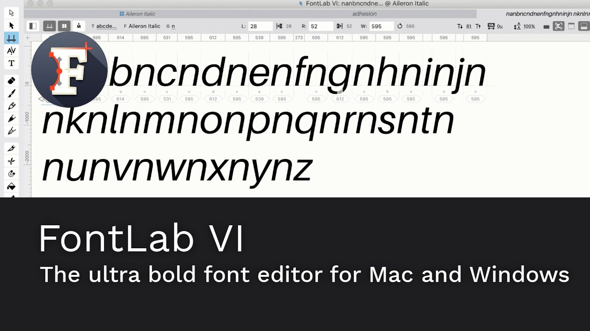

FontLab VI 6.1.2 shipped today.
That made twelve updates in twelve months after the first public version of our new font
editor.

<!-- more -->

A year earlier, FontLab VI was a large, slightly terrifying promise: a cross-platform
font editor with modern drawing tools, variable fonts, color fonts, interpolation,
scripting, and a new file format under the hood.
By the end of 2018, it was no longer just a promise.
It had been dragged through real jobs by type designers, students, production engineers,
and the patient sort of people who can describe a kerning bug without raising their
voice.

The release notes tell the year better than a birthday cake would.

In January and February, 6.0.2 and 6.0.3 added the small working comforts that make a
new editor feel less like visiting a stranger’s kitchen: a FontLab Studio-style
crosshair cursor, a contextual **Open Glyph Panel** command, and a searchable **Help >
Commands** dialog for finding menu commands without remembering where they live.

In April, 6.0.5 became the largest dot release up to that point, with more than 100
improvements. The saving workflow got serious: first-save file naming, autosave options,
and backup choices that made long font projects less dependent on luck.
Nobody should lose an afternoon of drawing because a computer fancied a lie-down.

In May, 6.0.6 went larger again: about 180 improvements, including synchronized editing
across matching masters, stronger metrics and kerning workflows, variable-font handling
improvements, and UFO3 support.
That was one of the moments when VI started to feel less like “the next FontLab” and
more like a practical shop floor for multi-master work.

In July and August, 6.0.7, 6.0.8, and 6.0.9 focused on the glyph window.
**Cousins** let you see visually related glyphs behind the one you were editing.
Auto glyphs and glyph recipes got better.
The Glyphs Bar became easier to navigate, duplicate glyph names were handled more
carefully, and the editor gained more control over PostScript-to-TrueType outline
conversion.

Then 6.1 arrived in October.
That was the big one: a new Font window Sidebar, real standards-style **Components**,
better metrics expressions, nonspacing components, handle length and angle display,
Matchmaker improvements, the Measurements panel, X-Ray view in Preview, the Source
panel, custom family names for instances, and more work on interpolation, TrueType
hinting, and OpenType feature editing.

Today, 6.1.2 closes the first year with practical production features: printing from
Font and Glyph windows, **Echo Text** across multiple windows, custom OpenType table
export through the Tables panel, faster class editing, OpenType Symbol font export, and
better restoration of panels when opening VFC and VFJ sources.

That is the unglamorous part of a font editor’s first year.
Not one grand unveiling, but a dozen rounds of listening, fixing, and sharpening.
The receipts are in the release notes, version by version.

Thank you to every type designer, student, font engineer, and professionally suspicious
beta tester who filed a bug, sent a sample file, or cornered us at a conference.
FontLab VI got better because you made it work for a living.

[Read more →](https://help.fontlab.com/fontlab-vi/Release-Notes-Archive/){ .fl-help-cta }
