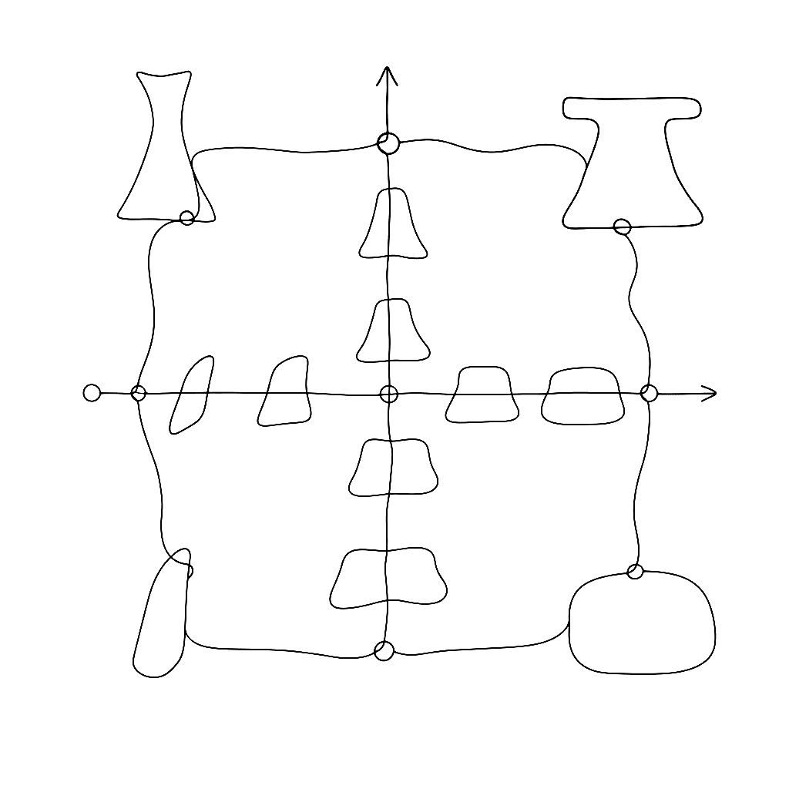
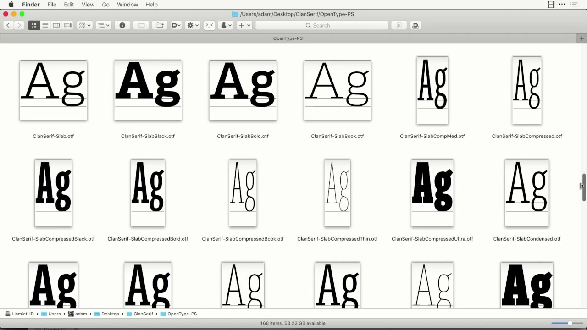

{.illu-thumb .illu-index}

Variable fonts force you to think in multiple dimensions at once. This four-minute video shows exactly how to set up a design space with axes and masters in FontLab VI. It gives you a concise, visual introduction to the core concepts behind variable font production.

<!-- more -->

A variable font isn’t a single design. It is a continuous space of designs. You define the extremes as separate masters, and the font interpolates smoothly between them at runtime. The design space is the conceptual model that holds all of this together.

Common extremes include:
* **Weight:** Light and bold.
* **Width:** Condensed and wide.
* **Slant:** Upright and italic.

FontLab VI’s design space panel lets you define axes, place masters at coordinates within that space, and immediately preview interpolated instances without exporting. You can use standard axes like Weight, Width, and Optical Size, or create custom axes of your own. This video walks through setting up a design space with two axes, adding masters, and checking that interpolation is compatible across glyphs.

What makes this video useful beyond the mechanics is how it makes the abstract concrete. Seeing the masters laid out on a grid turns a mathematical concept into something visual and tactile. A draggable instance point moves through the space to show you exactly what happens between your masters. Variable font design in FontLab starts here.

Watch on [FontLab TV](https://www.youtube.com/watch?v=AijDkf3DBk8).

[Read more →](https://help.fontlab.com/fontlab/7/manual/Variable-Fonts/){ .fl-help-cta }
