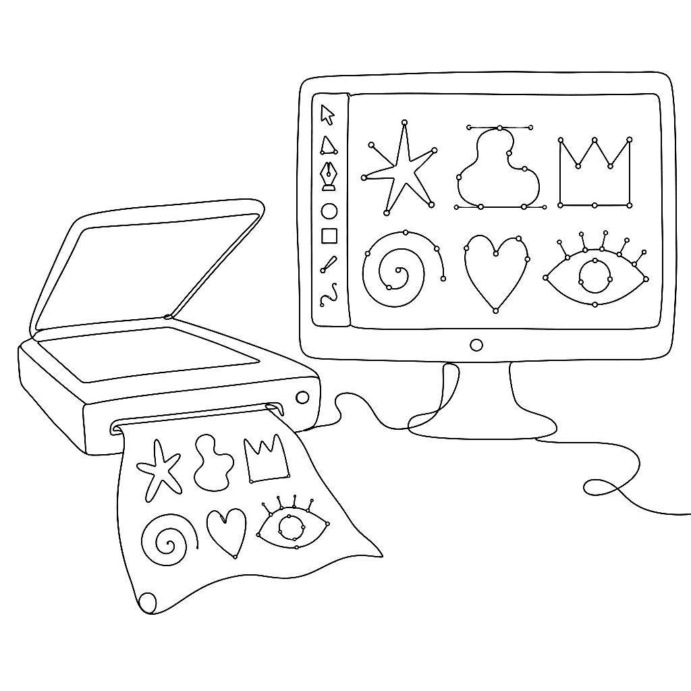
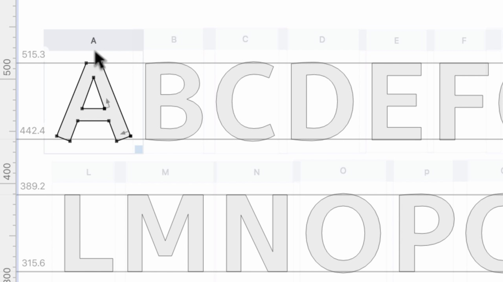

{.illu-thumb}

This two-minute demo of the built-in ScanFont feature has over 40,000 views.
It earns that attention by showing something genuinely useful in record time.
You scan or photograph hand-drawn letterforms, paste them into FontLab, and the software
traces them into editable outlines.

<!-- more -->

ScanFont used to be a separate app.
Starting with FontLab VI, its functionality lives directly inside the font editor.
The workflow is simple:

* **Paste** a bitmap image into a glyph cell.
* **Adjust** the tracing threshold.
* **Generate** vector outlines from the grayscale artwork automatically.

The video shows how to move from a scanned sketch to a traced outline to a cleaned-up
glyph in seconds per letter.
The tracing isn’t perfect.
You still need to do some hand cleanup.
But it removes the most tedious part of digitizing hand-drawn type.

For lettering artists, calligraphers, and designers who work analog-first, this
integration makes FontLab a practical bridge between the sketchbook and the font file.
This feature carries forward into FontLab 7 and FontLab 8, where the image import and
tracing workflow has been further refined.

Watch the full demo on [FontLab TV](https://www.youtube.com/watch?v=c0XCxcJY_UY).

[Read more →](https://help.fontlab.com/fontlab/7/manual/Importing-Artwork/){ .fl-help-cta }
