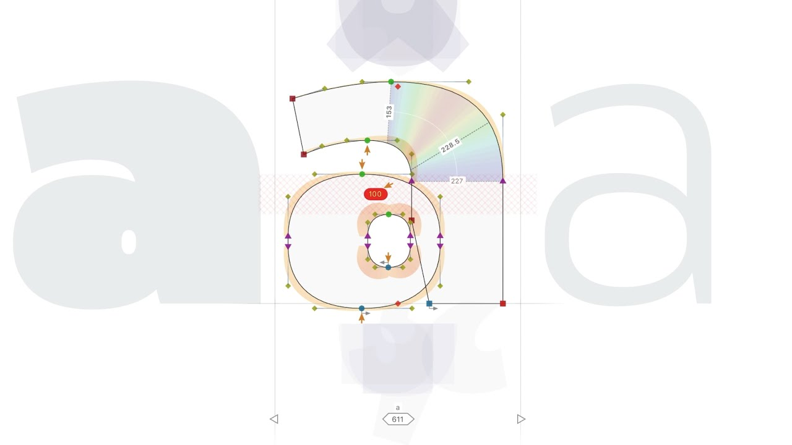

---
date:
  created: 2019-11-30
title: "Introducing FontLab 7: the pro font editor, evolved"
authors: [fontlab]
draft: false
review:
  cta_status: ok
  cta_target: "https://www.fontlab.com/font-editor/fontlab/"
  title_case: ok
  title_suggested: ""
  voice_quality: strong
  facts_to_verify:
    - "25% launch discount valid until December 22, 2019 — historical, no action needed"
    - "FontLab VI users who bought Aug 1, 2019 or later get free upgrade — verify policy"
    - "FontLab VI upgrade to 7 for $99 — verify this was the actual price"
    - "250+ new features claimed — verify against release notes"
    - "Dave Lawrence claim: 167 ornamental glyphs per day average — verify quote accuracy"
  image_status: present
  image_needs: "YouTube embed thumbnail present (ytimg.com) — adequate; verify URL still works"
  weakness_verdict: keep
  consolidate_with: ""
  notes: "Strong launch post with real user quotes that add credibility. The feature bullet string reads like release notes copy-paste; a prose paragraph would land better. Pricing and discount deadline are historical — no cleanup needed but add a note that current pricing is on fontlab.com."
---
{.illu-thumb .illu-index}

FontLab 7 is a major upgrade to FontLab VI, arriving after a summer and autumn of concentrated work, with more than 250 new features, fixes, and improvements. Highlights include auto-generated OpenType features, both-sided kerning classes, kerning clash detection, variable font intermediate masters and conditional glyph substitution, and 64-bit native performance on macOS Catalina and Windows 10. FontLab VI users who purchased on or after August 1, 2019 qualify for a free upgrade.

<!-- more -->

Until **December 22, 2019**, you can buy FontLab 7 or upgrade from FontLab Studio 5, Fontographer, or TypeTool 3 at a **25% discount**. If you have **FontLab VI**, you can upgrade to 7 for just $99 — and if you bought FontLab VI on August 1 or later, or hold a full educational license, the upgrade is **free**.

[Visit the FontLab 7 website](https://www.fontlab.com/font-editor/fontlab/)

> Auto OpenType features • Equalize uneven stems • Edit all masters • Precision dragging • View centerline & thickness • Batch glyph renaming • Conditional glyphs • Both-sided kerning classes • Fix kerning clashes • VF intermediate masters • Parametric GPOS • PDF • JSON • CFF2 • STAT • Quick Help • 250+ features & fixes

FontLab 7 focuses on stability, productivity, and technical excellence — four years of user feedback and deferred ideas now shipped.

**Edit curves precisely** without zooming. Improve **stem consistency** with thickness measurement and uneven-stem equalization. Create **kerning classes** quickly — now both-sided — and fix **clashing kerning** combinations. FontLab 7 fully supports **variable fonts**: open and export CFF2- and TrueType-based VFs with **intermediate** glyph masters, **conditional** glyph substitution, avar **axis mapping**, and STAT **axis instances**. **View multiple masters** simultaneously as overlaid wireframes or side-by-side cousins, and **edit across masters** with Edit across Layers and Match when Editing.

FontLab 7 understands **glyph naming** from other font editors and can **automatically generate OpenType features** from different naming schemes — batch-renaming glyphs is straightforward too. Hold **F1** over any interface element for **Quick Help**. Built on a 64-bit foundation, FontLab 7 runs on **macOS Catalina**, **Windows 10**, older systems, and even Linux with Wine.

[See what’s new in FontLab 7](https://fontlab.com/font-editor/fontlab/7/)

## Download the 30-day trial

Download the **30-day trial**, which runs side-by-side with your existing FontLab VI. Fully functional from day one.

[Go to FontLab 7 downloads](https://www.fontlab.com/font-editor/fontlab/#download)

## What early adopters say

**Fábio Duarte Martins** (Scannerlicker), designer of Optician Sans and Electrica: “This baby is a rock-solid font development software, from design to engineering. Drawing is a joy: FontLab has the best drawing tools I’ve ever seen, and they just got better!”

**Eduardo Tunni**, designer of the Graduate variable superfont: “Great stuff! FontLab 7 is very stable. Congrats to the FontLab team.”

**Dave Lawrence** (California Type Foundry), designer of CAL Bodoni and CAL Zed: “If you want to make more fonts faster and better and if you want to stay ahead of the competition, go with FontLab 7. My favorite parts are auto layers, glyph masters, and FontAudit. Using these features, I was able to create an average of 167 ornamental glyphs (in two weights) per day.”

**Vassil Kateliev** (Karandash / The FontMaker), co-designer of the Bolyar font family and developer of TypeRig: “FontLab 7 is superb. The best vector engine for drawing and manipulation I have seen in ages. Rock-steady interpolation engine that is also compliant with variable OpenType fonts. Start with an excellent multi-paradigm approach to type design — old-school outlines, element references, components, auto-generated glyphs, or all of them combined. Add auto layers, auto OpenType feature generation, a powerful Python API, and multi-platform support. FontLab 7 finally feels mature.”

[Read more →](https://www.fontlab.com/font-editor/fontlab/){ .fl-help-cta }
