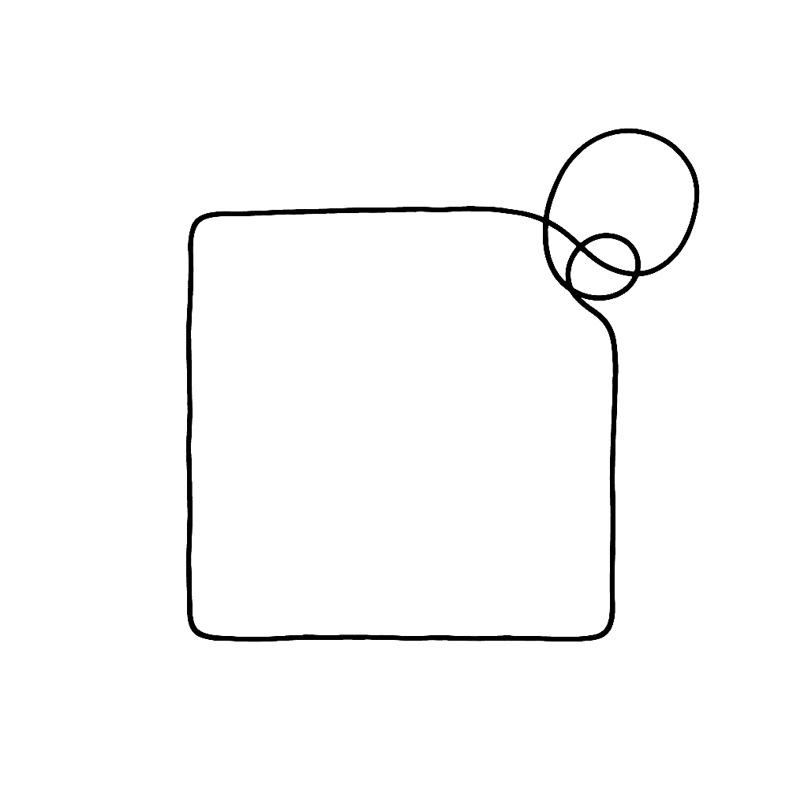

{.illu-thumb }

FontLab 7.1 landed in March 2020 as a free update to all [FontLab 7](2019-11-30-introducing-fontlab-7.md) users, delivering over 70 new and improved features and 80 fixes across five point releases between March and August 2020. The headline additions — ink traps, harmonized handles, looped corners, and quick measurement — gave designers finer control over node behavior and optical geometry than any prior version.

<!-- more -->

The 7.1 cycle ran from 7.1.0 (2 March 2020) through 7.1.4 (1 August 2020). Here are the features that defined it:

- **Ink traps with Scissors** — select a sharp corner node and use Scissors to cut a simple ink trap notch in one step. Notch depth and angle are adjustable, saving the manual node-placing work that ink trap design used to require.
- **Looped corners** — a new corner type that creates a smooth loop at a node rather than a hard angle. Useful for certain script and display designs; the loop radius is editable as a single parameter.
- **Harmonize Handles** — a node property that enforces G3 continuity (curvature continuity of the second derivative) at smooth nodes. The resulting transitions are visually smoother than standard G2 Bézier smoothness, with no extra nodes needed.
- **Knife improvements** — Knife can now duplicate nodes (splitting a segment without removing material) and display the cut angle as you drag, making precision cuts across a contour easier.
- **Quick measurement** — move the pointer over the fill area of a glyph and FontLab dynamically shows the distance between the two nearest opposing contours. A rainbow overlay visualizes where the stroke thickens and thins. Hold Shift+Ctrl to switch to vertical measurement respecting the italic angle.
- **Friendly glyph names** — 7.1.2 introduced a curated set of human-readable glyph names as the default when adding new glyphs, replacing the older AGLFN scheme for common characters. Alternative: Georg Seifert’s Glyphs-compatible name list.
- **Diagonal handle length display** — the length and angle of handles and line segments is shown in the property bar as you draw, with full diagonal handle support.
- **Opposite sidebearing link** — a one-click shortcut to link a glyph’s right sidebearing to its left sidebearing (or vice versa), useful for symmetric glyphs.
- **View details across glyphs (7.1.3)** — a new display mode that shows measurements and node data from neighboring glyphs in the Glyph window text, without switching to a separate comparison view.
- **VOLT export (7.1.4)** — export OpenType feature code in Microsoft VOLT format, making FontLab usable in complex-script workflows that rely on VOLT for hinting and feature development.
- **Add variation to an existing font (7.1.4)** — a guided flow for introducing a new master axis into a font that was not originally designed as variable, handling the structural changes automatically.

Full release notes and documentation start at the [FontLab Help Center](https://help.fontlab.com/).

[Read more →](https://help.fontlab.com/){ .fl-help-cta }
