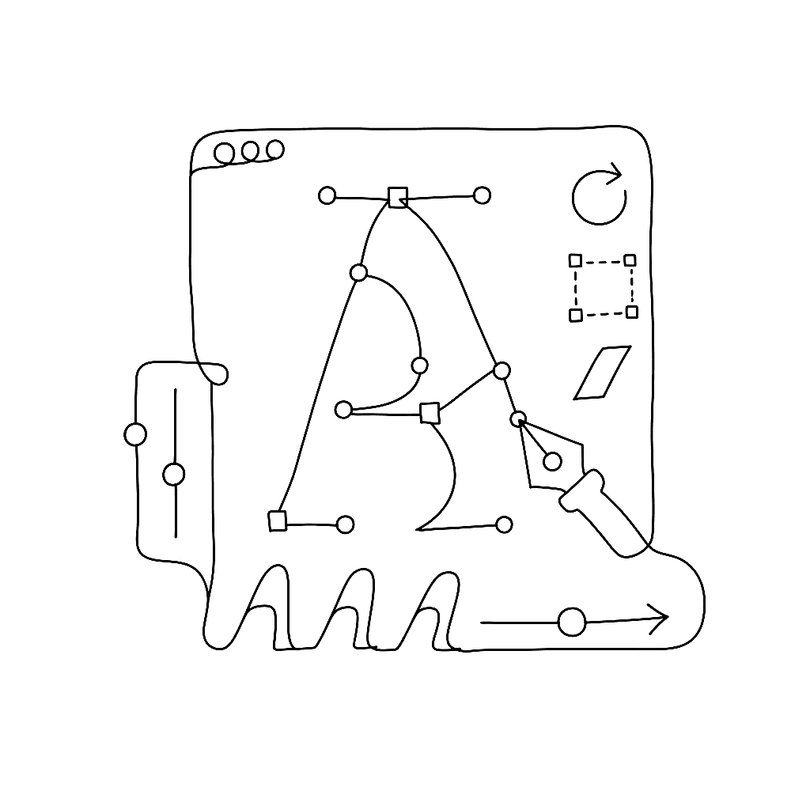
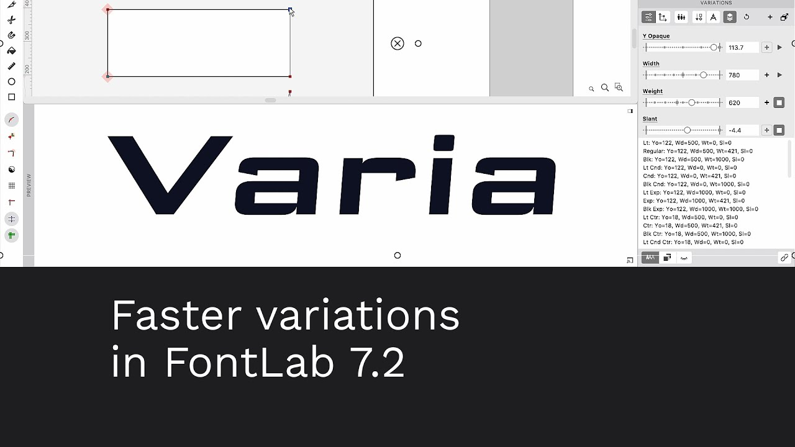
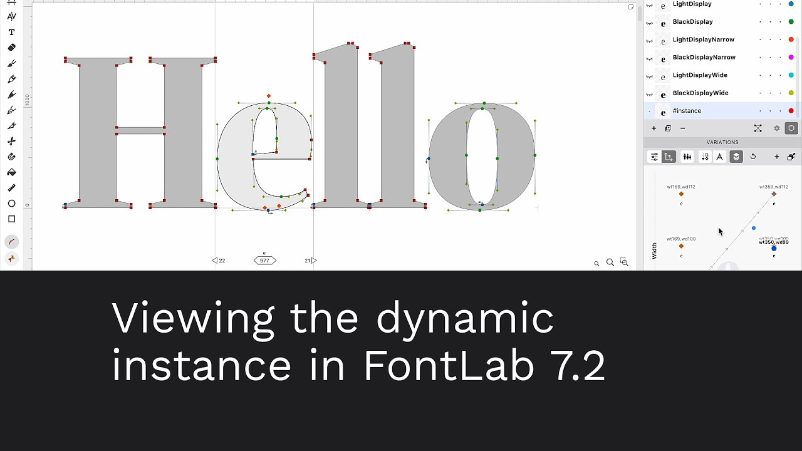
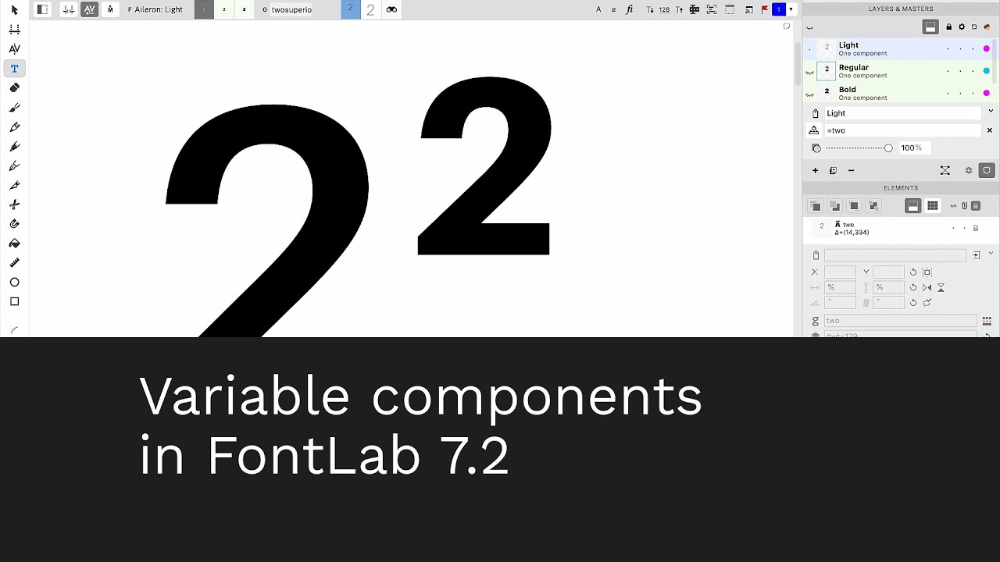
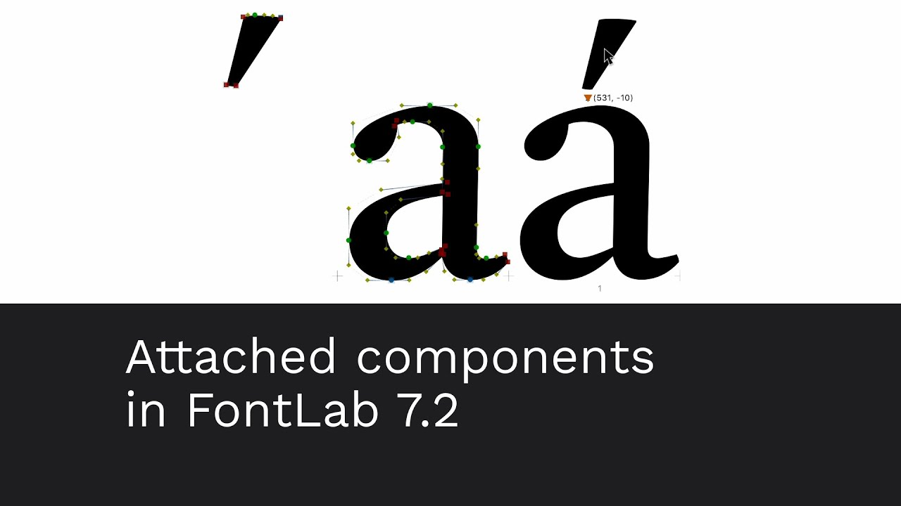
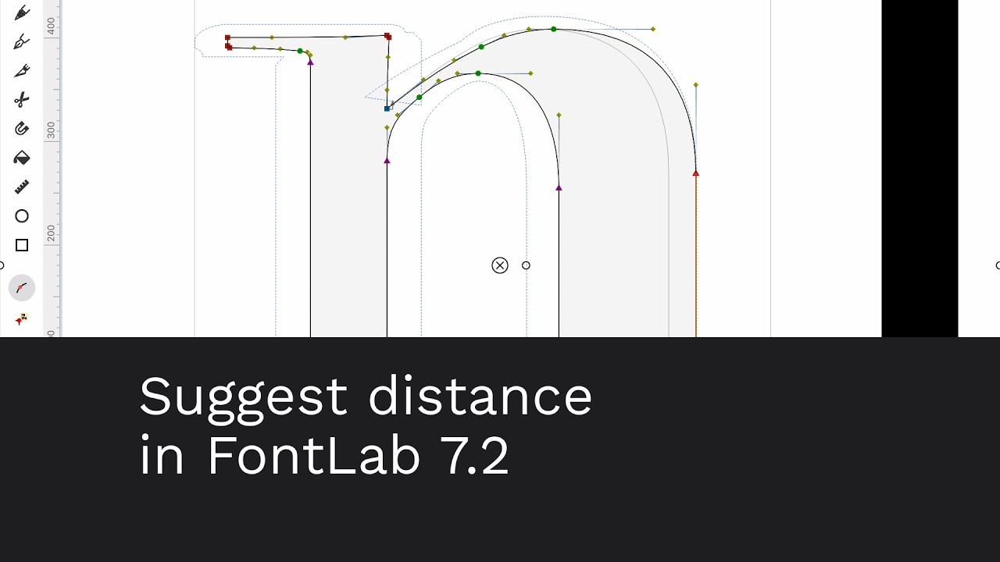
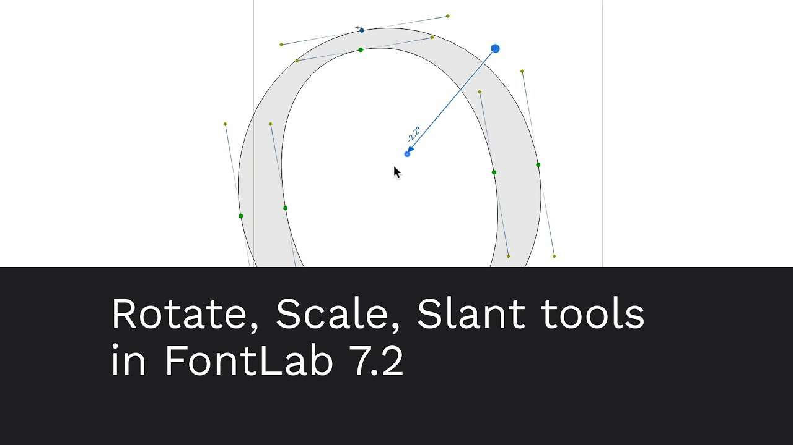
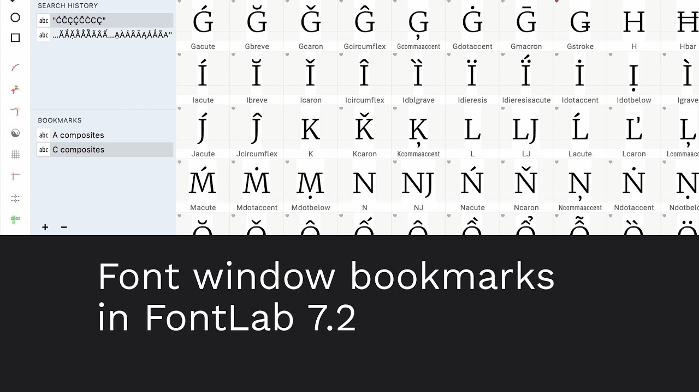
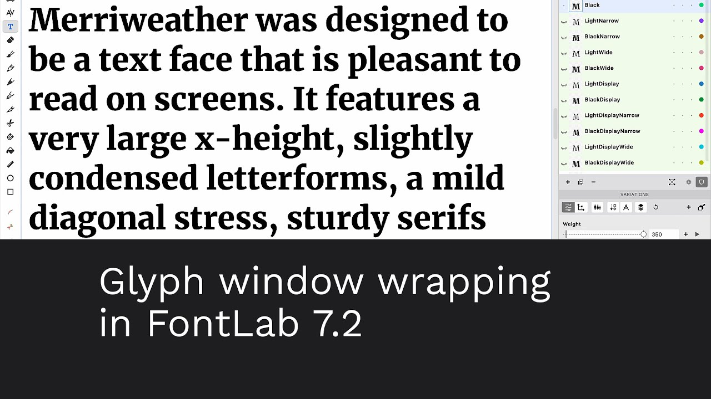
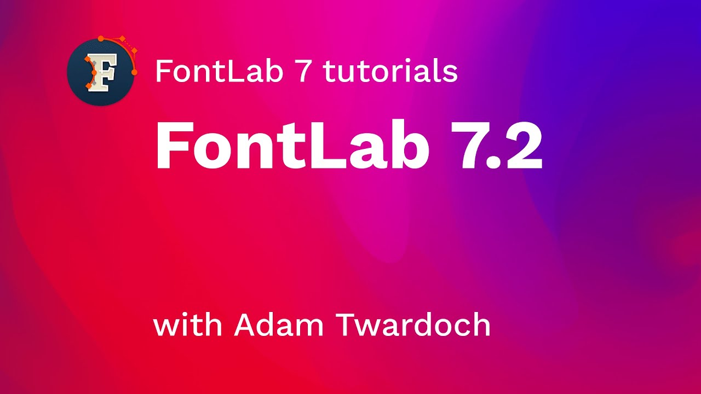

---
date:
  created: 2020-11-30
title: "Say hello to FontLab 7.2"
authors: [fontlab]
draft: false
review:
  cta_status: ok
  cta_target: "https://help.fontlab.com/fontlab/7/manual/Release-Notes-7622/"
  title_case: ok
  title_suggested: ""
  voice_quality: adequate
  facts_to_verify:
    - "Interpolation 30× faster — verify this benchmark claim and conditions"
    - "120 new or improved features — verify count"
    - "FontLab VI upgrade to 7.2 for $99 — verify price"
    - "Release Notes URL 7622 — verify this matches 7.2.0 build number"
  image_status: present
  image_needs: "Multiple YouTube thumbnails present (ytimg.com) — adequate; verify URLs still resolve"
  weakness_verdict: keep
  consolidate_with: ""
  notes: "Merged the 31-minute walkthrough video from 2021-01-18-whats-new-fontlab-72.md."
---
{.illu-thumb .illu-index}

FontLab 7.2 is a free update with 120 new or improved features.
The headline: interpolation now runs 30× faster.
New tools include Rotate, Scale, and Slant; an adaptive freeform grid with Suggest
Distance; variable and attached components; visual OpenType feature proofing; and
Microsoft VOLT integration.
Existing FontLab 7 users get it free; FontLab VI users can upgrade for $99.

<!-- more -->

FontLab 7.2 brings 120 new or improved features:

- [New Rotate, Scale and Slant tools](https://www.youtube.com/watch?v=NI51ir9f9xQ)
- [Adaptive freeform grid with Suggest Distance](https://www.youtube.com/watch?v=fjxUSlfbL9k)
- Per-font rounded or fractional coordinates
- Flexible [dynamic instances](https://www.youtube.com/watch?v=13-fnAf2YE8) and
  [30× faster interpolation](https://www.youtube.com/watch?v=9mtO-XdxGMQ)
- [Attached](https://www.youtube.com/watch?v=1QTsFihA9Ms) and
  [variable components](https://www.youtube.com/watch?v=lQqLRgOJ5Zo)
- Visual proofing and better editing of features
- Microsoft VOLT integration
- Font window filtering by color flag and glyph name suffix
- Better UFO 3 and .glyphs 2 and 3 interchange
- 80 fixes

FontLab 7.2 is free for existing FontLab 7 users, and $99 for FontLab VI users.
If you already have FontLab 7, use *Preferences › General › Check now* to update.
If you don’t have FontLab 7 yet, get a fully-functional 30-day trial from
[our website](https://www.fontlab.com/font-editor/fontlab/).

[See detailed FontLab 7.2 release notes](https://help.fontlab.com/fontlab/7/manual/Release-Notes-7622/)

## 30× faster interpolation

Interpolation works 30× faster than in previous versions, so you can preview variation
animation in the Preview panel and Glyph window.
In the Preview panel, you can also preview interpolation steps between any two
instances.

## Dynamic instance layer

If *Preferences › Variations › Show instance layer* is on, the Layers & Masters panel
shows an instance layer in all variable glyphs, corresponding to the dynamic instance
selected in the Variations panel.

In the Font window, make the instance layer current, then choose a dynamic instance in
the Variations panel to see that instance in all glyph cells.

In the Glyph window, making the instance layer current and selecting a dynamic instance
lets you see the detailed view in the Glyph window.
Use the Play buttons to animate the variations along the axes.

## Variable components

A component in FontLab can point to a glyph in a different layer, or to a dynamically
interpolated instance.
Open the Elements panel, turn on *Show/hide element properties*, and click *Expand
properties* (^) to see the Base layer name field.
Enter a different layer name there, or click *Select component instance* to open a
widget with variation sliders.

## Attached components

An attached component automatically snaps to the position determined by corresponding
anchors. You cannot manually move an attached component, but you can scale, rotate,
slant, or interpolate it.
To move it, move the anchors that determine its position.

Attached components give you anchor-based placement while keeping full flexibility over
metrics, and allow mixing contours with components.
To attach a component, select it in the Glyph window and turn on *Element › Attached*,
or toggle the paper-clip icon in the Glyph window property bar.

## Suggest distance

When *View › Suggest › Distance* is on and you drag a node, handle, selection, or
anchor, FontLab draws a temporary suggested outline at the distance defined in *Font
Info › Other Values › Contour properties › Suggest distance* — a freeform grid that
adapts to your current drawing.

You can define separate horizontal and vertical distances per master.
Use Suggest Distance to position anchors at a specified distance from existing contours,
or to transform an existing drawing.

## Rotate, scale and slant tools

The quick transform tools — Rotate, Scale, and Slant — have been revamped.
They work better and are accessible from the toolbar.

## Font window bookmarks

Use the Font window search box to find glyphs by name, Unicode character name, script,
codepoint, Unicode range, codepage, or encoding.
Drag a remembered search to the Bookmarks section to reuse the filter.
In FontLab 7.2, you can double-click a bookmarked search and give it a custom name.

## Glyph window wrapping

The Glyph window is single-line by default.
Make manual wraps with Enter, or switch to Auto wrap.
When you apply a text wrap in the Glyph window, you can switch masters and instances
without reflowing longer texts.

## Walkthrough

A 31-minute guided tour by Adam Twardoch covers each area in turn — drawing, variable
fonts, OpenType features, export — with commentary on why each design decision was made.
The fastest path from “I saw the release notes” to “I understand what actually changed.”

For the version-by-version detail, use the release notes below.

[Read more →](https://help.fontlab.com/fontlab/7/manual/Release-Notes-7622/){ .fl-help-cta }
