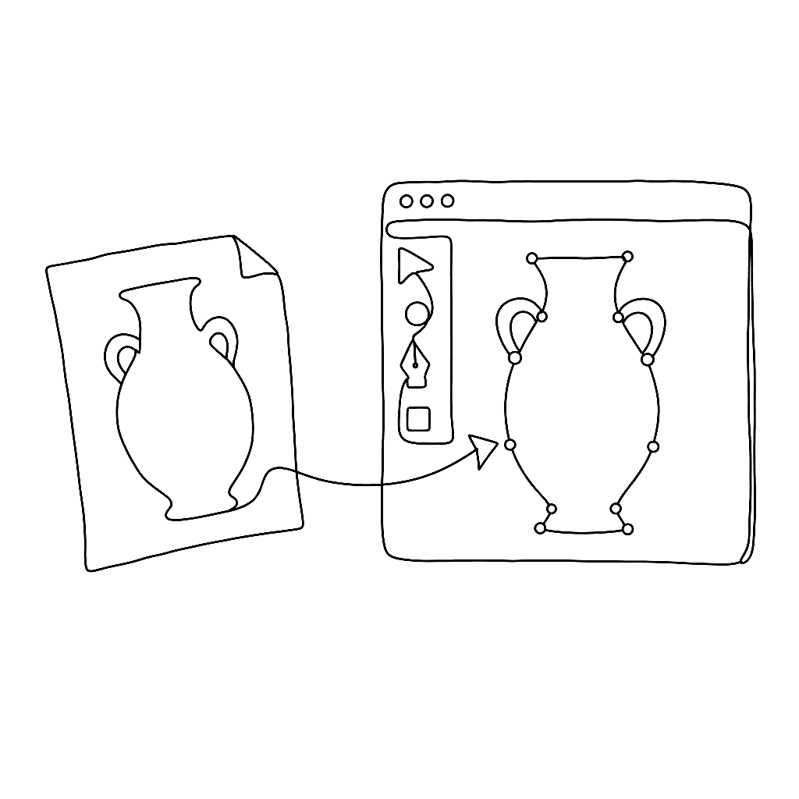
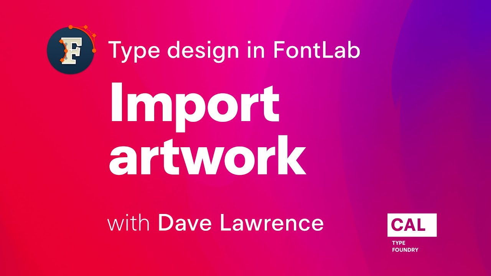

{.illu-thumb .illu-index}

Most type designers don’t draw directly in the font editor — they sketch in pencil, refine in Illustrator or Affinity Designer, then need to get that artwork into FontLab cleanly. This eight-minute video from Dave Lawrence’s FontLab 7 series shows exactly how.

<!-- more -->

FontLab 7 accepts artwork in multiple ways: paste from the clipboard (from Illustrator or any SVG-aware application), drag-and-drop of image files, or direct import of SVG files. Lawrence demonstrates each approach and explains the settings that control how imported artwork lands in the glyph cell — placement, scaling, and whether it arrives as a background reference image or as live vector outlines.

The tutorial is part of a longer series on type design with FontLab 7, developed by Dave Lawrence of California Type Foundry. Lawrence teaches each concept in isolation before combining them, making the series useful for beginners working through it sequentially and for more experienced users filling a specific gap.

Getting artwork into FontLab without friction is foundational. Once that step is smooth, the drawing and refinement workflow opens up considerably.

Watch on [FontLab TV](https://www.youtube.com/watch?v=b6TO3MF-eMU).

[Read more →](https://help.fontlab.com/fontlab/7/manual/Importing-Artwork/){ .fl-help-cta }
