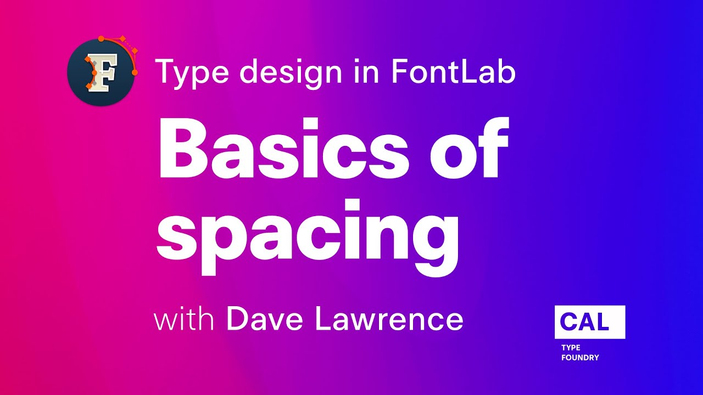

Spacing is the invisible work that determines whether a font feels effortless or labored
to read.
This five-minute tutorial from Dave Lawrence’s FontLab 7 series strips the topic
down to its essentials: what sidebearings are, how to set them in the metrics window,
and how to evaluate spacing visually as you work.

<!-- more -->

FontLab 7’s metrics window shows your glyphs in sequence, letting you type test strings
while adjusting left and right sidebearings numerically or by dragging.
Lawrence explains how to use reference characters — particularly n and o for lowercase,
H and O for uppercase — to establish a baseline rhythm that the rest of the alphabet can
be calibrated against.

The video covers the difference between sidebearing values and advance width, how
FontLab displays spacing guides in the glyph window, and the basic keyboard shortcuts
that make spacing work fast.
It is deliberately brief: Lawrence teaches one concept at a time, and at five minutes
this video covers exactly what the title says.

Spacing is addressed after drawing is mostly complete, but the decisions made here
affect how every glyph relates to its neighbors.
Getting it consistent is what separates a draft font from a usable one.

Watch on [FontLab TV](https://www.youtube.com/watch?v=cmDocLGmw4A).

[Read more →](https://help.fontlab.com/fontlab/7/manual/Spacing-and-Kerning/){ .fl-help-cta }
