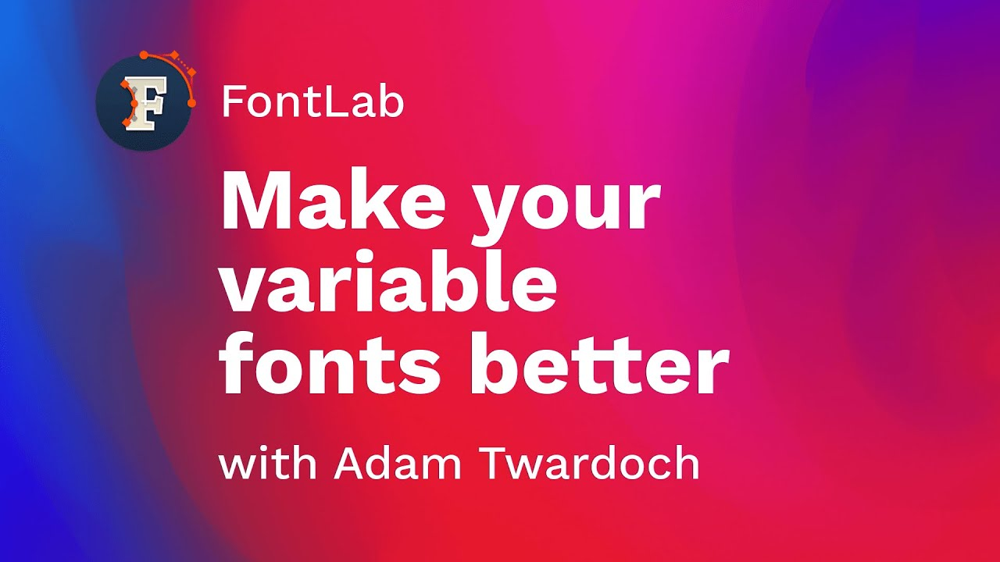

This 19-minute presentation by Adam Twardoch, delivered at ATypI Tech Talks 2021, goes
beyond building variable fonts to the harder question: making them good.
It covers quality assurance, interpolation checking, and the tools in FontLab 7 and
related applications that help catch problems before a variable font ships.

<!-- more -->

Variable fonts are technically complex: a single font file encodes a continuous design
space, and problems can appear at any point within it — not just at the named instances
you tested. Twardoch demonstrates a systematic workflow for checking variable fonts
across their full range, using FontLab 7’s variation preview alongside external tools to
catch interpolation errors, contour incompatibilities, and metric inconsistencies.

The presentation covers how to set up masters for clean interpolation, what FontLab’s
compatibility checker looks for, and how to interpret the results.
Twardoch also discusses common failure modes — nodes that drift, contours that flip,
anchors that interpolate incorrectly — and shows practical fixes for each.

Because this was a conference talk, the pace is faster and assumes more prior knowledge
than an introductory tutorial.
It is aimed at designers who have already built a variable font and want to raise the
quality of their output, or who have run into problems they couldn’t diagnose.

Watch on [FontLab TV](https://www.youtube.com/watch?v=xQcR9riPhTc).

[Read more →](https://help.fontlab.com/fontlab/7/manual/Variable-Fonts/){ .fl-help-cta }
