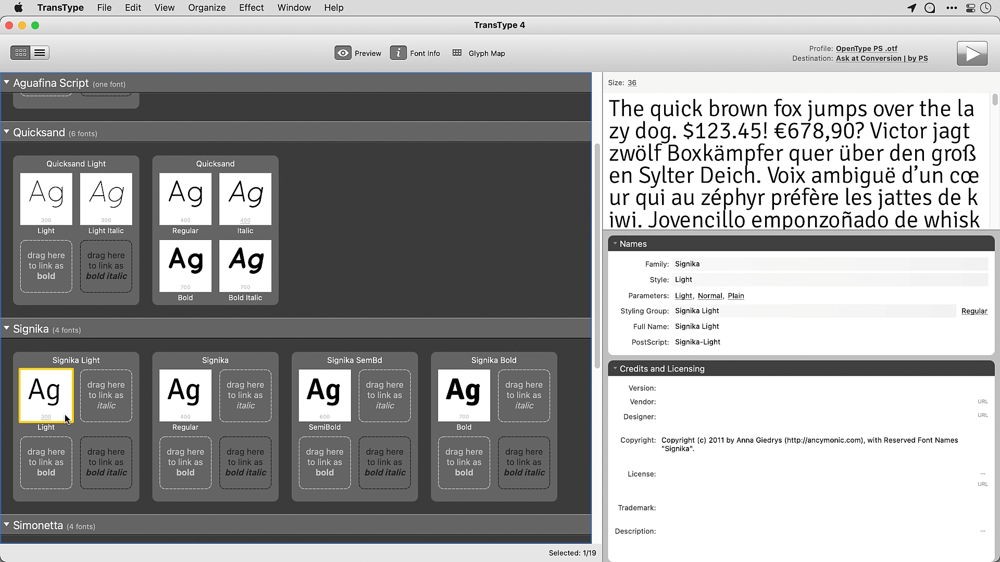

PostScript Type 1 fonts are on their way out. Adobe is ending Type 1 support in Creative Cloud applications in early 2023, and Apple has signalled the same direction in macOS. If you have a library of Type 1 fonts — and many working designers do — now is the time to convert them to OpenType.

<!-- more -->

PostScript Type 1 was introduced by Adobe in 1985 and became the standard for professional print publishing. Foundries including Adobe, Bitstream, FontFont, ITC, Linotype, Monotype, and URW published thousands of typefaces in the format. For roughly two decades, a Type 1 library was a serious professional asset.

OpenType began displacing Type 1 in the early 2000s, and by now the transition is complete everywhere except legacy font collections. The Adobe CC deadline makes the situation concrete: fonts that have worked fine for twenty years will stop loading in Photoshop, Illustrator, and InDesign within the next eighteen months.

FontLab's [TransType](https://www.fontlab.com/font-converter/transtype/) converts Type 1 fonts to OpenType on Mac and Windows. The workflow is straightforward: drag fonts in, configure the output family structure if needed, export as OTF. TransType also handles web font output (WOFF and EOT), intermediate weight generation via font blending, and family renaming — useful when old Type 1 families use naming conventions that confuse modern font menus.

A few things to check before converting:

- **License terms.** The end-user license agreement for many commercial fonts prohibits format conversion. Read it. If it doesn't explicitly forbid conversion for personal use, you're likely in the clear, but when in doubt contact the foundry.
- **Character coverage.** Type 1 fonts are limited to 256 glyphs per file. Some families shipped as multiple files (one for standard, one for expert characters). TransType can merge these into a single OpenType font with proper Unicode mapping.
- **Hinting.** Type 1 hinting doesn't translate directly to TrueType hinting. For screen use at small sizes this rarely matters today; for print output at any size, PostScript hinting in OTF is preserved correctly.

A font collection assembled over two decades has real value. Converting it once now is considerably less painful than discovering mid-project that your favorite headline face no longer loads.

TransType is available at [fontlab.com/font-converter/transtype/](https://www.fontlab.com/font-converter/transtype/).
