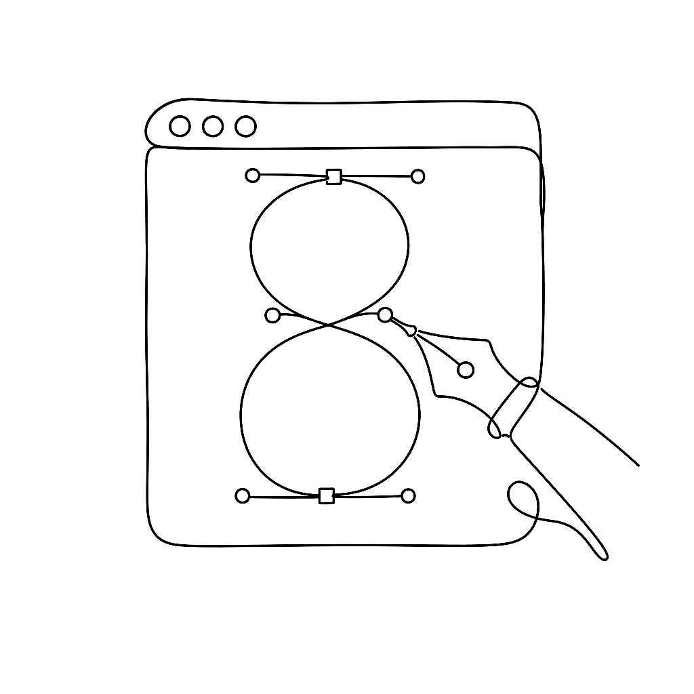
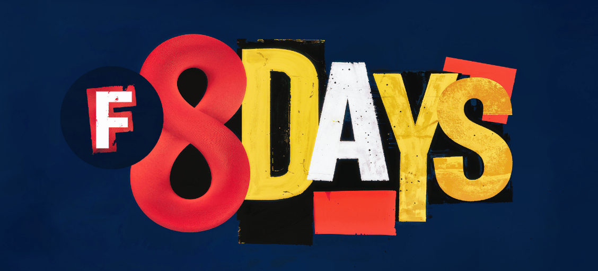

{.illu-thumb .illu-index}

Two years into FontLab 7, users had a clear message: the drawing engine is excellent, the variable font support is solid, now make the rest of the application match. FontLab 8, shipping today, is our answer.

<!-- more -->

FontLab 8 is a free upgrade for all FontLab 7 users, and a major revision for everyone else. It runs on macOS (Intel and Apple Silicon) and Windows 10/11. Here is what changed:

- **Boolean contour operations** — Subtract, Intersect, and Exclude are now proper menu commands under Contour > Overlap, not workarounds. Select two overlapping paths, choose your operation, done.
- **Measurements panel** — a dedicated panel for tracking design dimensions (stem weights, counter sizes, cap heights) with illustrative icons that make clear what you are measuring and why it matters.
- **Soft Brush and Soft Pencil** — two new drawing tools that apply inertia as you draw, producing smoother curves with fewer nodes than a steady hand alone.
- **Smart Pencil** — draws and immediately simplifies: nodes land at curve extrema, the node count stays as low as the shape allows.
- **Back/Forward navigation** in the Glyph window text bar, so switching between recent glyph sequences no longer requires retyping them.
- **Glyphs format v3** as the default export target for `.glyphs` files, including full tag support for interoperability with Glyphs.app workflows.
- **Custom Alt+key shortcuts** — assign your own keyboard shortcuts to any menu command, reducing hand travel for operations you run dozens of times a day.
- **UI redesign** throughout: updated icons, improved dark and light mode consistency, and a cleaned-up Font Info layout.

The 8.0 release is the foundation. Substantive free updates — more drawing tools, more overlap operations, more kerning improvements — are already in development and will follow shortly.

## Drawing and vector editing

Beyond the headline features, FontLab 8 introduces several precision editing tools:

- **Power Nudge** — adjusts a selected point while maintaining smooth curve relationships with adjacent segments, avoiding the manual handle correction that a plain nudge would require.
- **Lever drag** — moves a handle while keeping the opposite handle in proportion, preserving curve character when changing tension.
- **Slide** — moves a node along its path without disturbing the overall curve shape. Useful for repositioning a node that is structurally correct but geometrically misplaced.
- **Suggest** — displays live numeric distance hints during drawing, so you can hit a specific measurement without switching to a panel.
- **Power Brush and Power Stroke** — tools for creating and editing modulated (variable-width) strokes with a live-editable contour structure. The result is editable after drawing, not a flattened outline.

## Learning resources

FontLab 8 ships with an expanded tutorial system. Text tutorials by Dave Lawrence (California Type Foundry) and Gunnlaugur SE Briem cover foundational techniques. Over 240 video tutorials are available on the FontLab YouTube channel, with playlists organized by topic and difficulty.

The [8-day introductory tutorial series](https://help.fontlab.com/fontlab/8/tutorials/intro/) walks through the complete workflow from first glyph to exported font, covering drawing, spacing, kerning, OpenType features, and variable font basics in sequence.

## Upgrading from FontLab VI

Coming from FontLab VI? The leap is larger than the version number suggests. FontLab 8 keeps the elements model and the variable-font foundation VI introduced, then rebuilds the rest:

- **Interface** — optional dark theme, panel docks, widgets for quick property access, numeric fields that accept calculations (`300+50` → 350), F1 Quick Help over any control.
- **Drawing** — Power Stroke joins Power Brush; the Thickness tool modulates weight along a path; Pen and Rapid carry toolbox sub-tools; the Rectangle tool draws polygons and stars.
- **Editing precision** — the Lever (Cmd/Ctrl while dragging) gives sub-unit precision without zooming; align, collapse, and sort operations on selected nodes; paste-to-replace-selection.
- **Consistency** — Auto-meter shows live stem widths and curve tensions; Suggest Stems highlights common widths as you draw; snapping adds continuation, perpendicular, and centerlines.
- **Composites** — variable components, the Fusion Boolean filter, text shapes, clipping groups, Glue and Skin.
- **Metrics and kerning** — auto-spacing and auto-kerning on a single keypress; right-to-left kerning; Audit Kerning resolves class conflicts; the Pairs & Phrases panel.
- **Families and variation** — Merge Fonts to Masters, per-glyph variation axes, smart variable components, conditional substitutions via tilde tags (e.g. `~wt>850`) for `rvrn`.
- **Color** — redesigned Colors panel with linear, radial, and conical gradients; a visual gradient editor; OpenType COLRv1 export including variable color; automatic dark-mode palettes.
- **Scripting** — Python 3.11 (up from 2.7 in VI), 10–60% faster, with the bundled TypeRig library by Vassil Kateliev for batch glyph operations.

Download FontLab 8 and find the full what’s-new list at [fontlab.com/font-editor/fontlab/](https://www.fontlab.com/font-editor/fontlab/). The documentation starts at the [FontLab 8 help site](https://help.fontlab.com/fontlab/8/).

[Read more →](https://help.fontlab.com/fontlab/8/whats-new/){ .fl-help-cta }
