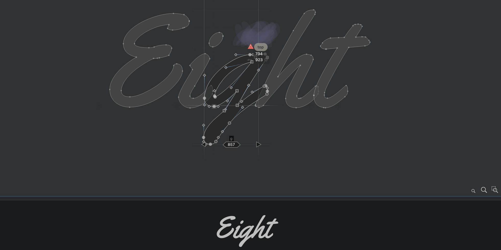
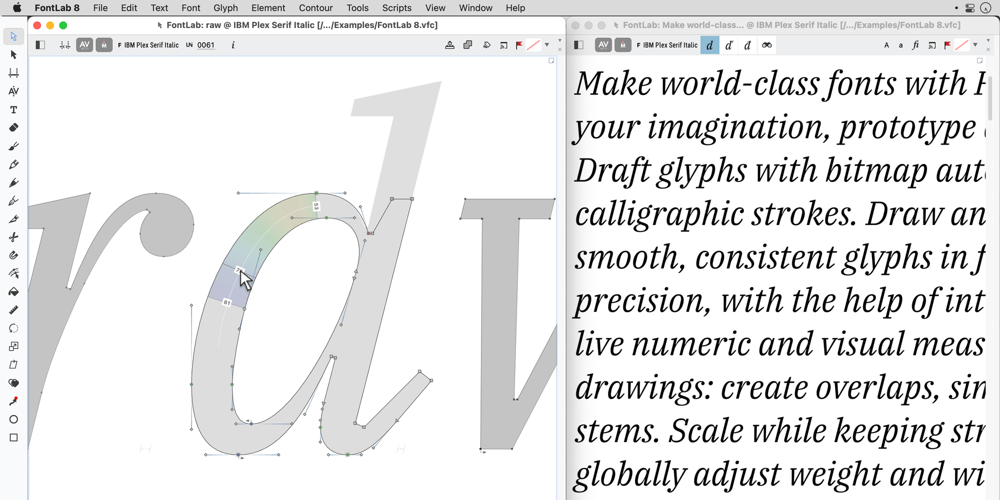
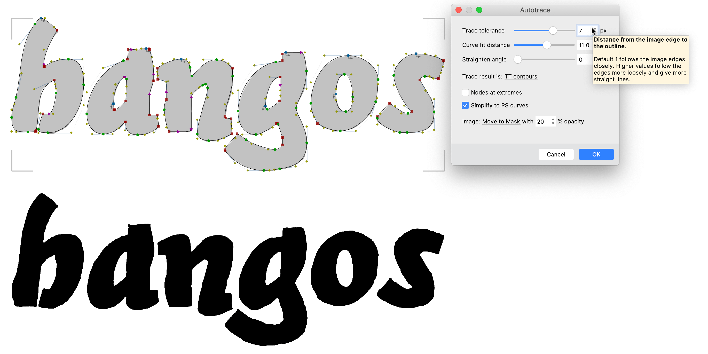
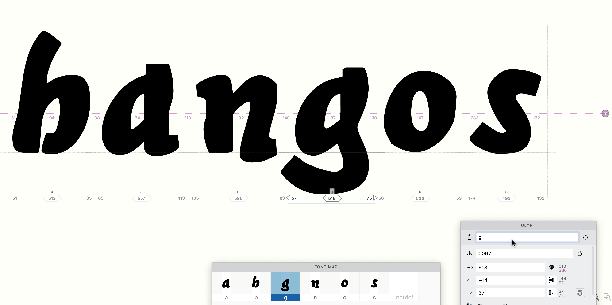

Ever wanted to make your own font?
FontLab 8 can take you from rough sketch to working OpenType file — and it handles more
of the tedious precision work than you might expect.
Day 1 covers what the software does, why it matters, and how Autotrace can cut hours off
your first project.

<!-- more -->

## Making a font is harder than drawing letters

Whether you need a brand identity typeface, a movie title, or just want your own
handwriting on screen, the gap between “nice sketches” and “working font” is real.
What looks good on paper may fall apart on screen.
Spacing that felt intuitive in a sketchbook can read like a ransom note in text.
Until recently, bridging that gap required something close to programming skill.

FontLab 8 exists to close that gap.

FontLab 8 is a professional font editor built around drawing tools optimized for
letterforms. You can import vector artwork from Illustrator or Affinity Designer, scan
physical drawings and bring them in as bitmaps, or draw glyphs directly in FontLab.
Most designers find they do all three at different stages of a project.

## How FontLab keeps things consistent

When you draw by hand, consistency comes from the tool and the hand.
The same pen pressure, the same stroke angle, creates a rhythm across letters.
FontLab replicates this digitally.

The **Power Brush** tool lets you draw a vector skeleton and apply a live calligraphic
stroke — adjustable at any time.
Want all the strokes thicker?
Change the stroke weight globally.
FontLab also suggests common stem widths as you draw new paths, flags unusual widths in
existing ones, and lets you draw a shape once as an *element* and reuse it as a
reference across dozens of glyphs.

For spacing, you start with auto-spacing and auto-kerning, then link the advance widths
and sidebearings of related glyphs to each other.
Class-based kerning handles groups of similar shapes in one operation.

**FontAudit** runs continuous checks on every node and curve in your font — flagging
kinks, near-flat curves, open contours, and about 18 other issues that would cause
problems later but are invisible on casual inspection.

## From sketch to font in under a minute with Autotrace

Sometimes you don’t need to build the mountain — you just need the tunnel.
In FontLab 8, that tunnel is **Autotrace**.

Scan or photograph your sketches and drag them onto FontLab’s **Sketchboard** window
(for a word or full alphabet image) or drop individual glyph images directly onto Font
window cells. FontLab’s autotracer is tuned for font glyphs — sliders let you control
smoothness and corner detection with a live preview.

Use **Optically Separate** on the Sketchboard to isolate each glyph as its own element,
select them with the Element tool, and **Place As Glyphs** to drop them into the right
font slots. FontLab’s built-in optical character recognition usually names them
correctly; use the Glyph panel to fix anything it gets wrong.

Tweak sidebearings with the Metrics tool, and your hand-drawn alphabet is a working
font.
The whole process, start to export, can take less than a minute for a simple set of
characters.

That’s the tunnel. Manual tracing is the mountain.
Choose accordingly.

## Further reading

- [Briem’s notes on type design](https://help.fontlab.com/fontlab/8/tutorials/briem/)
- [FontLab 8 tutorials by Dave Lawrence](https://help.fontlab.com/fontlab/8/tutorials/calfonts/)
- [FontLab manual](https://help.fontlab.com/fontlab/7/manual/)

* * *

## More in this series

1. **Day 1: start making fonts** (this post)
2. [Day 2: A-B-C](2022-09-12-8-days-abc.md)
3. [Day 3: beyond A-B-C](2022-10-10-8-days-beyond-abc.md)
4. [Day 4: clever fonts](2022-11-07-8-days-clever.md)
5. [Day 5: letter crowd](2022-12-05-8-days-letter-crowd.md)
6. [Day 6: bigger, bolder, better](2023-01-09-8-days-bigger-bolder.md)
7. [Day 7: beyond text](2023-02-13-8-days-beyond-text.md)
8. [Day 8: color is the new black](2023-03-13-8-days-color.md)
