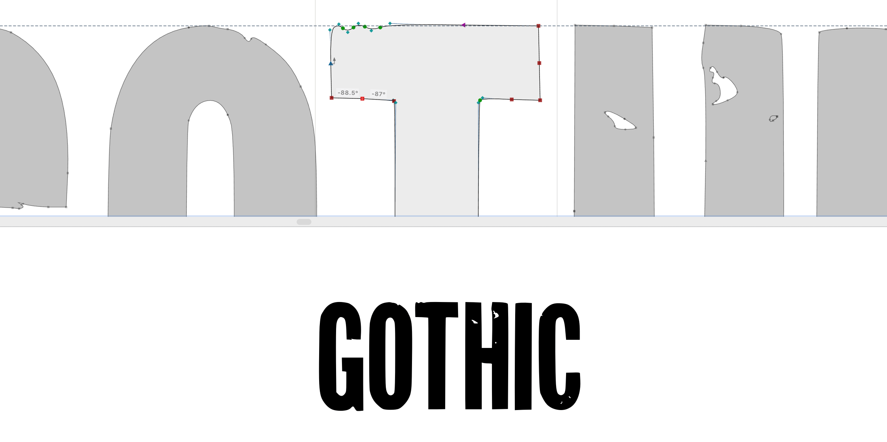
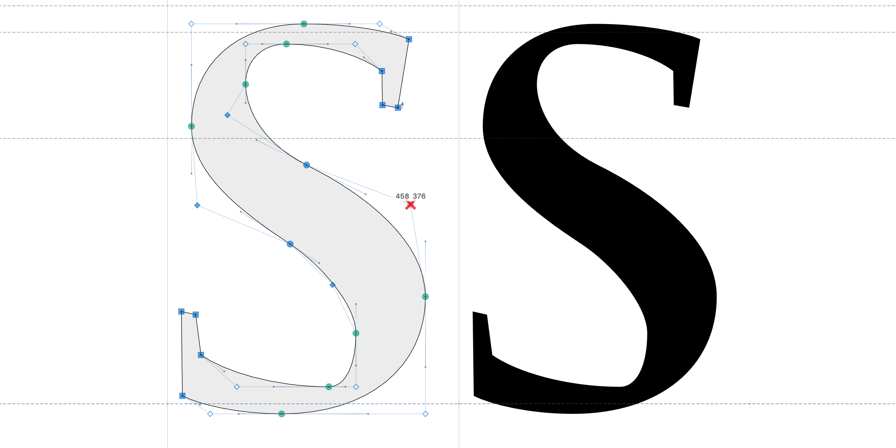
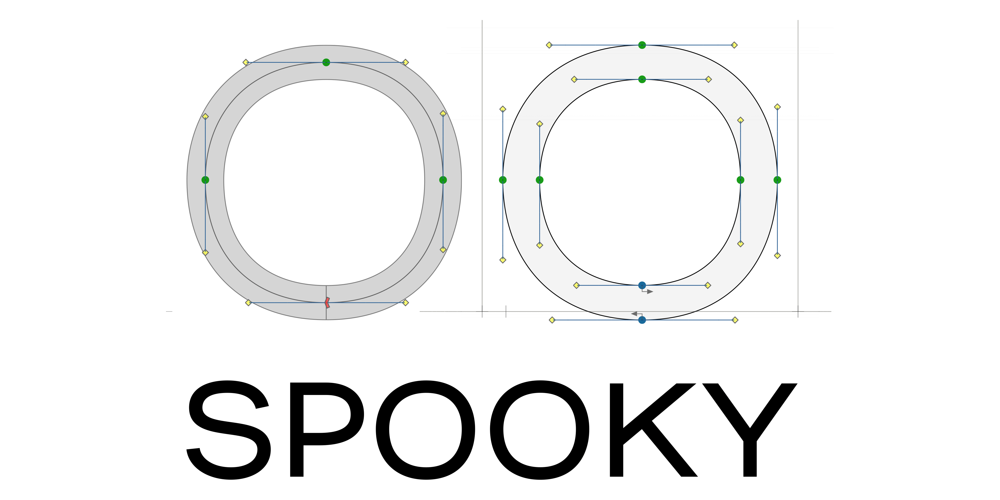
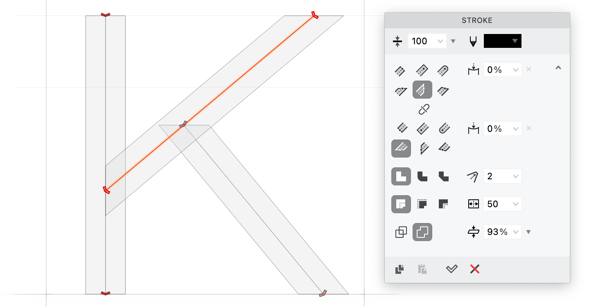
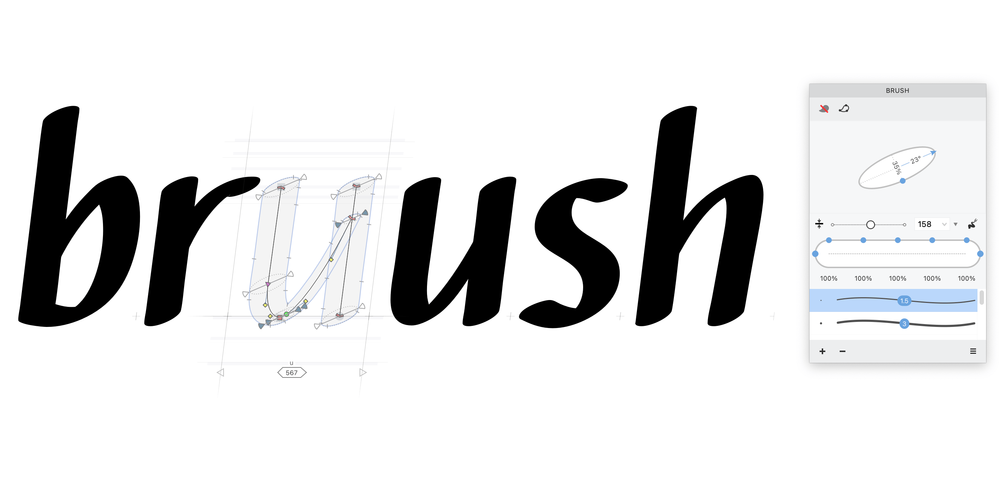
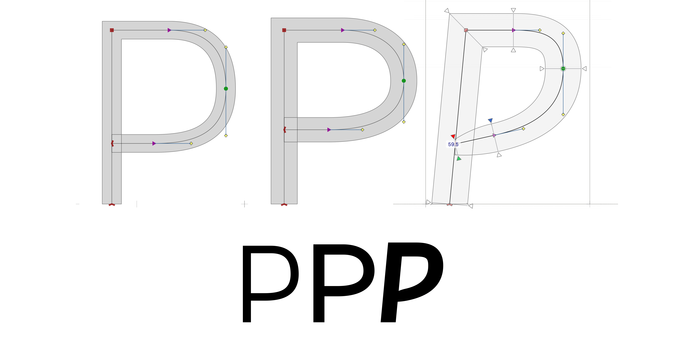

You don’t always need a full character set.
A font with a dozen glyphs is still a font — and it works everywhere an OpenType file
works. Day 2 looks at why packaging even a small set of drawings as a font pays off, and
how stroke-based drawing makes calligraphic and script letterforms accessible.

<!-- more -->

## Why bother with a font for just a few letters?

Suppose you need an attention-grabbing headline, a logo, or a company symbol.
It’s tempting to draw those shapes in Illustrator and leave them there as vectors.
Font editors sound like more than you need.

But consider the upside.
An OpenType font file — `.otf` — is the one universal vector container that works
without negotiation.
It renders smooth, scalable vectors in professional design applications, office
software, web browsers, on Mac, Windows, and Linux.
No PDF, EPS, SVG, WMF, or PNG required.
One file, everywhere.

Your font can contain exactly as many glyphs as you want.
If your signage needs twelve letters, make a twelve-character font.
A logo can be a single character.
And if you want to expand it later, the infrastructure is already there.

Fewer glyphs also means less work.
No kerning tables to maintain across hundreds of pairs.
No hinting for small sizes if you’re only using the font at display scale.
You can make a standard monochrome font and colorize the characters in any application —
want the logo in black, white, or red?
Change the text color.
No separate “dark” and “light” versions of the artwork.

## Drawing tools built for letterforms

General vector programs weren’t designed for glyphs.
FontLab was.

With FontLab’s **Rapid** tool, you draw consistent glyphs efficiently — it’s built
around the kinds of curves that letters are made of.
With **Power Nudge**, **Servant** nodes, and **Power Guides**, you adjust glyph widths
and heights while preserving stroke thickness, without the constant zoom-in, zoom-out
that generic vector tools require.

Two-color symbols are straightforward: draw the first color’s vectors as one glyph
(“A”), the second color’s as a zero-width glyph (“B”). They overlay when you type them
together, and each can be styled independently in any app that supports text coloring.

## Stroke-based design: drawing the skeleton, not the outline

The most popular font formats require closed contours — lines drawn around enclosed
spaces. That works fine for geometric sans-serifs, but for scripts, calligraphic faces,
or anything with organic strokes, manually pushing and pulling outline nodes is
genuinely tedious.

Stroke-based design is the alternative: draw a skeleton line and let FontLab expand it
to the right thickness and shape.
End-cap shapes give you the serif or termination you want.

Rather than wrestling with outline nodes, you edit the central skeleton.
Converting strokes to contours for fine-tuning is always an option.

The stroke doesn’t have to be uniform.
You can specify a stroke that starts thin, tapers to full width, then narrows again.
With a pressure-sensitive tablet, you can draw strokes of variable thickness simply by
adjusting pen pressure — it behaves like a real brush.

Curvy fonts aren’t as intimidating as they look when the tool works the way a pen does.

## Further reading

- [Basics of drawing in FontLab](https://help.fontlab.com/fontlab/8/tutorials/calfonts/)
- Bézier curves and type design: a tutorial

* * *

## More in this series

1. [Day 1: start making fonts](2022-08-15-8-days-start.md)
2. **Day 2: A-B-C** (this post)
3. [Day 3: beyond A-B-C](2022-10-10-8-days-beyond-abc.md)
4. [Day 4: clever fonts](2022-11-07-8-days-clever.md)
5. [Day 5: letter crowd](2022-12-05-8-days-letter-crowd.md)
6. [Day 6: bigger, bolder, better](2023-01-09-8-days-bigger-bolder.md)
7. [Day 7: beyond text](2023-02-13-8-days-beyond-text.md)
8. [Day 8: color is the new black](2023-03-13-8-days-color.md)
