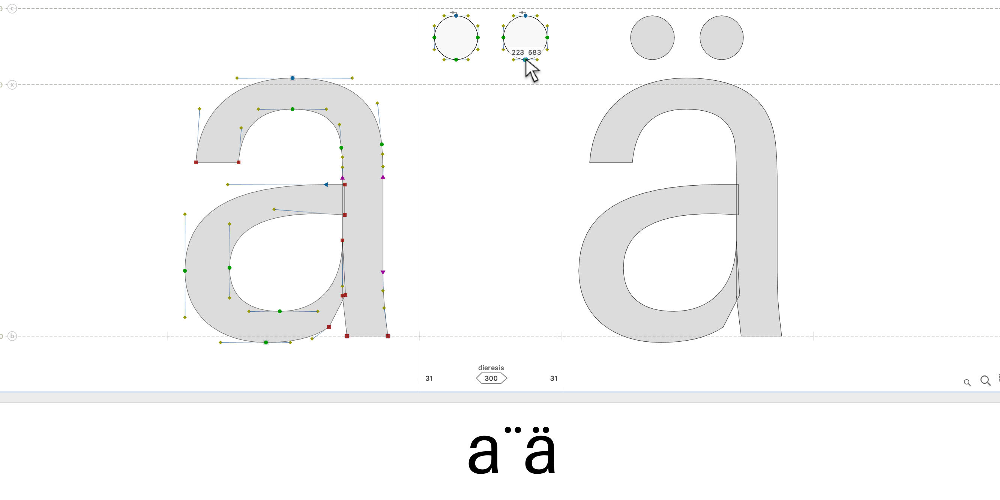
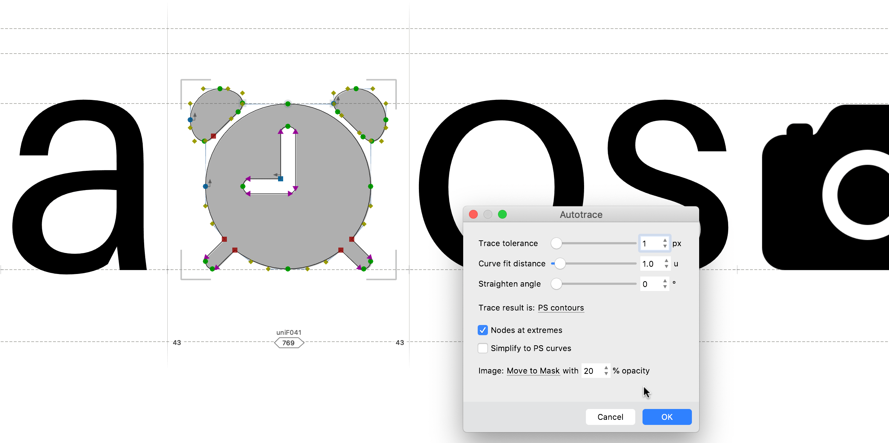
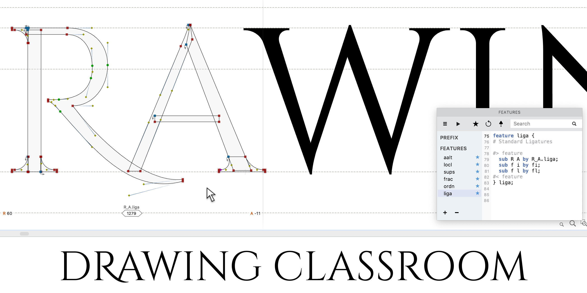
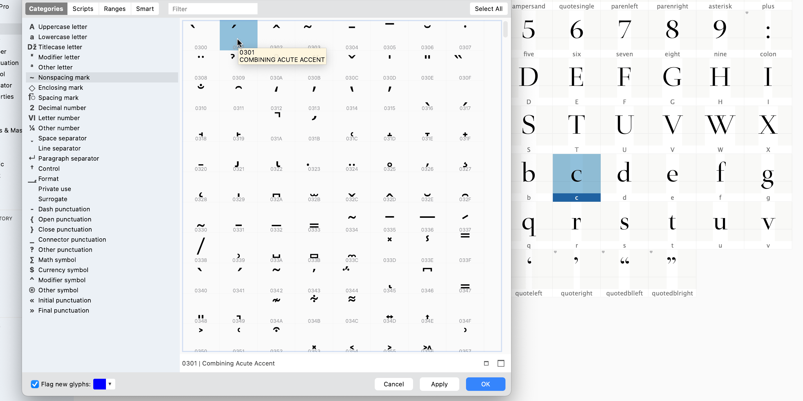
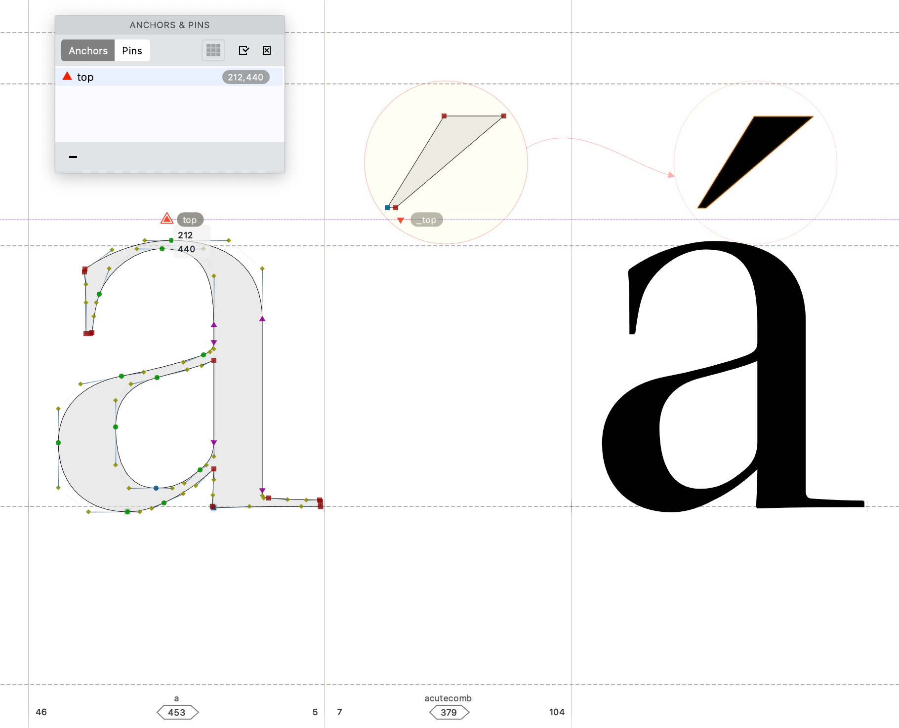
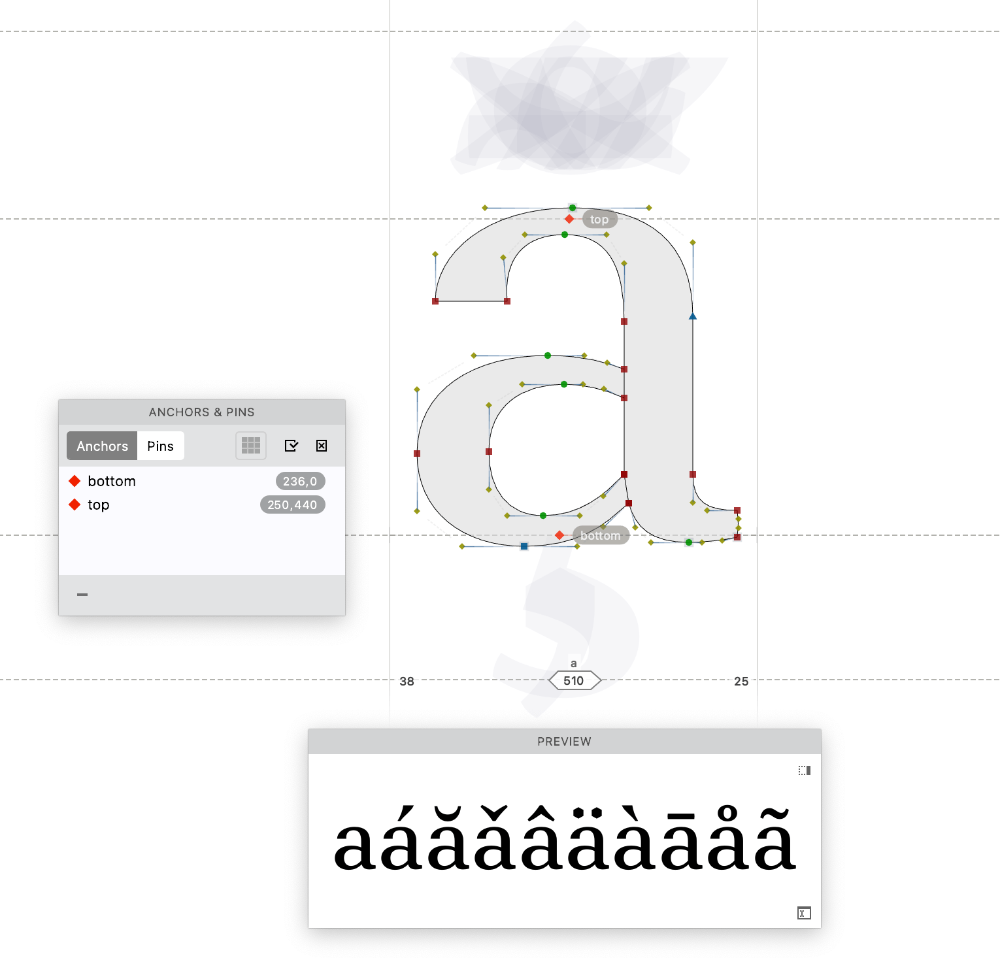

Fifty glyphs is a start. Five hundred is a font that works for most of Europe. Day 3 covers composites, diacritics, symbols, ligatures, and the FontLab tools — auto layers, anchors, auto features — that let you build a large glyph set without drawing each piece from scratch.

<!-- more -->

## Why fonts need more than A–Z

English gets by with the basic Latin alphabet, digits, and common punctuation. Most other Latin-script languages don't. French, Czech, Spanish, German, and dozens more rely on accented letters: àčñü and hundreds of variants. Add Greek, Cyrillic, or Devanagari and the number climbs fast.

Ordinarily, each of these glyphs would require separate drawing. With FontLab's composite system, it doesn't.

Draw a diaeresis once, combine it with your "a", and you have "ä". Include a set of diacritical marks, and one click in FontLab generates all composite letters for European languages. Whenever you change the base letterform, the composites update automatically.

## Symbols without Unicode codepoints

Every character in the Unicode standard has a dedicated code. The Euro sign is U+20AC; FontLab provides a slot for it. But what about symbols that have no Unicode at all?

You can store custom symbols in a font under Private Use Area unicodes (U+E000 to U+F0FF). Or make a dedicated symbol font where typing "A" produces your first symbol, "B" produces the second, and so on.

Adding symbols is simple: copy-paste from Illustrator or Affinity Designer, or drag-drop named image files and let Autotrace convert them to smooth contours.

## Ligatures and alternate glyphs

Ligatures are glyphs that replace two or more adjacent characters with a single combined form. Name a glyph "R_A.liga" (underscore separating component names, ".liga" suffix), and FontLab's **Add Auto Features** command builds the OpenType code automatically. In any OpenType-aware application, typing "RA" will substitute the ligature glyph.

You can also make substitutions context-dependent — different letter variants before or after specific neighbors. Script and handwriting fonts use this extensively to avoid repeating identical letterforms.

## Diacritics in detail: anchors and auto layers

Need a diacritic your font is missing? Go to *Font > Add Glyphs*, select the Nonspacing Mark category, click the cells you need, click OK. Double-click the added glyph and draw the mark — diacritics have simple shapes and take only a few minutes each.

To create the composite "á": go to *Font > Add Glyphs*, choose Lowercase Letter, select "aacute". If your font already has "a" and "acutecomb", FontLab builds the composite with the mark automatically centered above the base. Any future change to either component updates the composite.

For precision positioning, use **anchors**. In "a", add an anchor named "top" using the Guides tool with Shift-click. In "acutecomb", add a corresponding anchor named "\_top" — the underscore prefix creates the link. Turn on *Glyph > Auto Layer* in "aacute", and the mark snaps precisely to where the two anchors meet.

Move the "\_top" anchor in "acutecomb", and the accent shifts in every accented variant that uses it. Move "top" in "a", and all variants of "a" update together. One change, everywhere it applies.

## Further reading

- [On legibility: in typography and type design](https://learn.scannerlicker.net/2014/11/14/on-legibility-in-typography-and-type-design/)

---

## More in this series

1. [Day 1: start making fonts](2022-08-15-8-days-start.md)
2. [Day 2: A-B-C](2022-09-12-8-days-abc.md)
3. **Day 3: beyond A-B-C** (this post)
4. [Day 4: clever fonts](2022-11-07-8-days-clever.md)
5. [Day 5: letter crowd](2022-12-05-8-days-letter-crowd.md)
6. [Day 6: bigger, bolder, better](2023-01-09-8-days-bigger-bolder.md)
7. [Day 7: beyond text](2023-02-13-8-days-beyond-text.md)
8. [Day 8: color is the new black](2023-03-13-8-days-color.md)
