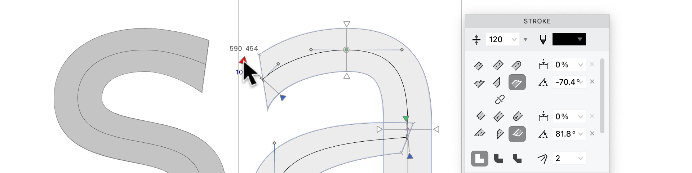

Two of FontLab 8's "What's New" chapters cover drafting and drawing tools, and editing and refining contours. Together they describe a toolkit that has grown considerably since FontLab VI — with a new stroke engine, better selection mechanics, and a precision editing approach that reduces the need to zoom in constantly.

<!-- more -->

## A new stroke engine

FontLab has supported stroke-based design for years — draw a skeleton, let the software expand it to a full outline. FontLab 8 rethinks the underlying engine.

**Simple stroke** applies an outline decoration to a contour, similar to how strokes work in Illustrator. The skeleton is what FontLab "sees" — the stroke is a visual property. It's quick to apply and easy to preview.

**Power Stroke** is different. It creates virtual contours from the stroke on the fly, treating the expanded result as a first-class object. You get control over which portion of the stroke appears inside versus outside the skeleton, different cap shapes at start and end nodes, global thickness with vertical compression for optical compensation, and per-node local thickness adjustment on either side. The result: asymmetric strokes, modulated weight, and faithful calligraphic quality — all without converting to outlines until you're ready.

**Power Brush** takes a different approach than Power Stroke: it traces an ellipse along the skeleton rather than offsetting it. The result is more faithfully calligraphic — it simulates a broad-nib pen — but with fewer cap options and less thickness asymmetry than Power Stroke. For script and calligraphic typefaces, Power Brush is often the right starting point.

The **Thickness** tool modulates stroke weight visually. Drag along a path to make it heavier or lighter locally. Combined with a pressure-sensitive tablet, this lets you draw strokes that taper and swell as naturally as physical media.

## The Sketchboard and import

FontLab's **Sketchboard** is an unlimited canvas outside the font's glyph grid. Drag bitmaps or vectors onto it, sketch freely, arrange and compose without committing to specific glyph slots. When you're ready, Optically Separate breaks a word image into individual glyphs; Place As Glyphs drops them into the font.

SVG, PDF, and AI files can be imported as simple contours, or with their stroke and color properties preserved. Autotrace has been re-tuned for font glyph output — the algorithm knows about stem widths, curves appropriate for letterforms, and the difference between a serif and a stray artifact.

## Editing: selecting, nudging, and precision

The editing chapter is largely about reducing friction in the small operations that compose a working session.

**Slanted marquee selection** — hold Ctrl while dragging a selection rectangle — selects in a rhomboid rather than a rectangle, useful for diagonal strokes. Selections persist when you switch masters, and can be saved to the **Selections** panel for reuse.

**Power Nudge** (the white arrow with modifier keys) moves a node while related nodes follow intelligently — stroke thickness is preserved when you move along a stem. The toolbox toggle lets you switch between standard nudge and Power Nudge without a menu visit.

The **Lever** is the standout new editing feature. Hold Cmd (Mac) or Ctrl (Windows) while dragging a node or handle, and it moves at a fraction of the actual cursor displacement — typically 1/10. You get sub-unit precision without zooming in. This is useful for small kerning and spacing adjustments, curve tension tweaks, and fine-tuning node positions on complex curves.

**Align and collapse** operations work on selected points: align to a grid position, or collapse multiple nearby nodes into one. **Sort contours** reorders them by position, which matters for interpolation compatibility.

The **Eraser** toolbox works in three modes: erase a segment between two nodes (connecting the gap), erase a range of nodes while preserving the contour shape, or erase an entire contour. The mode switch happens in the toolbox sub-tool selector.

---

Full documentation for these features is in the [FontLab 8 manual](https://help.fontlab.com/fontlab/7/manual/) and the [What's New section](https://help.fontlab.com/fontlab/8/whats-new/).
