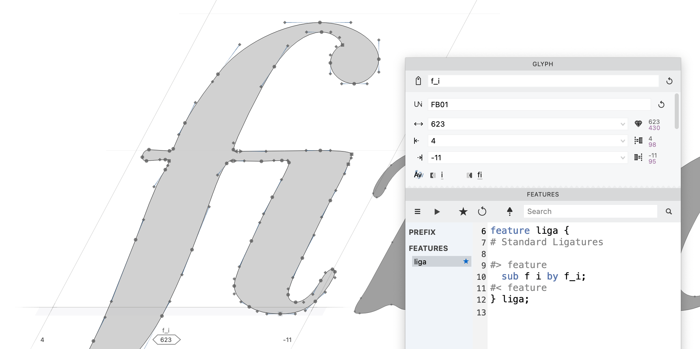
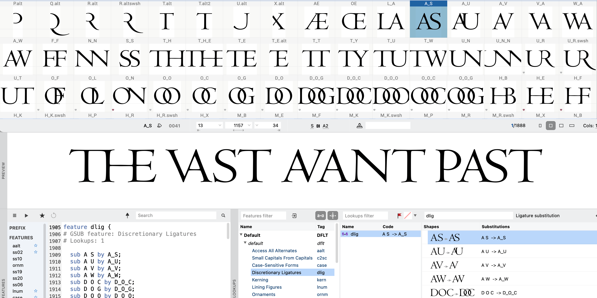
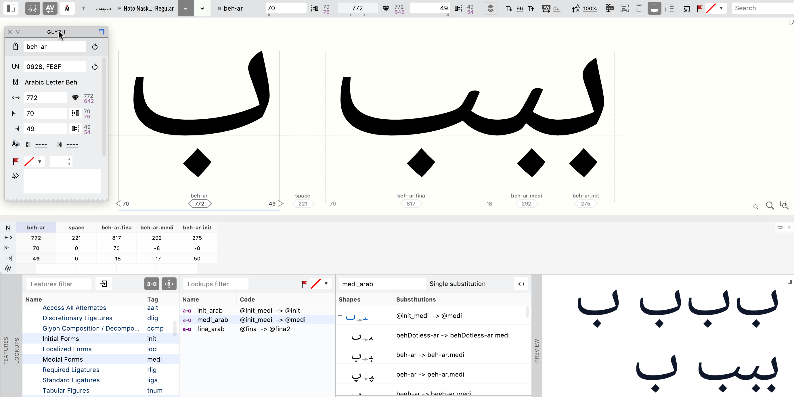
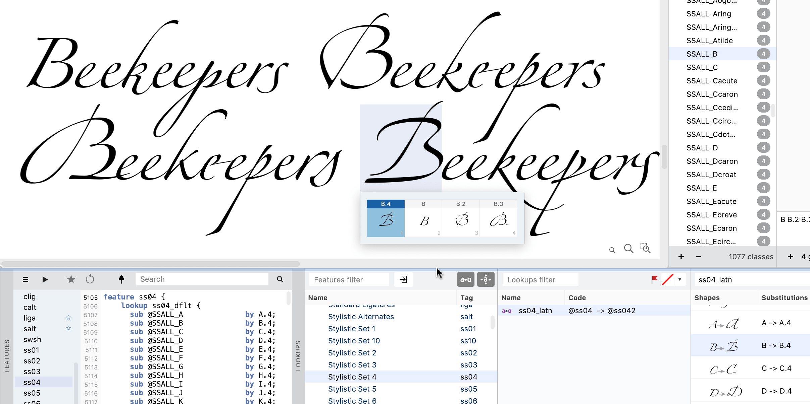
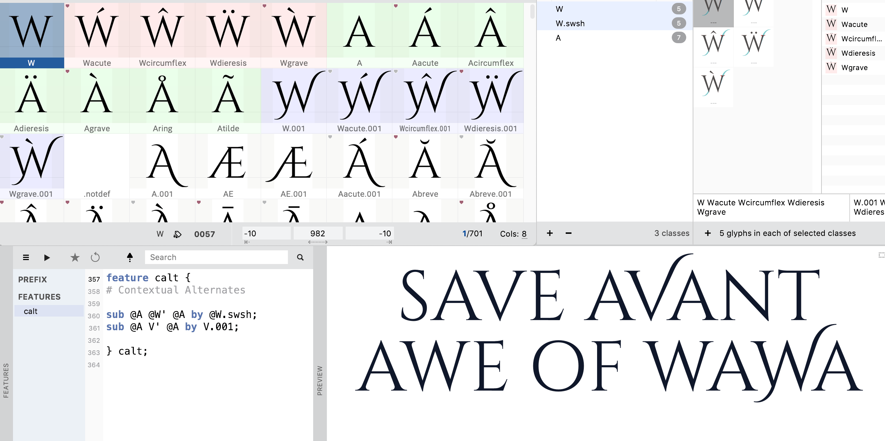

A font is more than a collection of drawings.
Modern OpenType fonts can substitute glyphs automatically, adjust letter positioning
based on context, and adapt to different languages — all driven by code inside the font
file. Day 4 covers ligatures and OpenType features, and how FontLab’s naming conventions
and auto feature generation do most of the work for you.

<!-- more -->

## Ligatures: when two letters become one

You’ve seen those joined “fi” and “fl” pairs in well-set text.
Those are ligatures — single glyphs that replace common letter combinations.
Foundries casting type in metal used them to solve physical incompatibilities between
adjacent letter slugs.
In digital type, they solve optical ones and add visual richness.

Making a ligature in FontLab is a matter of naming.
Create a new glyph with the “fi” design.
In the Glyph panel, name it “f_i” — the underscore between component names tells FontLab
it’s a ligature. Then in the Features panel’s local menu (☰), choose **Add Auto
Features**. FontLab writes the `liga` feature code.
Add more ligature glyphs with the right names and click the star button to update.

The naming rules:
- `f_i` (no suffix) → Standard Ligatures (`liga`), on by default in apps
- `f_i.liga` → also Standard Ligatures
- `s_t.dlig` → Discretionary Ligatures (`dlig`), off by default, user-enabled

## OpenType features: what they are and why they matter

English typographer Walter Tracy wrote: “A great typeface is not a collection of
beautiful letters, but a beautiful collection of letters.”
For digital fonts, that’s truer than ever.

Every glyph is a small program.
A font is a coordinated system of programs.
OpenType Layout gives fonts two kinds of intelligence: continuous variation along design
axes (covered in day 6), and substitution and positioning rules that respond to text
content and context.

In Arabic, a letter takes different shapes at the beginning, middle, or end of a word,
or when it stands alone.
A handwriting or calligraphic Latin font may want different “e” shapes to avoid
repetition. A formal font may want swash capitals only at the start of words, not
mid-word. All of this is OpenType Layout.

OpenType features are named slots — `liga`, `frac`, `smcp`, `calt`, `swsh` — each
associated with lookup rules that swap or reposition glyphs under specified conditions.

## Glyph naming does the heavy lifting

Follow FontLab’s naming conventions and you won’t need to write feature code manually
for the most common cases:

- `A.swsh` → swash variant, goes into the `swsh` feature
- `A.ss01` → Stylistic Set 1 variant, goes into `ss01`
- `A.sc` → small cap, goes into `smcp` and `c2sc`

Name your glyphs, then choose **Add Auto Features** from the Features panel menu.
Done.

For contextual substitutions — where a glyph substitutes only when adjacent to specific
others — you’ll need to write `calt` feature code.
There are good tutorials online and the logic is learnable.
But you’ll be surprised how far the naming conventions alone take you.

## Further reading

- [OpenType features in FontLab 8](https://help.fontlab.com/fontlab/7/manual/OpenType-Features/)
- [Introduction to OpenType programming](https://simoncozens.github.io/fonts-and-layout/features.html)
- [OpenType cookbook](https://opentypecookbook.com/)

* * *

## More in this series

1. [Day 1: start making fonts](2022-08-15-8-days-start.md)
2. [Day 2: A-B-C](2022-09-12-8-days-abc.md)
3. [Day 3: beyond A-B-C](2022-10-10-8-days-beyond-abc.md)
4. **Day 4: clever fonts** (this post)
5. [Day 5: letter crowd](2022-12-05-8-days-letter-crowd.md)
6. [Day 6: bigger, bolder, better](2023-01-09-8-days-bigger-bolder.md)
7. [Day 7: beyond text](2023-02-13-8-days-beyond-text.md)
8. [Day 8: color is the new black](2023-03-13-8-days-color.md)
