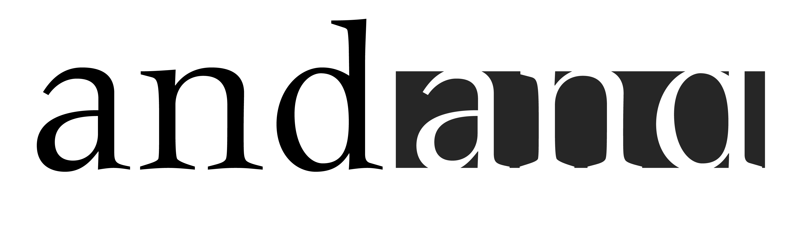
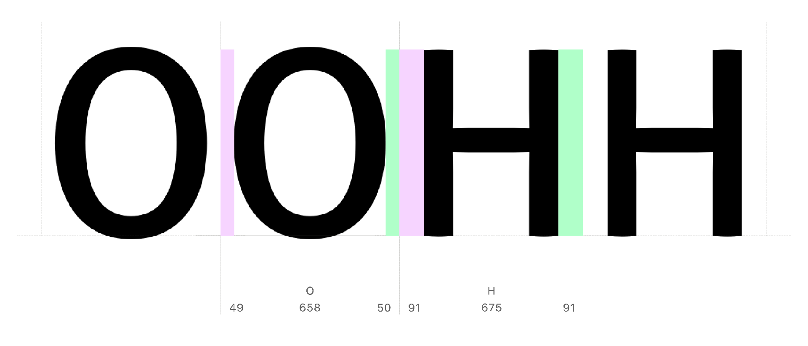
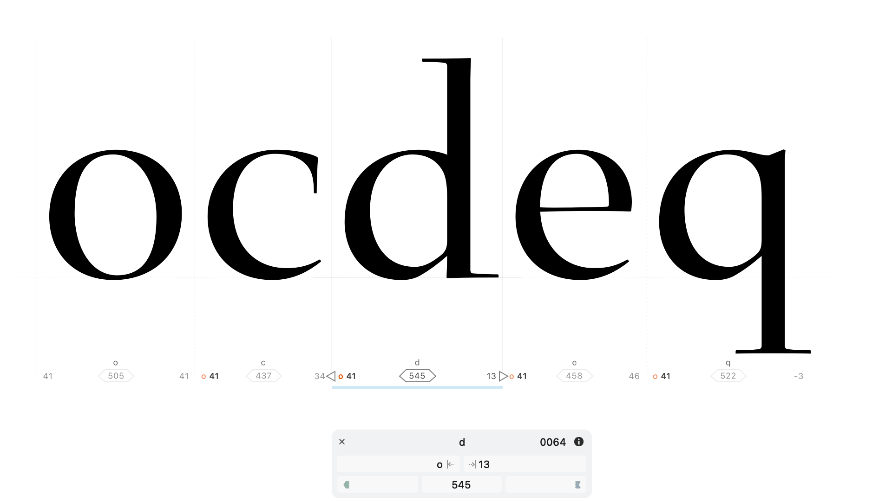
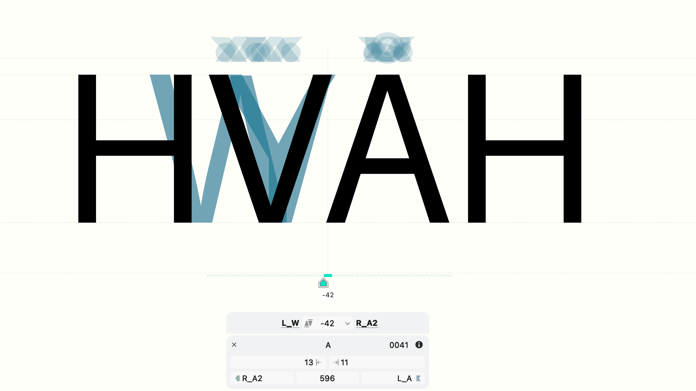

Letters are social creatures. How much space they give each other determines whether a font reads comfortably or looks like a ransom note. Day 5 covers spacing (sidebearings and metrics keys) and kerning (class-based pair adjustment) — the two disciplines that turn a set of well-drawn glyphs into a usable typeface.

<!-- more -->

## Personal space, glyph by glyph

English typographer Harry Carter put it well: "The success or failure of a type is very much a question of getting a good balance of white inside and outside the letters." Swiss designer Adrian Frutiger illustrated this when presenting his Meridien — he showed that the white space between letters is as important as the letterforms themselves.

In FontLab terms, the space to the left and right of each glyph is its **sidebearings**. You can adjust these by dragging the boundary lines in the Metrics window. But doing each glyph individually would take forever, and you'd end up with inconsistent results.

Instead, use **metrics keys**. Start with the "control characters" — 'n' and 'o' for lowercase, 'H' and 'O' for uppercase. Set these until pseudo-words like "nnonoo" and "HHOHOO" feel right. Then link other glyphs to these controls.

The left side of 'b' is flat like 'n', but its right side is round like 'o'. So you assign 'n' as the left sidebearing of 'b', 'h', 'i', 'j', 'k', 'l', 'm', 'p', and 'r'. You assign 'o' as the left sidebearing of 'c', 'd', 'e', and 'q'. Change the 'n' spacing later and all those dependent glyphs update automatically.

Test in running text. Tweak the control characters. Handle the idiosyncratic ones ('a', 'g', 's', 't', 'z') separately — they don't fit cleanly into either the 'n' or 'o' family. The goal is visual equality between all letter combinations, not mathematical equality.

## Kerning: when spacing classes aren't enough

Good spacing gets most letter pairs to sit comfortably together. But some combinations have shapes that collide or gap regardless of how well you've spaced the individual glyphs. The classic case is "VA" — that wedge of open space between the diagonal of V and the slope of A looks odd no matter how the surrounding text is spaced.

Kerning is the per-pair override that fixes this. In FontLab 8, kerning is independent of spacing — adjusting a kerning pair doesn't disturb the underlying sidebearings.

The trick to scalable kerning is **kerning classes**. Similar shapes share similar problems: every capital diagonal (V, W, Y, and their accented variants) has trouble with every capital opening (A, Á, Ä...). Group all the V-family glyphs into a kerning class and all the A-family glyphs into another, kern the class pair once, and the adjustment propagates automatically to every combination of members.

Don't start kerning until spacing is finalized. Kern the big problems first — diagonals, arms, and open shapes — then add exceptions for pairs that still stand out. Step back regularly and look at whole paragraphs, not individual pairs. You're after a comfortable overall texture, not perfection in every combination.

When does kerning end? When the font reads well without distracting gaps or collisions. Trust your eye more than the kerning table.

## Further reading

- [How to space a typeface](https://www.myfonts.com/a/font/content/how-to-space-a-typeface)
- [Briem's notes: spacing](https://help.fontlab.com/fontlab/8/tutorials/briem/5-0-spacing/briem-5-01-spacing/)

---

## More in this series

1. [Day 1: start making fonts](2022-08-15-8-days-start.md)
2. [Day 2: A-B-C](2022-09-12-8-days-abc.md)
3. [Day 3: beyond A-B-C](2022-10-10-8-days-beyond-abc.md)
4. [Day 4: clever fonts](2022-11-07-8-days-clever.md)
5. **Day 5: letter crowd** (this post)
6. [Day 6: bigger, bolder, better](2023-01-09-8-days-bigger-bolder.md)
7. [Day 7: beyond text](2023-02-13-8-days-beyond-text.md)
8. [Day 8: color is the new black](2023-03-13-8-days-color.md)
