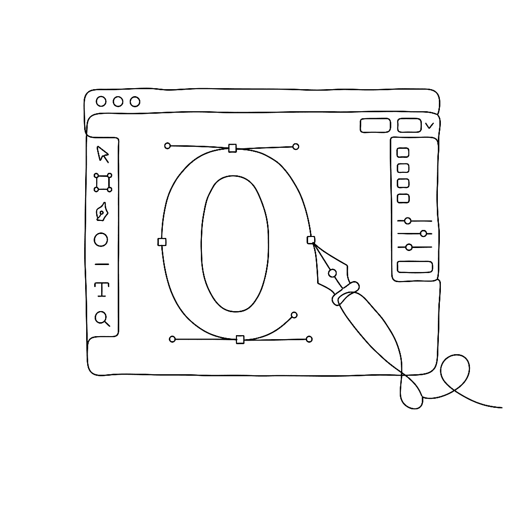
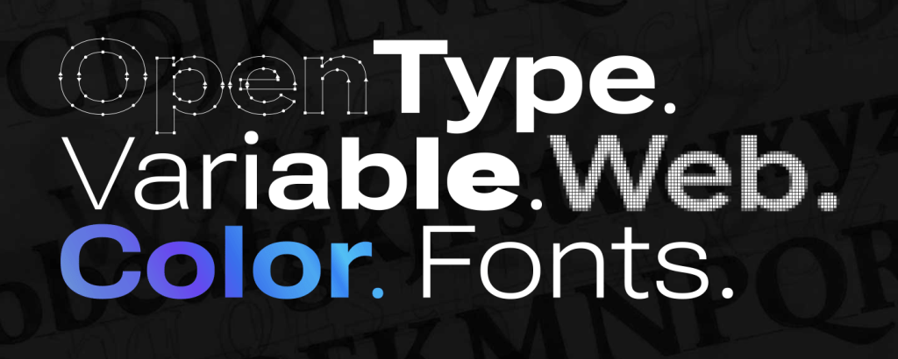

{.illu-thumb .illu-index}

FontLab 8.2 lands with around 250 changes on top of 8.0 — a consolidation release that touches every corner of the app, from the Sketchboard to the export dialog. Drawing tools get smoother handles and snappier strokes; kerning learns to read right-to-left; the COLR format reaches v1; Python moves to 3.11; and a quietly redesigned UI makes large fonts feel lighter to work with. Free for FontLab 8 owners.

<!-- more -->

## Drawing, strokes, and contours

The drawing toolset is where most of the daily craft happens, and most of 8.2’s polish lands here.

**Stroke** and **Brush** modulation is more responsive, and you can now snap their thicknesses to specific distances, stems, or guides — so a calligraphic stroke can match an existing stem rather than getting eyeballed to it. On the Sketchboard, segment and handle lengths and angles are visible while you draw.

In the Glyph window, **Harmonize Handles** is new: a one-click smoothing that produces G2 continuity across a node, the kind of curvature agreement you’d otherwise hand-tune by Tunni line. Node sliding works from the keyboard with arrow keys; conversion between smooth and corner nodes is faster; the **Knife** slices cleanly through nodes; and the *View* menu has been redesigned around how people actually use it. Selection and deselection now have separate undo, which sounds small until the first time it saves you.

The drag-to-zoom experience has been rebuilt — closer to a viewport tool than a modal interruption. Power guides got smarter, autohinting and zone handling improved, and points align cleanly to *Mask*, guides, or grid in one move. Scale, rotate, and slant are losslessly fractional.

## Build, assemble, and OpenType

The single biggest workflow win is **one-click copying of auto-layer recipes** to other masters. If you’ve assembled `aacute` from `a` plus `acutecomb` in your Regular master, the same recipe propagates to Bold and Condensed without rebuilding it three times. The *Skin* filter is better at element switching, and simple contours convert to composites automatically when the geometry matches.

For OpenType features, automatic generation of ligatures, small caps, and old-style numerals from glyph names continues to do most of the heavy lifting; 8.2 sharpens the edge cases.

## Kerning and metrics

Kerning is where 8.2 most clearly grew up. Right-to-left **kerning for Arabic and Hebrew** is supported throughout the Metrics workflow — pair order, exception auditing, class management, RTL kerning import and export between formats — so designers working in those scripts no longer have to hold the file the wrong way around.

**Kern to Distance** is a new autokerning mode that targets a perceived distance between glyphs rather than a numeric pair value. Exception handling is more transparent, and class management has been rebuilt around the way kerning classes are actually used in practice. The Metrics line-spacing workflow gained support for **optical bounds**, which aligns text edges to where the ink actually sits rather than to the bounding box.

## Variation

Adding simple variation is easier — particularly for designers who don’t need a full multi-master tree, just a Light/Bold pair to start. The bigger spec-level change: **conditional glyph substitution** now extends beyond `rvrn` to other features. Variable fonts that swap glyphs at specific axis positions — a different `g` past a certain weight — no longer have to abuse the required-variation feature to get there.

## Glyphs, formats, and colour

The Font window picks up **case conversion** (with title case in the Glyph window), easier renaming, and improved cross-font metrics comparison. Autohinting controls are finer, OpenType feature decompilation is cleaner, and `.glyphs` interop is closer to round-trip.

On export, **temporary font installation** lets you test in another application without permanently installing the build — the font lives for the session and disappears. Glyphs and Sketchboard content can be exported as PDF, SVG, or PNG. Variable COLRv1 fonts open and export, and installed variable fonts open directly.

The big colour news is **OpenType COLRv1** support: gradients, compositing, and variable colour, which COLRv0 couldn’t carry. Combined with the existing SVG, sbix, and CBDT exports, FontLab covers every colour format currently in the wild. **FontAudit** gained detection and fixing of short segments, *Warp* and *Scribble & Strokes* actions are new, and the *Preview* panel has been redesigned.

## Scripting

FontLab 8.2 bundles **Python 3.11.3**, which Python’s own release notes benchmark at roughly 10–60% faster than 3.10 across typical workloads — the difference between scripts that run while you make coffee and scripts that just run. **TypeRig** has numerous improvements and proper dark-mode support.

## Stable, fast, quiet

Underneath the feature list, 8.2 reaches a new level of reliability: many user-reported issues fixed, lower memory consumption, faster operation on large fonts, a more uniform UI in dark and light themes, and Enter usable as a keyboard shortcut. Nothing flashy. Just less friction in every direction.

[Read more →](https://help.fontlab.com/fontlab/8/whats-new/){ .fl-help-cta }
