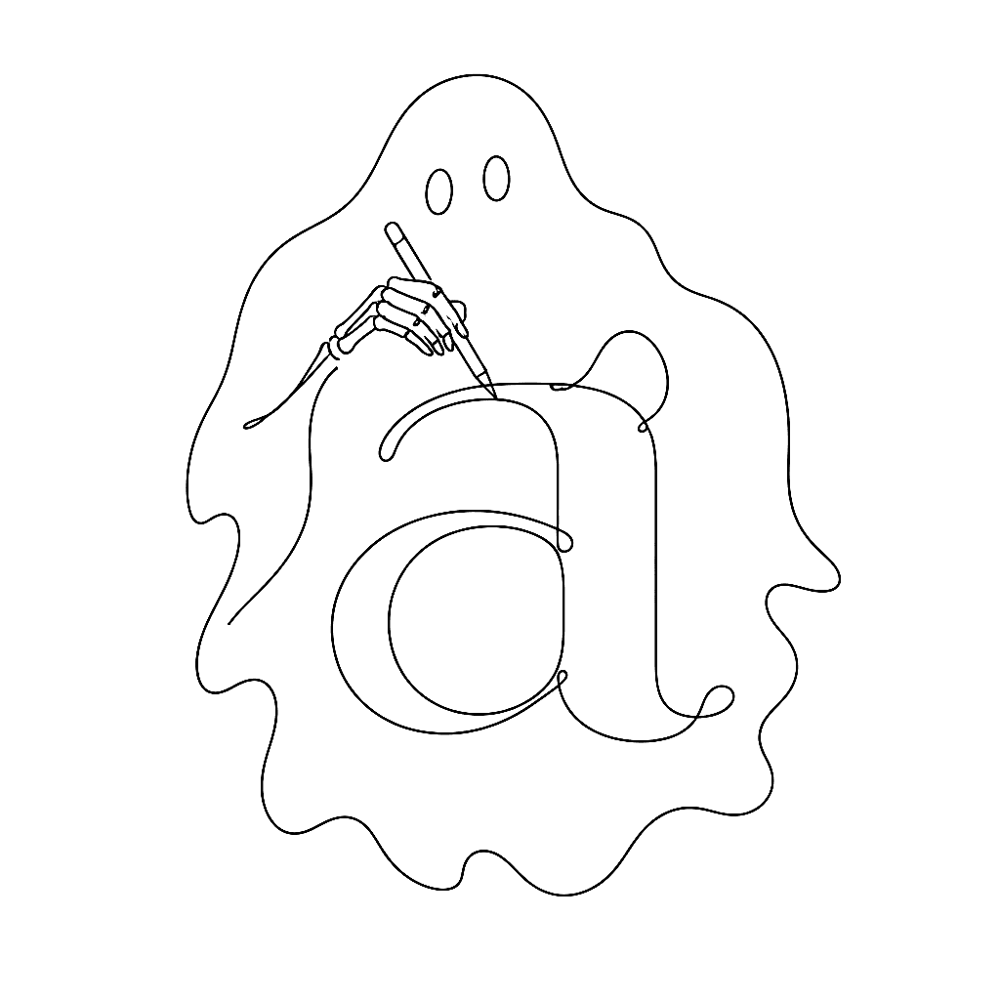

{.illu-thumb .illu-index}

The standard method for digitising a font is to draw the outline.
You map the exterior boundary of the shape with Bezier curves, and you push and pull
nodes until the silhouette behaves.
This works fine for rigid sans-serifs.
For a script font, it feels like sculpting in oven mitts.

<!-- more -->

FontLab 8 sidesteps the problem entirely.
Instead of drawing the skin, you draw the skeleton — a single central line, the nervous
system of the glyph — and FontLab projects a live, editable thickness over it.
The Power Brush traces an ellipse along the path, mimicking a broad-nib pen at a fixed
angle. The Power Stroke takes a different tack: it treats the expanded thickness as a
virtual contour, so you can pull a stroke thicker on the inside of a curve while keeping
the outside tight. Asymmetric expansion, controllable per node.

For local modulation there is the Thickness tool.
With a pressure-sensitive tablet, the stroke swells and tapers in real time as you press
the stylus. The software translates the analog feedback of the human hand into
reproducible mathematics, which is the whole game.

If you prefer to start on paper, FontLab’s Autotrace is tuned for typography rather than
logos. Drop a sketched alphabet onto the Sketchboard, and the algorithm converts the
photograph to vectors with a sense of which marks are intentional serifs and which are
stray pencil lines.
It is not perfect — no autotracer is — but it crosses the gap between
the sketchbook and the grid in seconds.

The deeper point is that calligraphic typefaces are skeletal in conception long before
they are outlined. Tools that respect the skeleton respect the design.

## References

- [Drawing in FontLab — calligraphic basics](https://help.fontlab.com/fontlab/8/tutorials/calfonts/)
- [FontLab 8 — overview](https://www.fontlab.com/font-editor/fontlab/)
- Bezier curves and type design — scannerlicker
- [What’s new in FontLab 8](https://help.fontlab.com/fontlab/8/whats-new/)

[Read more →](https://help.fontlab.com/fontlab/8/manual/){ .fl-help-cta }
