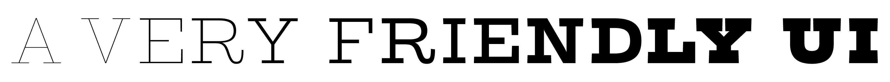
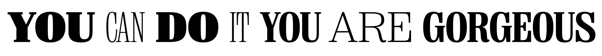

YFF Becha looks like a poster you’d find tacked behind a bar in Lviv — heavy, slightly
off, deliberately so.
It’s the kind of display face that does not pretend to be neutral, and it’s drawn by
Alexander Kapusta at his one-person foundry, Your Font Fetish.

<!-- more -->

Kapusta runs [Your Font Fetish](https://www.yourfontfetish.com/) as a small, opinionated
catalogue: four families currently in the public made-with-fontlab gallery, each with a
strong personality, none of them trying to be everyone’s safe sans.
Becha, Fargo, Rare, and Zarya — display work that knows what it is.

He drew them in FontLab 7 and FontLab 8. Asked about the experience, he keeps it dry:

> Much easier than it sounds to get started with type design.
> Much harder to finish what you started.
> But you can do it in FontLab 8.
> 
> A very friendly interface for such a complex working tool like FontLab 8.
> 
> A little bit of skills in working with a curve, a couple of days reading the manual,
> several months of sleepless nights at FontLab 8, some tears and your first typeface is
> done. You are gorgeous!

— Alexander Kapusta, [Your Font Fetish](https://www.yourfontfetish.com/)

That last line is the honest one.
Type design is months of work that nobody sees, and the tool you use is the thing you
stare at while the deadline crawls toward you.
Kapusta’s pitch for FontLab is not that it makes the work easy — he is explicit that it
does not — but that the tool stays out of the way of the part that’s already hard.

The “friendly interface for such a complex working tool” is the right framing.
FontLab is not a beginner’s app — it ships with FontAudit, expressions, masters and
layers, OpenType feature autogeneration, and a Python API. You do not need any of that
on day one.
You can draw a glyph, set sidebearings, and export a TTF without touching any
of the deeper machinery.
The deep machinery is still there when you need it, which is roughly the moment you stop
being a beginner.

Kapusta’s catalogue is the proof.
Four shipping families from a one-person studio is not a portfolio you ship without the
tool earning its keep.

## More from Alexander Kapusta

- [YFF Becha](https://www.yourfontfetish.com/) — Your Font Fetish
- [YFF Fargo](https://www.yourfontfetish.com/) — Your Font Fetish
- [YFF Rare](https://www.yourfontfetish.com/) — Your Font Fetish
- [YFF Zarya](https://www.yourfontfetish.com/) — Your Font Fetish

[Browse Your Font Fetish →](https://www.yourfontfetish.com/){ .fl-help-cta }
