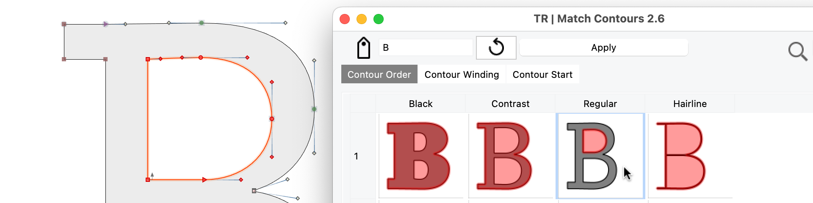

{.illu-thumb}

Type design is an art form.
Font production is a factory job.
Once the aesthetic decisions are settled on the core alphabet, you face the unglamorous
reality of propagating those decisions across hundreds — sometimes thousands — of
glyphs. Doing that by hand is a recipe for repetitive strain injury and existential
dread.

<!-- more -->

## The boring 90%

Open any serious foundry’s production timeline and the visible part — drawing the
lowercase, agreeing on the bowl of the ‘a’ — is maybe ten percent of the work.
The other ninety is propagation: building the diacritics from a base glyph plus an
accent, generating small caps from the lowercase, deriving old-style figures from the
lining figures, normalising sidebearings across the family, exporting to a dozen formats
with a dozen different naming conventions, syncing the result to a test server, and then
running a quality audit before any of it ships.

Doing that by clicking through menus is the wrong shape of solution.
It is repetitive, mistake-prone, and impossible to revisit.
The right shape is a script — a small piece of code that encodes the decision once and
applies it everywhere it needs to apply.

## Python 3.11, faster than it looks

FontLab has supported Python scripting for two decades.
FontLab 8 took the engine to Python 3.11. The version bump sounds like a chore, but it
bought ten to sixty percent faster execution speeds for typical scripts and unlocked the
modern Python ecosystem — `pathlib`, dataclasses, structural pattern matching, all of
it. A script written today reads like Python written today, not like 2007.

The API surface is comprehensive.
Glyphs, masters, contours, anchors, sidebearings, kerning, OpenType features, font info,
export profiles — all addressable from Python, all editable in scripts.
The standard pattern is to open a font, walk the glyph set, apply a transformation,
save.
The unusual pattern is to write a script that runs as part of FontLab’s post-export
hook and operates on the file the editor just produced.

## TypeRig, the production-grade library

The serious script work in the FontLab world is built on TypeRig, the Python library
Vassil Kateliev developed for type-design operations.
TypeRig wraps FontLab’s lower-level API in higher-level abstractions: stem-weight
adjustments across an entire master, systematic metric changes to every diacritic in the
font, custom audit scripts to check for hyper-specific curve anomalies.
What would be three hundred lines of menu-driven clicking becomes ten lines of TypeRig.

A representative script: walk every glyph in the font, find the ones whose advance width
is below a threshold, and report them.
Six lines. Another: open every master, normalise the cap-height anchor, save.
Eight lines. Another: regenerate every composite glyph from its base components after a
change to one of those bases.
Twelve lines.
The kind of work that used to consume a Tuesday afternoon now runs in three
seconds and produces a log.

## Post-export hooks

FontLab 8.3 introduced the ability to run a Python script after the font has finished
compiling. The script gets the path to the exported file and can do whatever it likes:
rename it according to a foundry’s naming convention, copy it to a staging folder,
upload it to a test server, generate a WOFF2 from it via `fonttools`, push the change to
a Git repository, run a regression test against a known-good rendering snapshot.

This is the bit that turns FontLab from a font editor into a node in a build pipeline.
The boundary between the type designer’s craft and the production engineer’s craft
starts to dissolve. The output of the editor becomes the input of a CI/CD process, with
the script as the bridge.

## The rule of five

The rule of thumb in any craft that involves a computer: if you find yourself doing the
exact same sequence of clicks five times in a row, write a script.
The first time costs more than the manual operation.
By the third or fourth use, the script is in profit.
By the tenth, you have a small library of utilities that other people on the team can
also use, and the work that used to be a daily chore is now a Python module someone else
maintains.

This applies as much to a one-person foundry as to a corporate type department.
The economics are the same; the only difference is who maintains the script library.
The aesthetic of FontLab’s scripting environment is to make that library small,
readable, and easy to keep.

## The moral

The goal of Python in a font editor is to eliminate clicking.
The clicks that remain are the ones where a human aesthetic decision needs to happen.
Everything else — the propagation, the export, the QA, the deployment — should be
running while the human is making coffee.
FontLab 8 plus TypeRig is the version of that toolkit that exists today.

## References

- [What’s new in FontLab 8 — scripts and extensions](https://help.fontlab.com/fontlab/8/whats-new/whats-new-12-scripts-extensions/)
- [TypeRig on GitHub](https://github.com/kateliev/TypeRig)
- [Awesome typography — curated list](https://github.com/Jolg42/awesome-typography)
- [FontLab 8 — overview](https://www.fontlab.com/font-editor/fontlab/)

[Read more →](https://help.fontlab.com/fontlab/8/manual/){ .fl-help-cta }
