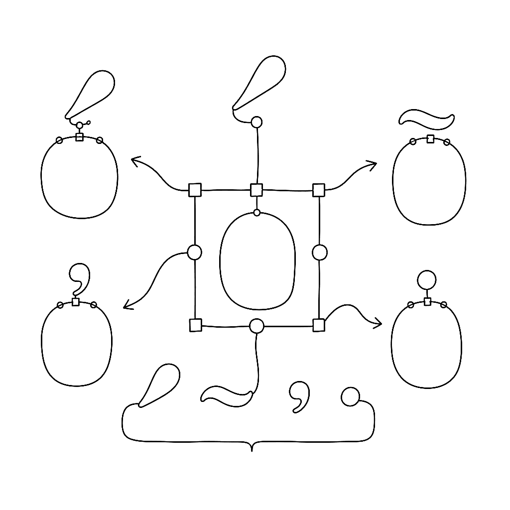
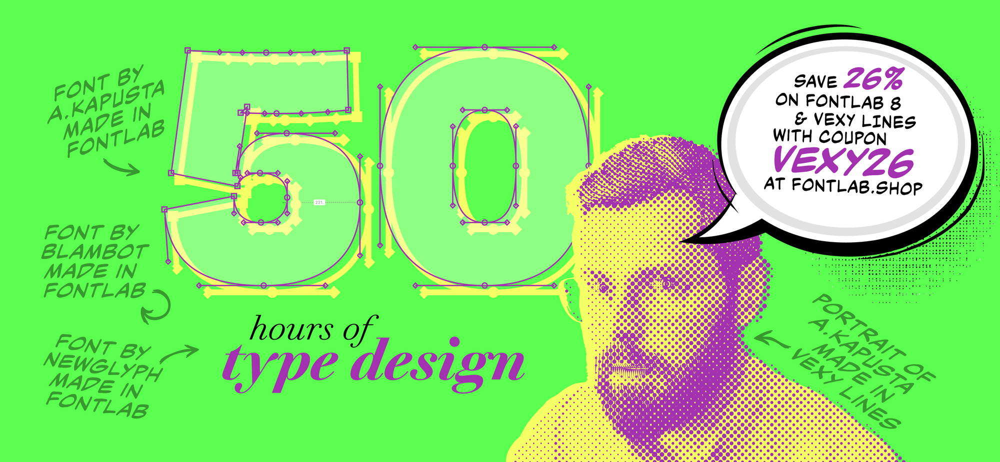

{.illu-thumb .illu-index}

If you are still drawing every accented letter by hand, this is the episode that retires that habit. Anchors plus components mean you draw `a` and `acute` once, and FontLab assembles `aacute`, `acircumflex`, `agrave`, and the other 700-odd accented forms for you.

<!-- more -->

> 📺 Watch: [Auto layers — composite glyphs on FontLab TV](https://www.youtube.com/watch?v=l36FY1YKAek)

## What it covers

**Components, briefly.** A component is a glyph that references another glyph rather than holding its own contours. Move the master, every reference moves. This is the basis of every multi-script and accented font workflow.

**Anchors.** An anchor is a named point — `top`, `bottom`, `ogonek`, `_top` — that says “marks attach here.” The leading underscore on the mark glyph means “this is my attachment point on the *other* side of the connection.” The episode shows the naming convention and how FontLab uses anchor pairs to position marks automatically.

**Auto-generating accented glyphs.** Once `a` has a `top` anchor and `acute` has a `_top` anchor, FontLab can build `aacute` as a composite with both anchors aligned. Multiply that across the alphabet and you get full Latin Extended-A coverage almost free.

**Stacked marks and combining accents.** The episode covers the case where one mark stacks on another (`combiningacute` over `combiningmacron`), and what the OpenType `mark` and `mkmk` features do at runtime to keep that stack stable.

## Why it matters

Most languages that use Latin script need a lot of accented glyphs. Anchors and components are how you ship them without losing your weekend. They are also what makes Vietnamese, Polish, Czech, and Eastern European Latin coverage achievable for solo designers.

[Read more →](https://help.fontlab.com/fontlab/8/manual/){ .fl-help-cta }
