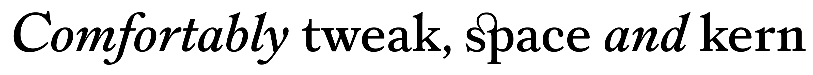

{.illu-thumb }

Bananas is a casual brush face that is mostly an excuse to grin while you set it. Ronaldson Pro is a 19th-century revival that took years to draw and exists because Patrick Griffin would not let the original die. Both are Canada Type. Both came out of FontLab.

<!-- more -->

Griffin runs [Canada Type](https://canadatype.com/) and has spent more than two and a half decades shipping revival and original families. The made-with-fontlab gallery shows the range with four representative entries: [Bananas](https://canadatype.com/product/bananas/) (Griffin alone), [Borax](https://canadatype.com/product/borax_/) (Griffin with Jamie Chang), [Goluska](https://canadatype.com/product/goluska/) (drawn by Rod McDonald, also a longtime FontLab user), and [Ronaldson Pro](https://canadatype.com/2021/10/20/ronaldson-pro/) (Griffin after Alexander Kay). The full catalogue at Canada Type is far larger.

Griffin is not a man given to soft praise. His testimonial is one sentence long and lands clean:

> Having used so many font development products for more than 27 years now, I can say without hesitation that FontLab 8 is the best and most comprehensive font making and editing program ever made. Its customizability and wealth of features set a very high bar for adaptability in simple, complex or automated environments. Add a positively responsive development team and a helpful support community, and FontLab 8 should easily be the primary tool in every type designer’s daily workflow.

— Patrick Griffin, [Canada Type](https://canadatype.com/)

Twenty-seven years of trying every editor on the market is a long apprenticeship in what the alternatives don’t do. The phrase to read carefully is “adaptability in simple, complex or automated environments.” Canada Type ships brush scripts and exhaustive Latin Extended revivals out of the same studio. The brush scripts want a fast drawing loop and not much else. The revivals want everything: components, references, masters, OpenType features, glyph variants, and the Python hooks to automate the boring bits. One tool that does both, without forcing you into one workflow, is rarer than it should be.

Ronaldson Pro is the case study. The original Ronaldson is a Philadelphia text face from 1884; reviving it properly meant recovering optical sizes, alternate glyphs, ligatures, and the small-caps and old-style figures that make a 19th-century text face actually function as one. The credits on that family — FontLab Studio 5, Glyphs 2, FontLab 7 — quietly tell the story of Griffin moving the project forward across software generations as the tools improved. The current “primary tool” he names is FontLab.

## More from Patrick Griffin

- [Bananas](https://canadatype.com/product/bananas/) — Canada Type
- [Borax](https://canadatype.com/product/borax_/) — Canada Type (with Jamie Chang)
- [Goluska](https://canadatype.com/product/goluska/) — Canada Type (drawn by Rod McDonald)
- [Ronaldson Pro](https://canadatype.com/2021/10/20/ronaldson-pro/) — Canada Type

[Browse Patrick Griffin →](https://www.myfonts.com/collections/patrick-griffin){ .fl-help-cta }
