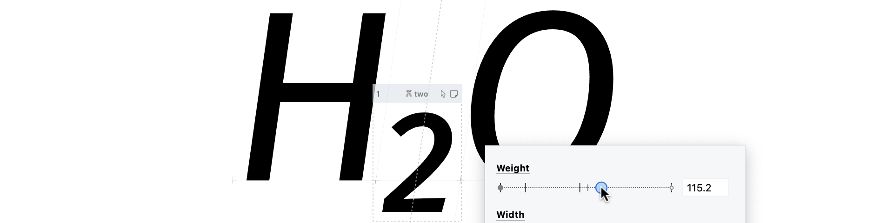

The marketing for variable fonts has spent a decade promising smaller downloads.
The smaller downloads are real.
They are also the least interesting thing about the format.

<!-- more -->



## Yes, the page weight drops

We used to ship eighteen separate font files just to make a website look decent.
It was a dark time. Now you ship one, and the browser handles the math.
CSS does the rest:

```css
@font-face {
  font-family: 'Roboto Flex';
  src: url('roboto-flex.woff2') format('woff2-variations');
  font-weight: 100 1000;
  font-stretch: 25% 151%;
}
```

You write `font-variation-settings: 'wght' 700, 'wdth' 85;` and the text responds
instantly. No flicker.
Layouts stay put. Performance wins twice — smaller payload, smoother animation.
Google’s Roboto Flex specimen shows the full range live; Monotype rebuilt FF Meta as a
variable font and replaced a small library with a single file.

The Google Fonts and web.dev articles have repeated this story for years and they are
correct. They are also where the conversation usually stops, which is a shame, because
the file-size argument is the boring half.

## The maths underneath, briefly

For five hundred years, making a letter bolder meant casting a new chunk of lead.
Digital typography clung to the habit for decades.
You wanted bold italic, you bought a separate file.
Then in 2016, Apple, Adobe, Google, and Microsoft agreed on OpenType Font Variations,
and a whole family started fitting inside one file.

A variable font stores a default master design plus a dense set of mathematical
instructions for stretching and squishing it along continuous axes.
Two axes — weight and width — define a square with four corners: Light Condensed, Light
Wide, Black Condensed, Black Wide.
The renderer interpolates any point inside the square on demand.
Add an axis and you get a cube.
Add another and your design lives in a hyperspace nobody can draw on paper, but the file
does not care.

Linear interpolation has limits.
Letters do not get bolder at a constant rate.
If you interpolate straight from a hairline to an ultra-black, the middle weights look
anaemic or muddy. The fix is intermediate masters: a corrected drawing at, say, the 700
weight position, which warps the interpolation path through that anchor.
Sometimes a glyph needs to change shape entirely — a single-storey `g` past weight 850 —
and the format handles that through the `rvrn` feature.

## Continuous control changes the design itself

A static family forces the typesetter to choose between Regular and Bold, with nothing
in between. A variable family lets the typesetter pick 525 — between Medium and Semibold
— because that is the weight the column actually wants.
UI teams use this for hierarchy.
Editorial teams use it for colour balance on a tight page.
Motion designers use it because the same axis that controls weight in CSS controls the
keyframe in After Effects.

Underware’s argument from 2018 still holds: variable fonts get interesting when you stop
treating old categories as sacred.
Time can be an axis.
Motion can be an axis.
The interface itself can become part of the typeface experience.
A weight slider is the start, not the destination.

## The argument crosses every language

The same case for variable fonts has been made, in slightly different accents, in
Polish, Spanish, Chinese, Japanese, and Korean tutorials over the past few years.
They all converge. Chinese and Japanese guides explain variation axes as levers for
weight, width, slant, and optical size, noting that axes can be continuous ranges or
simple on–off switches.
Polish and Spanish articles speak the language of practice: fewer HTTP requests,
smoother responsive type scales, the comfort of adjusting weight in fine steps instead
of jumping between Regular and Bold.
Korean writing goes further, treating variable fonts as part of design systems — using
Roboto Flex and similar families to tune stroke width, counter size, and contrast for
specific screen densities and hierarchy levels.

A Spanish primer on Runebook puts it bluntly: if your OS and browser are even vaguely
current, your bottleneck is no longer technology.
It is whether your typeface is ready.

## What the production tool has to do

Building these files needs capable software.
FontLab 8 treats the variation space as a primary unit.
Open a Light and a Black as masters; the engine establishes the axis automatically.
Add an intermediate master where linear interpolation muddies the middle.
Tag a single-storey `g` to swap in past weight 850 via `rvrn`. Match Moves propagates a
node adjustment across all visible masters at once — often the difference between
meeting and missing a deadline on a serious family.

External reviewers have flagged FontLab 8 as a complete variable-font production
environment on macOS and Windows, closing the long-standing gap for Windows-based
designers who needed robust interpolation, OpenType features, and export in one app.
In practice, that means you can draw a Light and a Black, interpolate the in-between
masters, define `wght`, `wdth`, and custom axes, and export one file that speaks
fluently to a Korean news site, a Japanese app UI, and a Polish cultural portal.
All those multilingual tutorials stop being aspirational.
They describe what you can ship today.

## The point

Look at Roboto Flex or IBM Plex Sans Variable.
A single file acts as a complete typography system.
UX teams get granular control without licensing a new weight every time a client changes
their mind. Designers get a continuum instead of a ladder.

The savings on bandwidth are nice.
The control is the point.

## References

- [Variable fonts on the web — web.dev](https://web.dev/articles/variable-fonts)
- [Variable fonts — MDN](https://developer.mozilla.org/en-US/docs/Web/CSS/Guides/Fonts/Variable_fonts)
- [OpenType Font Variations — Microsoft](https://learn.microsoft.com/en-us/typography/opentype/spec/otvaroverview)
- [Very-able fonts — Underware](https://www.underware.nl/blog/2018/06/very-able-fonts-com/)
- [Variable fonts and screen typography — Typoteka](https://typoteka.pl/en/period/variable-fonts-and-screen-typography)
- [Migrating to variable fonts — Google Codelabs](https://codelabs.developers.google.com/migrating-variable-fonts)

[Read more →](https://help.fontlab.com/fontlab/8/whats-new/whats-new-07-families-variation/){ .fl-help-cta }
