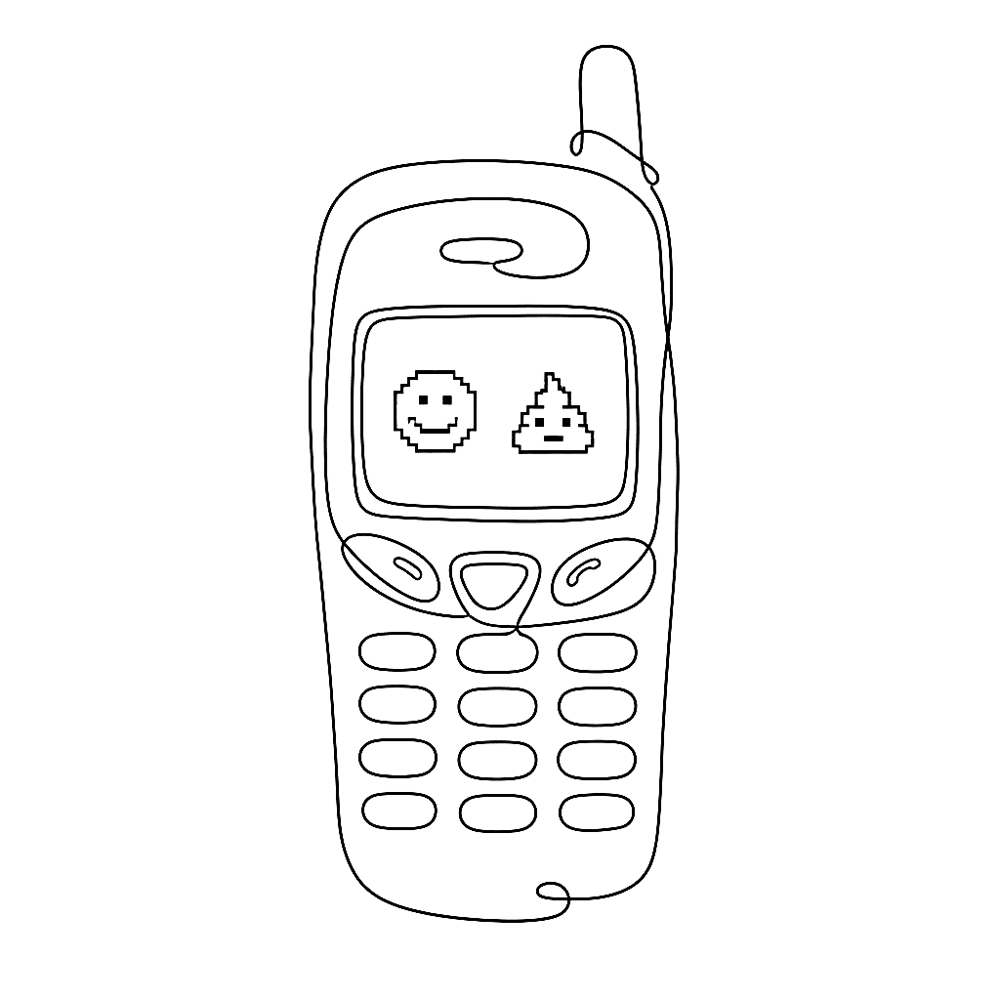

{.illu-thumb .illu-index}

The story everyone tells is that Shigetaka Kurita designed emoji at NTT Docomo in 1999.
It is a good story. It is also wrong.

<!-- more -->

Emojipedia corrected the record in 2019. The first commercial emoji set shipped on the
**SoftBank/J-Phone SkyWalker DP-211SW in 1997** — ninety glyphs, monochrome, twelve by
twelve pixels. The pile of poo was already there.
Kurita’s 1999 set was influential, better documented, and designed by someone with a
name attached to the project.
It was not first.

That correction matters more than a trivia point.
The SoftBank set arrived two years before Docomo’s, which means emoji were a competitive
feature before anyone had decided they were culturally significant.
They weren’t designed as art or communication theory.
They were designed to sell phones.

**Apple Color Emoji** shipped on November 21, 2008, with iPhone OS 2.2 — 471 glyphs,
originally Japan-only, tied to SoftBank’s exclusivity deal with Apple.
The designers were Raymond Sepulveda, Angela Guzman, and Ollie Wagner.
Guzman later wrote about the process: every glyph had to read at 20 × 20 pixels and hold
up at larger sizes, which meant simplifying and then simplifying again until the thing
that remained still looked like itself.

Two years after that, Unicode 6.0 (2010) accepted emoji as proper code points.
The characters that teenagers were sending each other had to be added to the same
standard that encodes ancient Sumerian.

The easter eggs in the Apple set are still there.
The 📰 newspaper headline reads “The Apple Times.”
The 📅 calendar shows **July 17** — the day Apple announced iCal in 2002, and the day
Emojipedia eventually designated World Emoji Day.

**Microsoft open-sourced 1,538 Fluent Emoji on August 10, 2022**, under MIT licence —
the first major vendor to make their emoji set actually free to reuse.
The rest remain proprietary.

The reason this matters for a font tool is that emoji forced the colour-font question.
Every “should fonts have colour” argument from the 2000s lost the moment a Japanese
teenager could send a smiley face.
Apple shipped SBIX (PNG bitmaps).
Google shipped CBDT. Microsoft and Adobe proposed COLR and OT-SVG respectively.
COLRv1 arrived in 2021 and the browsers followed through 2022. The whole stack — CPAL,
`@font-palette-values`, colour font tooling in FontLab — exists because in 1997 someone
at J-Phone decided ninety tiny pictures would sell a handset.

## References

- [Correcting the record on the first emoji set — Emojipedia](https://blog.emojipedia.org/correcting-the-record-on-the-first-emoji-set/)
- [Apple Emoji turns 10 — Emojipedia](https://blog.emojipedia.org/apple-emoji-turns-10/)
- [Apple did not invent emoji — eev.ee](https://eev.ee/blog/2016/04/12/apple-did-not-invent-emoji/)
- [Bringing new emoji to Windows 11 — Microsoft Design](https://microsoft.design/articles/bringing-new-emoji-to-windows-11/)

[Read more →](https://www.fontlab.com/font-editor/fontlab/){ .fl-help-cta }
