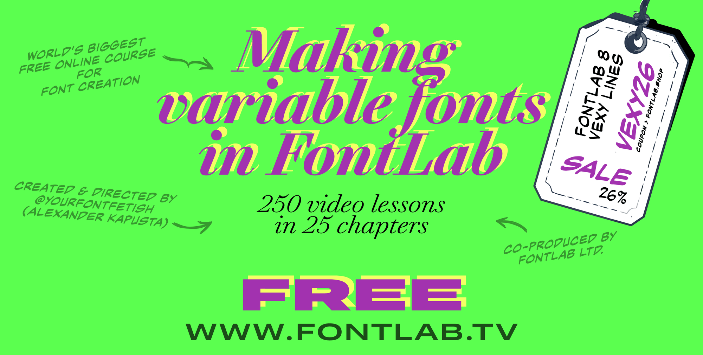

{.illu-thumb}

Design space is the part of variable font work that decides whether your font feels good
or merely works. The FontLab TV design space episode is the conceptual foundation for
everything you do with masters, axes, and instances.

<!-- more -->

> 📺 Watch:
> [Design space axes & multiple masters on FontLab TV](https://www.youtube.com/watch?v=AijDkf3DBk8)

## What it covers

**The space, not the masters.** A design space is a coordinate system.
Masters are points in it.
Instances — what users see when they pick “Bold” or set a slider — are coordinates in
that same space. Once you think this way, axis design starts to feel like a normal
modeling problem.

**Choosing axes.** The five registered axes (Weight, Width, Italic, Slant, Optical Size)
cover most cases, but custom axes solve things the registered ones cannot — `XHGT` for
x-height, `YOPQ` for stroke contrast, the kind of thing the variable-font spec was
designed to make extensible.

**Master placement.** Masters at the corners of the space define the linear
interpolation. The episode shows when corners are enough and when you need an interior
master to control a specific instance — for instance to keep the Bold from being
mathematically the average of Light and Black.

**Instance design.** Named instances (`Light`, `Regular`, `Bold`, `Black`) are
coordinates plus a name table entry.
The video shows how to set up the STAT table so that operating systems and apps name
your instances correctly in font menus.

**Axis ranges and conditional substitution.** A late-episode topic worth knowing about:
the `rclt` and `rvrn` features let you substitute one glyph for another when the design
space crosses a threshold.
Useful for letterforms that need to change shape at certain weights.

## Why it matters

Most variable font problems are design space problems.
This episode is the framing that lets you debug VF behaviour by drawing diagrams instead
of guessing.

[Read more →](https://help.fontlab.com/fontlab/8/manual/){ .fl-help-cta }
