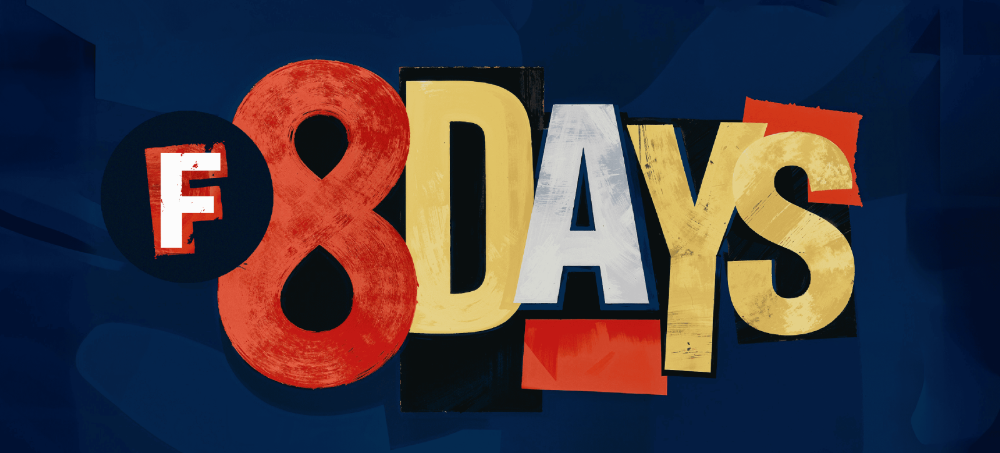

A bold weight is not a thicker version of the regular.
It is a different design that has to share a family with the regular and pretend they
were drawn together.
Briem’s bold tutorial — adapted lightly here — is the cleanest argument for why the
obvious approach doesn’t work.

<!-- more -->

## The wrong way

Take the regular, scale every contour outward by 30 units, ship it as Bold.
The result is recognizable.
It is also wrong in three specific ways:

1. **Counters close up.** The white space inside `o`, `e`, `a`, `n` collapses.
   By the time you can read the bold at small sizes, the letters look choked.
2. **Round letters get fat.** Curved sides take the offset on both edges; the visual
   weight of `o` becomes heavier than the visual weight of `n`.
3. **Joins thicken non-linearly.** Where two strokes meet — `n`’s top-right join, `a`’s
   spine — the offset overlaps and produces a darker spot than the rest of the letter.

## What to do instead

**Keep counters open.** The widths of `n`, `o`, `H`, `O` should grow when you go bold.
Letters get wider, not just darker.
Briem’s rule of thumb: a bold weight is roughly 5–10% wider than the regular at the same
point size.

**Distribute weight asymmetrically on curves.** Round letters take more weight on the
inside than the outside.
The contrast axis (the angle along which the thick parts of the letter sit) usually
stays the same as the regular, which means the inside of `o` is darker than the outside.

**Resolve joins manually.** At every place where two strokes meet, look at the corner
and decide what should happen.
Sometimes you trim. Sometimes you ink-trap.
Sometimes you let the join darken because the letter needs that darkness.
What you do not do is leave it alone.

## The masters question

If the regular and bold are two masters of a variable font, all of the above has to be
designed so that intermediate weights interpolate cleanly.
That is one more reason to draw the bold deliberately rather than offset-and-pray — bad
bold geometry produces ugly intermediate weights all the way down the axis.

## Practical exercise

Draw a regular `n`. Then draw a bold `n` from scratch — same height, same x-height —
without scaling the regular.
Compare. The differences you find on `n` are the differences you will need to apply
across the rest of the lowercase.

[Read more →](https://help.fontlab.com/fontlab/8/tutorials/briem/4-2-bold/briem-4-21-exercise2/){ .fl-help-cta }
