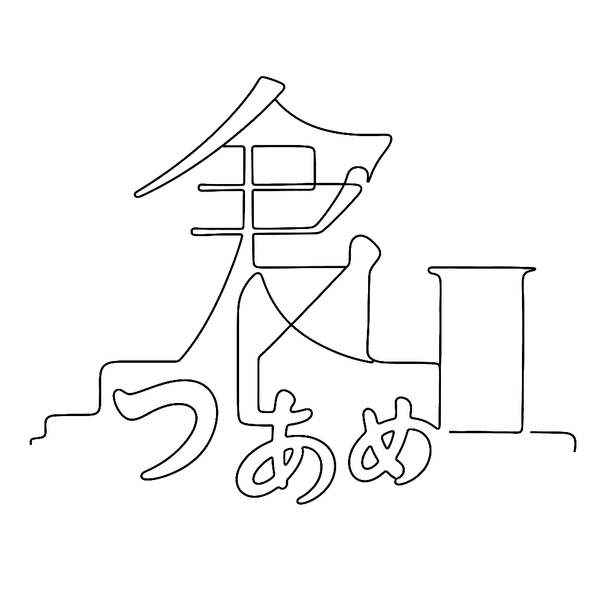

{.illu-thumb
.illu-index}

The problem with Japanese set in Helvetica has annoyed transit designers for fifty
years. In January 2017, Akira Kobayashi did something about it.

<!-- more -->

The structural problem is this.
Japanese kanji sit taller than Latin caps.
Japanese kana sit shorter.
The Latin baseline and the CJK optical centre don’t agree.
On a sign, in a brochure, in a UI — any line that mixes Japanese and European type in a
sans-serif has a vertical alignment problem that the layout software cannot fix, because
the mismatch is baked into the fonts themselves.

Sign painters and book designers have worked around it for half a century.
**Akira Kobayashi**, working with **Kazuhiro Yamada** and **Ryota Doi**, designed
**Tazugane Gothic** to fix the specific version of the problem that bothered him most:
Japanese with Helvetica, on transit signage, looking visually broken.

Released on **25 January 2017**, Tazugane is built as a partner for **Adrian Frutiger’s
Neue Frutiger 1450**. The solution is precise rather than approximate: Frutiger glyphs
are scaled to **108%** with the baseline shifted down, so Latin caps and kanji visually
align without either feeling stretched or repositioned.
Ten weights, Ultra Light through Extra Black.

The name is the surprise.
**Tazugane** is an archaic Japanese word for crane — 鶴, a symbol of longevity.

> “I had never heard of the archaic Japanese word for Tazugane but I immediately liked
> it as it reminded me of the grace and elegance of the crane.”
> — Akira Kobayashi

**Monotype acquired Fontworks in 2023**, which puts Tazugane and the Tsukushi family —
most of the Japanese type Apple ships — under one corporate roof with most of what
Monotype already owned.
The Japanese type landscape consolidated faster than most people expected.

For a FontLab designer working on a mixed-script family, Tazugane is a useful case study
in what “harmonised” actually means in practice.
It is not “make things look similar.”
It is “decide exactly which numbers need to change, and by how much, so that the eye
stops noticing the join.”

## References

- [Tazugane Gothic — Monotype](https://www.monotype.com/resources/font-stories/tazugane-gothic-a-japanese-typeface-with-the-elegance-of-a-crane)
- [Monotype acquires Fontworks — Print Mag](https://www.printmag.com/type-tuesday/monotype-acquires-fontworks-interview-akira-kobayashi/)

[Read more →](https://www.fontlab.com/font-editor/fontlab/){ .fl-help-cta }
