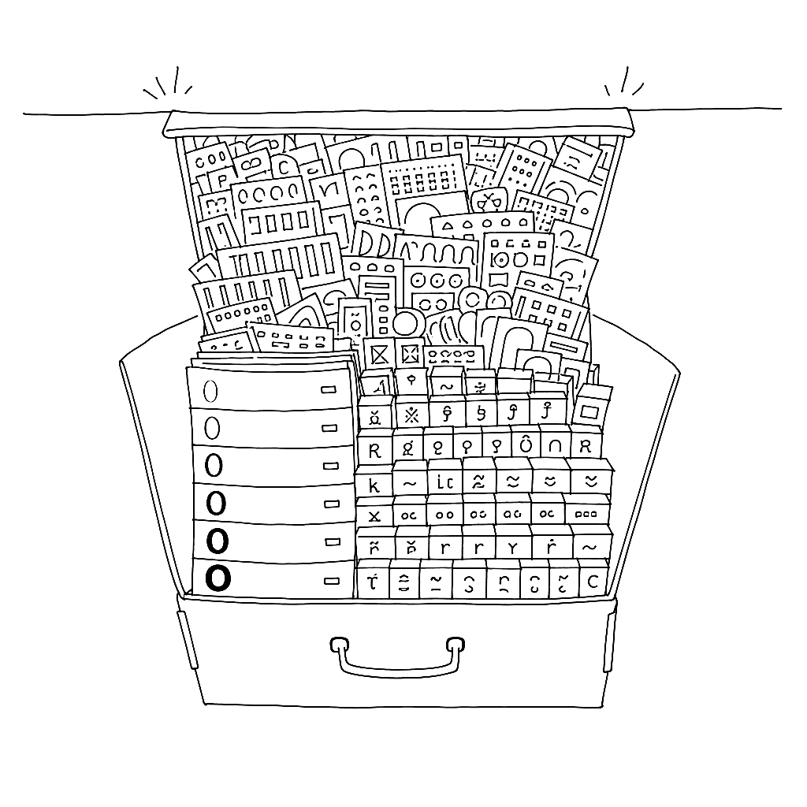

{.illu-thumb .illu-index}

Seven weights. Four regional variants.
65,535 glyphs each — the maximum an OpenType font can hold.
Adobe and Google hit the ceiling on purpose.

<!-- more -->

**Source Han Sans** was released on **15 July 2014**. Lead designer: **Ryoko Nishizuka**
at Adobe Tokyo. Project architect: **Dr Ken Lunde**, who has spent three decades writing
the reference books on CJK Unicode that everyone else cites.
Foundry partners: **Iwata** (Japan), **Sandoll** (Korea — designers Joo-Yeon Kang and
Soo-Young Jang), **Changzhou SinoType** (China).
The Latin, Greek, and Cyrillic glyphs come from Source Sans (Paul Hunt), scaled to
**115%** to match the CJK x-height.

Seven weights × 65,535 glyphs each.
Four regional variants — Simplified Chinese, Traditional Chinese, Japanese, Korean —
switching via the OpenType `locl` feature: the same Unicode code point resolves to a
different glyph depending on the document’s language tag.
Total across weights and variants approaches **450,000 glyphs**. Latest version is
2.005, released June 2025.

> “These fonts achieve the goal of ‘No More Tofu,’ meaning no empty glyphs when
> typesetting Unicode.”
> — Geumho Seok, CEO of Sandoll

The cultural fact, which is harder to find in the documentation, is what it took to get
four foundries to agree.
Weight curves, stroke proportions, which radicals were drawn consistently across regions
and which needed to differ — these are not technical questions with technical answers.
The same Unicode code point genuinely is a different character in a Tokyo newspaper and
a Beijing one. The same character looks different because it *is* different: different
calligraphic tradition, different stroke memory, different reader expectation.
Source Han Sans is the negotiated result of four teams arguing about that in detail
across multiple time zones.

For a FontLab user the technical payoff is concrete.
Source Han’s regional switching is the largest production deployment of language-tagged
glyph substitution (`locl`) that has ever shipped.
Reading its sources — the full project is on GitHub under an open licence — is the
fastest way to understand what `locl` is actually for, at a scale that no tutorial can
fake.

The project is also a reminder that “pan-CJK” is not a style claim.
It is an engineering commitment with a very specific cost.

## References

- [Introducing Source Han Sans — Adobe blog (2014)](https://blog.typekit.com/2014/07/15/introducing-source-han-sans/)
- [Source Han Sans — Wikipedia](https://en.wikipedia.org/wiki/Source_Han_Sans)
- [Source Han Sans — GitHub](https://github.com/adobe-fonts/source-han-sans)

[Read more →](https://www.fontlab.com/font-editor/fontlab/){ .fl-help-cta }
