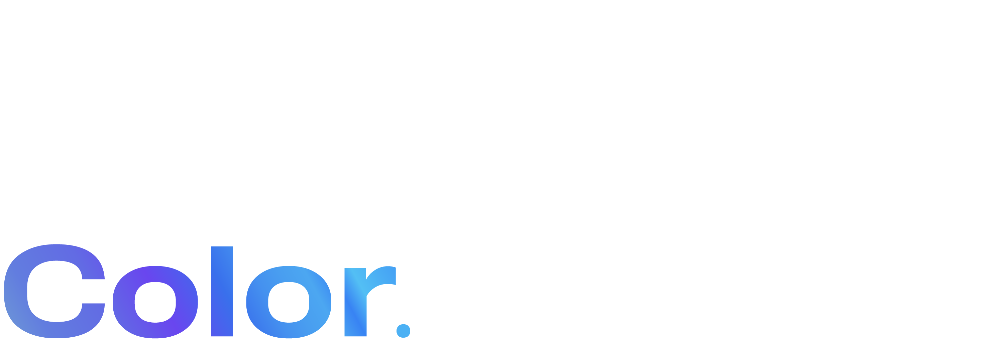

If you only read industry marketing, you might think type designers spend their time
celebrating the same handful of features.
The forums tell a different story.

<!-- more -->

<!-- image TBD -->

The arguments on TypeDrawers, Reddit’s r/typography, and the various national mailing
lists are surprisingly consistent.
Outline drawing direction.
Whether overlap removal should be destructive.
Whether `calt` is being abused.
Whether autotrace is ever good enough.
Whether RoboFont’s “build your own tools” philosophy is liberating or exhausting.
Whether FontForge counts as software.
Whether the right way to space a typeface is Tracy or Briem or neither.

These arguments are not noise.
They are how the discipline calibrates itself.
The designer who claims they have a definitive opinion on overlap removal has usually
not shipped enough fonts to have changed their mind yet.

A few specific debates keep coming back.
Variable-font compatibility: do you allow incompatible masters and let the variation
engine warn you, or do you enforce strict compatibility from the first stroke?
FontLab 8 leans toward the second.
Hinting: do you rely on the auto-hinter, or do you maintain hand-tuned hints for the
weights that need them most?
Both, usually, but the ratio is contested.
CJK design: should the font editor expose every encoded variant, or hide them behind a
more curated UI? The honest answer is that nobody has solved this.

The interesting argument in 2025 is about AI in the workflow.
Some designers use machine-learning autotracers and generative tools as raw material —
concepts to break, not finished work to ship.
Others reject the practice entirely.
The middle position, which is winning, is that AI is a sketching tool whose output is
unusable without human editing.
FontLab 8.4’s improved Autotrace fits this view: it is much better than the autotracers
of five years ago, and it still requires a human to clean up.

Reading these debates is one of the better ways to learn type design.
The product changes.
The arguments mature.

## References

- [TypeDrawers — best free font editor thread](https://typedrawers.com/discussion/5400/which-is-the-best-free-font-editor)
- [r/typography — what program for fonts](https://www.reddit.com/r/typography/comments/10jslv4/what_program_is_the_goto_for_creating_fonts_in/)
- [Alex John Lucas on FontLab vs RoboFont vs Glyphs](https://alexjohnlucas.com/type/software)
- [Awesome typography — Jolg42](https://github.com/Jolg42/awesome-typography)

[Read more →](https://help.fontlab.com/fontlab/8/manual/){ .fl-help-cta }
