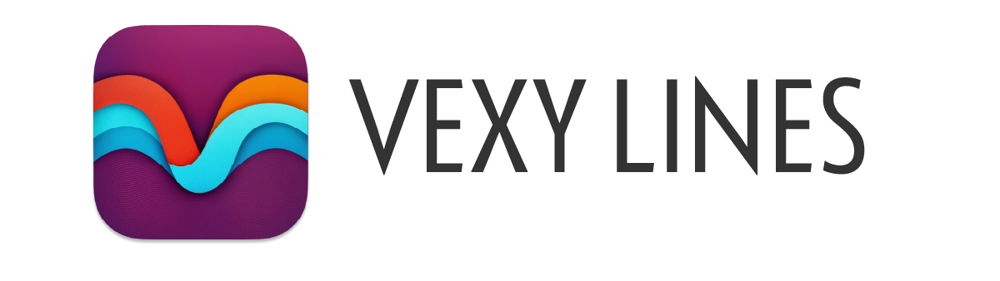
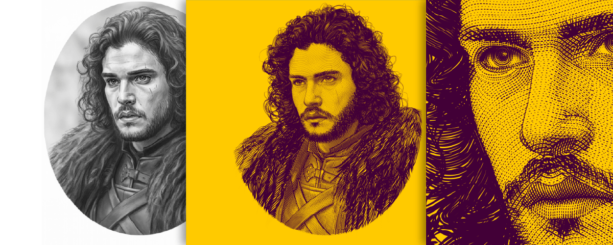
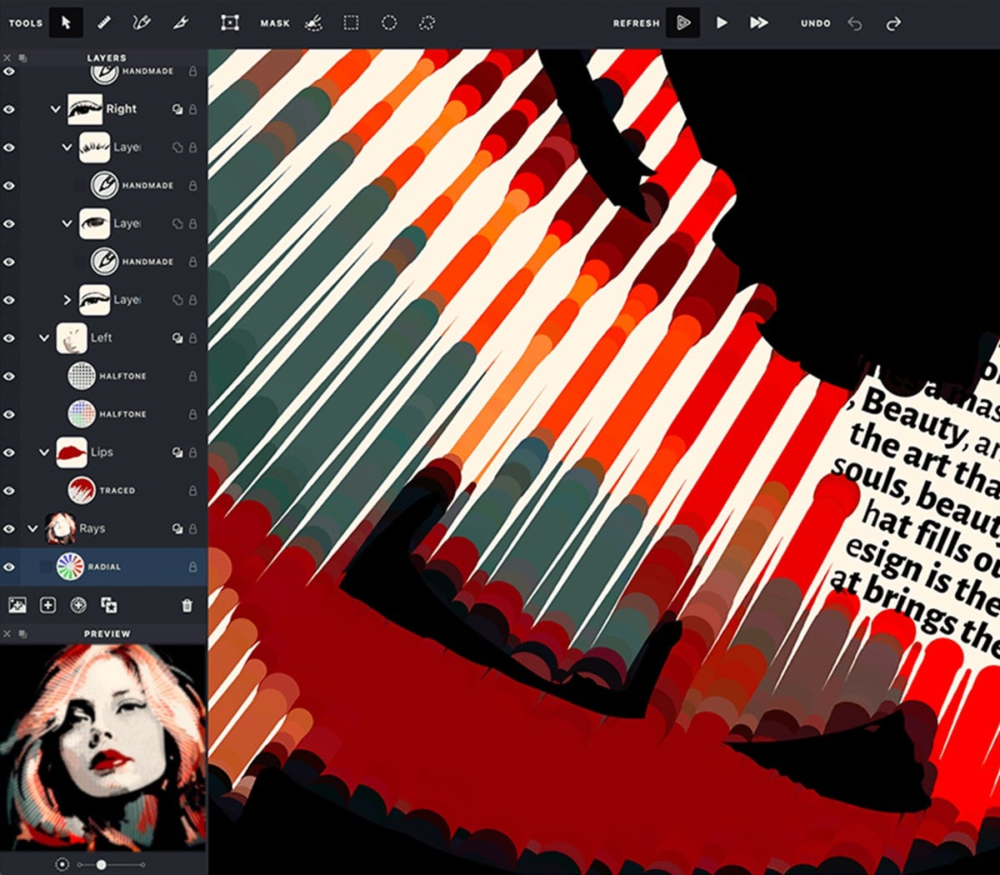

Drop a photo into Vexy Lines, and it hands you back a crisp vector drawing.
It reads the brightness of your image and adjusts stroke thickness to match. Dark areas get heavy lines. Light areas get fine ones. It's simple math, but the results look like magic.

<!-- more -->

You get six fill styles right out of the box:

* **Linear**: Parallel lines that swell and shrink with the shadows.
* **Wave**: Wavy lines doing the exact same thing.
* **Halftone**: The classic dot pattern from old comic books.
* **Trace**: Follows the actual edges in your image instead of a rigid grid.
* **Text**: Fills space with letters, shifting font weight to build the picture.
* **Handmade**: A messy, sketched look for when perfection is boring.

The app keeps everything tidy. Your output arrives neatly packed into layers, groups, and masks. You decide exactly which parts of your image get which treatment.

Want color? The strokes can pull hues straight from your source image. The result is a vibrant vector piece that perfectly matches your original photo. We also threw in mesh-wrapping to keep patterns flowing smoothly, plus hidden-line removal so strokes on the back of a shape stay out of sight.

That text fill mode is particularly fun.
It uses the same logic that controls line thickness, but applies it to typography. The letters themselves get bolder in the dark spots and lighter in the bright spots. Feed it a variable font with a weight axis, and watch the text build your image. You can even stack it with linear or wave fills if you're feeling adventurous.

Try Vexy Lines right now in your browser for free. If you need full-resolution SVG and PDF exports, grab the paid desktop app for macOS or Windows.

Go play with it at [vexy.art](https://vexy.art/).
