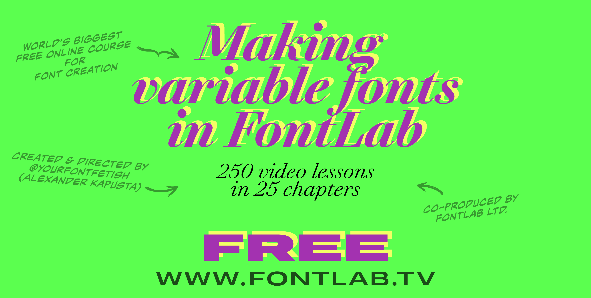
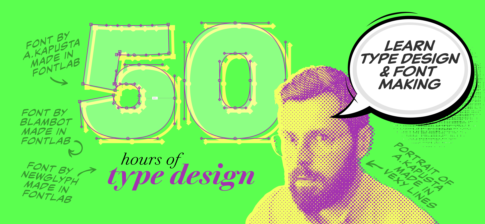

FontLab TV has published a 50-hour video course on variable font design, organized into 25 playlists. It runs from absolute fundamentals — coordinates, contours, metrics — through production, hinting, export, and font business basics.

<!-- more -->

The course was created and directed by Alexander Kapusta ([@YourFontFetish](https://www.youtube.com/@YourFontFetish)) and co-produced by FontLab Ltd. All content is on YouTube.

**Curriculum overview.** The 25 modules cover:

- Foundational concepts: the coordinate system, contour construction, metrics and sidebearings
- Intermediate techniques: variable fonts and master setup, Cyrillic design, diacritic and mark attachment
- OpenType features: substitution rules, contextual alternates, complex scripts
- Production: font testing, hinting for screen and print, export configuration, quality auditing
- Business: licensing structures, copyright basics, revenue models

**Who it is for.** The course is structured sequentially, but individual playlists are self-contained enough to work as reference material for designers with some type design background. The variable font modules are worth watching even if you skip the early sections.

**Format.** Video, YouTube, free. The FontLab TV page at [fontlab.tv](https://fontlab.tv/) links to each playlist in order.

FontLab 8 is used throughout. At 50 hours, this is one of the more comprehensive publicly available type design curricula — comparable in scope to paid courses from dedicated type design programs.
