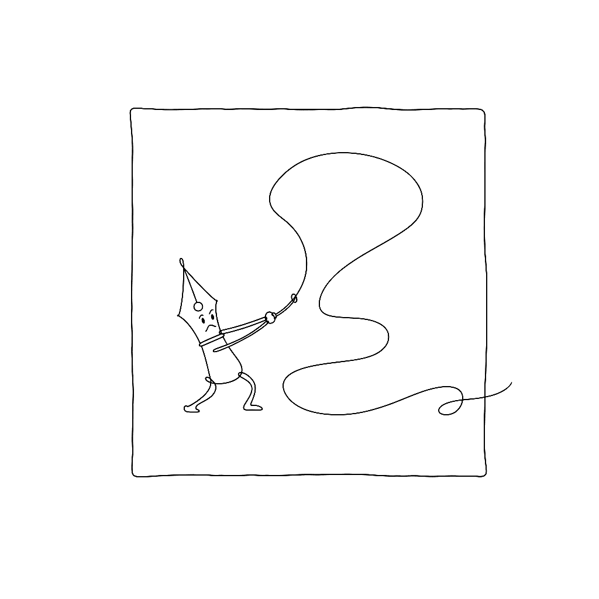

{.illu-thumb}

The first letter is the hardest.
The FontLab TV glyph construction episode is a calm, deliberate walkthrough of drawing
one letter — `n` — from a blank glyph cell to a finished, point-clean contour you can
build a font around.

<!-- more -->

> 📺 Watch:
> [Assembling glyphs in FontLab 7, Part 1](https://www.youtube.com/watch?v=McFex__HSfk)

## What it covers

**The starting point.** Before drawing, set the UPM, ascender, descender, x-height,
cap-height, and overshoot lines.
The episode shows where these go in FontLab and why getting them right at the start
saves rework later.

**Why `n`.** Three vertical stems, one curve, the basic stress axis — `n` contains the
DNA of every other lowercase letter.
Get it right and `h`, `m`, `u`, `i`, `r` follow.

**Bézier discipline.** Two on-curve points per extremum, handles aligned to the curve
direction, no spurious points.
The episode shows the difference between a clean two-point curve and the same shape
drawn with five points and offers a concrete heuristic: if removing a point does not
change the shape, remove the point.

**Overshoot.** Curved letters need to extend slightly above and below straight letters
to look the same height.
The episode shows the standard overshoot values (1–2% of UPM) and how to apply them via
overshoot zones rather than per-glyph fudging.

**Quality checks.** FontLab’s contour audit catches reversed paths, duplicate points,
near-collinear handles, and other geometry sins.
Run it before you call a glyph done.

## Why it matters

Every glyph after the first is a variation on a structure you set up at the start.
This episode is the patient version of “draw one letter properly” — and it pays off
across the entire font.

[Read more →](https://help.fontlab.com/fontlab/8/tutorials/calfonts/1.%20Drawing/01b%20Basics%20of%20Drawing%20in%20FontLab/){ .fl-help-cta }
