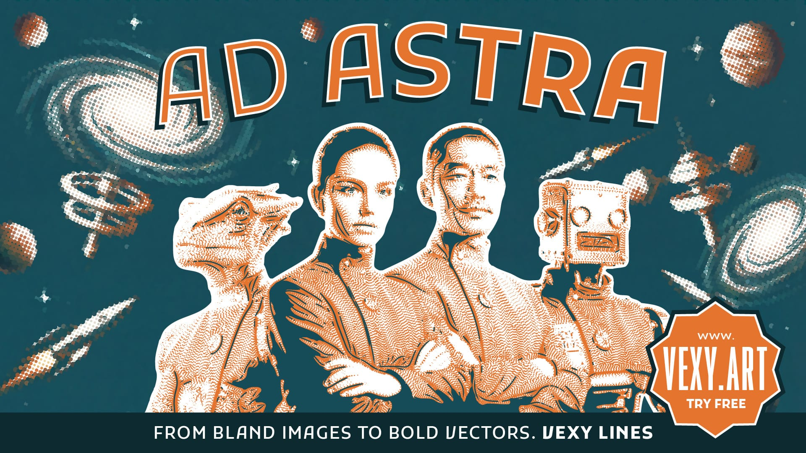
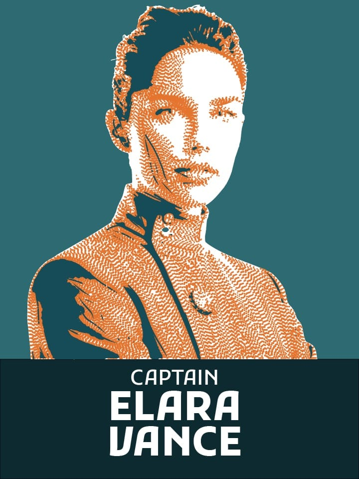

A closer look at the effects in Vexy Lines: halftone and dithering, stipple hedcuts, contour-following flowlines, multicolor screenprint separations, and variable-font text fills. Export covers SVG, PDF, EPS, PNG, and JPG.

<!-- more -->

## Fill types worth knowing about

**Halftone and dithering.** Halftone is its own mode, with configurable dot size, angle, and frequency. Dithering produces a coarser, textured variant. Both respond to image luminance: highlights have smaller or sparser dots, shadows are denser.

**Stipple.** A dotted rendering that gives you the hedcut look familiar from newspaper illustrations. Works well for portraits and high-contrast subjects.

**Flowlines and Trace fills.** Flowlines follow the contour structure of the source image rather than a fixed grid — lines curve around the shape of a face or object. Trace fill combines edge detection with stroke generation for an engraving-like result.

## Multicolor halftone

The multicolor halftone mode separates the source image into multiple color channels and renders each as a separate halftone layer at a different angle — reproducing the look of classic screenprinting. The output is a layered SVG with one layer per color, ready for print production or further editing.

## Variable-font text fills

Text fills can combine linear and wave patterns with variable-font weight encoding. A gradient source drives the variable-font axis, producing typographic textures where letterform weight transitions across the image. The practical output: SVG text fills that animate cleanly in browsers using CSS transitions.

## Export formats

SVG, PDF, and EPS for scalable output; PNG and JPG for raster output at configurable resolutions. The raster formats make Vexy Lines usable without an SVG-capable application downstream.

## Where this fits

Typical uses: social-media graphics, vintage poster design, tattoo artwork, hedcut portraits, textile patterns, screenprint preparation, retro gradient effects, SVG animation source material, large-format prints, murals, vinyl-cutting files.

Platform: macOS and Windows, with a free browser version for evaluation. More at [vexy.art](https://vexy.art/).
