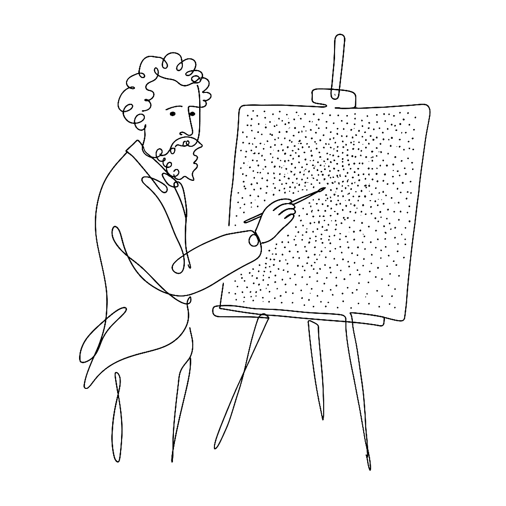
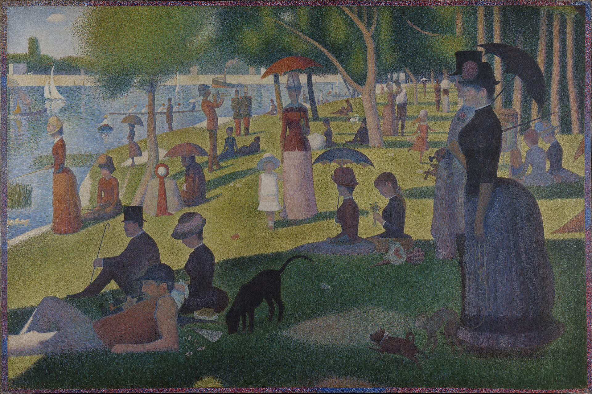

{.illu-thumb}

Georges Seurat spent two years applying roughly 220,000 dots to a canvas.
The painting works because the dots don’t blend on the canvas.
They blend in your eye.

<!-- more -->

*A Sunday on La Grande Jatte — 1884* (1884–86), now at the Art Institute of Chicago,
measures **207.5 × 308.1 cm**. The science behind it predates the painting by decades.

**Michel Eugène Chevreul** published *De la loi du contraste simultané des couleurs* in
**1839** — the foundational text on how colours placed adjacent to each other change
each other on the retina.
A red dot next to a yellow dot does not produce orange on the canvas.
It produces orange in the viewer’s visual cortex, which is a different thing entirely.
**Ogden Rood’s** *Modern Chromatics* (1879) brought the principle to a broader audience.
Seurat and **Paul Signac** read both.

They called their method *Divisionism* or *Chromo-Luminarism*. The press called it
pointillism and the name stuck.

Félix Fénéon’s 1888 essay captures the theory with unusual precision:

> “These colors, isolated on the canvas, recombine on the retina; we have, therefore,
> not a mixture of material colors (pigments), but a mixture of differently colored rays
> of light.”

The distinction matters.
Mixing pigments produces darker results — every colour you add absorbs more light.
Mixing light produces brighter results.
Seurat wanted the brightness of mixed light from the physical substance of pigment.
The dots are a workaround for the laws of chemistry.

The technique has never fully gone away.
The Smithsonian still employs scientific illustrators who draw stippled moth scales
**0.0079 inches across** — smaller than the dots in La Grande Jatte, the same optical
logic.

For a vector tool the lesson is pointed.
A million dots placed by an algorithm is not what Seurat did.
What Seurat did is decide which dots, where, and what colour each one contributes to its
neighbours. The interesting part is the rule set, not the raster count.
Resolution without intent is just noise.

Seurat died in **1891**, aged 31, two days after his son.
He left seven finished paintings.

## References

- [A Sunday on La Grande Jatte — Art Institute of Chicago](https://www.artic.edu/artworks/27992/a-sunday-on-la-grande-jatte-1884)
- [Pointillism — Wikipedia](https://en.wikipedia.org/wiki/Pointillism)
- [A Sunday on La Grande Jatte — Wikipedia](https://en.wikipedia.org/wiki/A_Sunday_on_La_Grande_Jatte)
- [Vexy Lines — official](https://vexy.art/lines/)

[Read more →](https://vexy.art/lines/){ .fl-help-cta }
