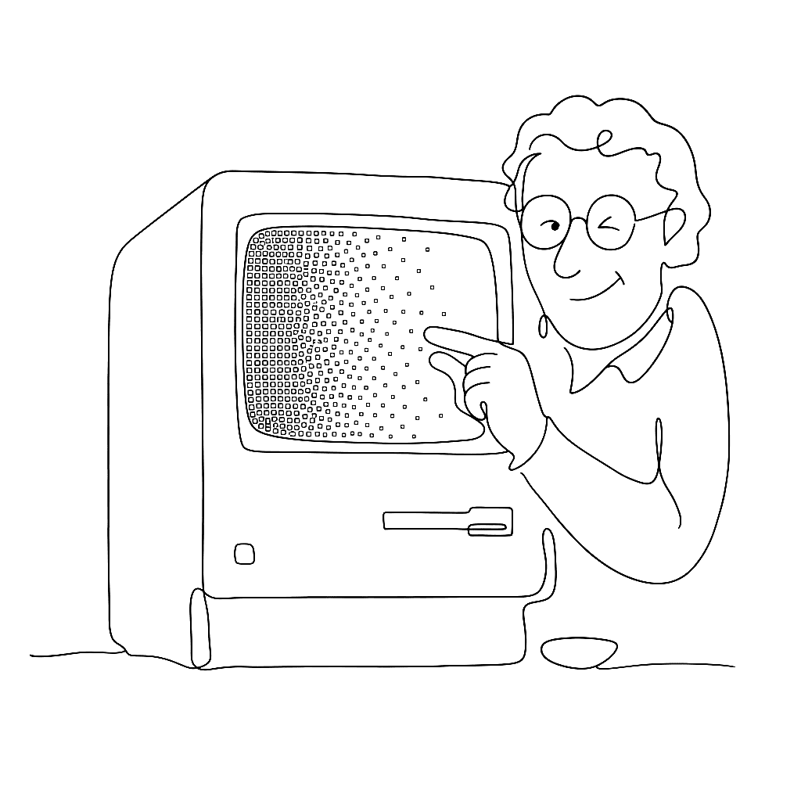

{.illu-thumb .illu-index}

A one-bit display has no grey. Dithering is the sixty-year argument that it doesn’t need one.

<!-- more -->

The lineage is short and famous if you know where to look.

**Larry Roberts**, MIT, 1961 — the first paper on adding calibrated noise to a grayscale image to make the eye see more tones than the device has. The idea is older than digital: printers had been using similar tricks with mezzotint and aquatint for centuries. Roberts just proved it mathematically and pointed it at a computer.

**Bryce Bayer**, Kodak, 1973 — the recursive matrix dither still named after him, still in every digital camera sensor made today.

**Floyd–Steinberg**, 1976 — error diffusion with the canonical 7/16, 3/16, 5/16, 1/16 weights. Instead of rounding each pixel independently, the algorithm propagates the rounding error to its neighbours. The laser printer industry ran on this.

**Bill Atkinson**, Apple, 1983–84 — a variant for the original Macintosh’s one-bit display that **discards 25% of the error** at each pixel rather than passing it all forward. The discard sounds like sloppiness. In practice it produces sharper, higher-contrast images on cheap screens, which is what MacPaint and HyperCard actually needed. Atkinson died on **June 5, 2025**, of pancreatic cancer, aged 74.

After Atkinson the story gets quieter and stranger. **Mark Ferrari** drew dithered EGA backgrounds for LucasArts (*Zak McKracken*, *Loom*, *Monkey Island*) in the late 1980s and pioneered colour cycling — animation by rotating the palette rather than redrawing the frame. His palettes were small enough to count; his images looked like nothing else on the hardware.

**Lucas Pope’s *Return of the Obra Dinn*** (2018) made the genre legible to a generation that had never lived through one-bit displays. The game is a murder mystery aboard a tall ship, rendered entirely in 1-bit dither. Most players under thirty had never seen the aesthetic before. Most found it uncomfortable and then beautiful.

**Surma’s** 2021 essay gave the style its name: *ditherpunk*.

The reason this history matters when you’re working in Vexy Lines: dithering is the original argument that *line is enough*. You don’t need tone. You don’t need colour. You need a pattern of marks placed with enough precision that the eye fills in the rest. Every modern halftone, hatching, and stipple effect descends from somebody at MIT in 1961 deciding the retina can be fooled.

It still can.

## References

- [Floyd–Steinberg dithering — Wikipedia](https://en.wikipedia.org/wiki/Floyd%E2%80%93Steinberg_dithering)
- [Ditherpunk — Surma (2021)](https://surma.dev/things/ditherpunk/)
- [Mark Ferrari interview — Effect Games](http://www.effectgames.com/effect/article-Q_A_with_Mark_J_Ferrari.html)
- [Bill Atkinson — Wikipedia](https://en.wikipedia.org/wiki/Bill_Atkinson)
- [Vexy Lines — official](https://vexy.art/lines/)

[Read more →](https://vexy.art/lines/){ .fl-help-cta }
