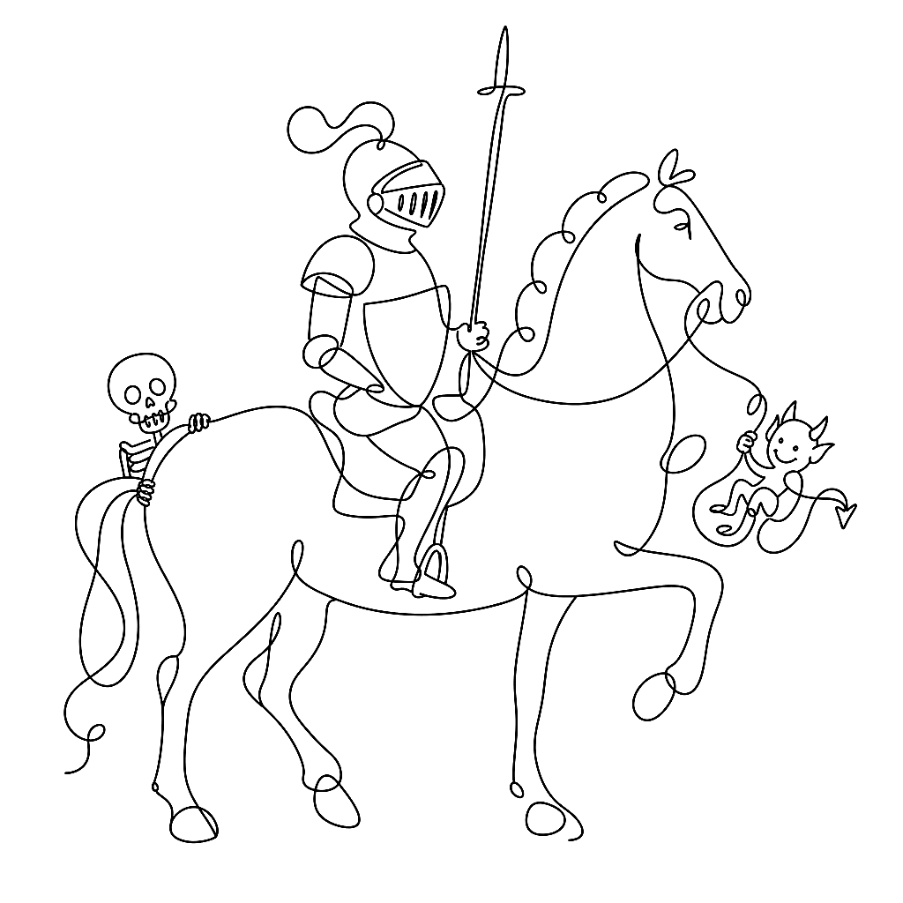
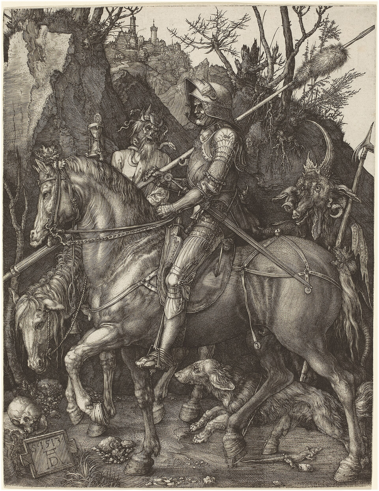

{.illu-thumb }

A line can carry tone, texture, shadow, and emotion — and never once pretend to be a photograph. That is the whole argument of five centuries of printmaking, made with a burin, a graver, and eventually a stylus.

<!-- more -->

**Albrecht Dürer, 1513.** *Knight, Death and the Devil* is copperplate burin engraving, 24.5 × 19.1 cm — one of his three *Meisterstiche*. Dürer called it simply *Der Reuter*, the Rider. There is no halftone anywhere in it. Every shadow is parallel hatching; every curved surface is cross-hatching that turns with the form. The shadow on the horse’s flank follows the muscle. The shadow in the hollow of the knight’s armour follows the concavity. Direction *is* the information.

**William Hogarth, 1735.** *A Rake’s Progress* was published the day the Engravers’ Copyright Act 1734 — “Hogarth’s Act” — took effect. It was the first copyright law in any country to protect engravers, passed because pirates had flooded the market with knock-offs of *A Harlot’s Progress* three years earlier. Hogarth had essentially co-authored the law that made his next series possible. The prints reward that attention: they are satirical journalism, using hatch density and line weight to carry what caption text would have been too polite to say.

**Thomas Bewick, 1797.** Bewick revived wood engraving in Northumberland — end-grain boxwood, white-line technique, fine enough to hold detail that competed with copper. *History of British Birds* was the proof. But the structural innovation was quieter: his blocks could be locked into letterpress alongside movable type at the same height. Illustrated journalism became economically possible the day that happened. The nineteenth-century picture press — the cheap weeklies, the illustrated magazines, the whole visual culture — is downstream of one craftsman in Newcastle cutting white lines into boxwood.

**Gustave Doré, 1861.** Dante’s *Inferno*, self-published after no Paris house would take the production cost. It sold out and kept selling. The economy of horror in a Doré plate is that nothing is rendered in tone — every shadow is a different *kind* of line, and the eye reads them all as the same darkness anyway. Curved lines for flesh. Ragged lines for stone. Tight parallel hatching for the pit. The variety is invisible until you look for it, and then you can’t stop seeing it.

For Vexy Lines, this is the canon. Every modern hatching, stipple, or vector engraving algorithm is attempting to reproduce something one of these four printmakers did with a tool small enough to hold in one hand. The constraint was never a limitation. It was the point.

## References

- [Knight, Death and the Devil — Wikimedia Commons](https://commons.wikimedia.org/wiki/Category:Knight,_Death_and_the_Devil_by_Albrecht_D%C3%BCrer)
- [Engraving Copyright Act 1734 — Wikipedia](https://en.wikipedia.org/wiki/Engraving_Copyright_Act_1734)
- [Thomas Bewick — Wikipedia](https://en.wikipedia.org/wiki/Thomas_Bewick)
- [Gustave Doré, Inferno illustrations — Wikimedia Commons](https://commons.wikimedia.org/wiki/Category:Gustave_Dor%C3%A9_-_Inferno)

[Read more →](https://vexy.art/lines/){ .fl-help-cta }
