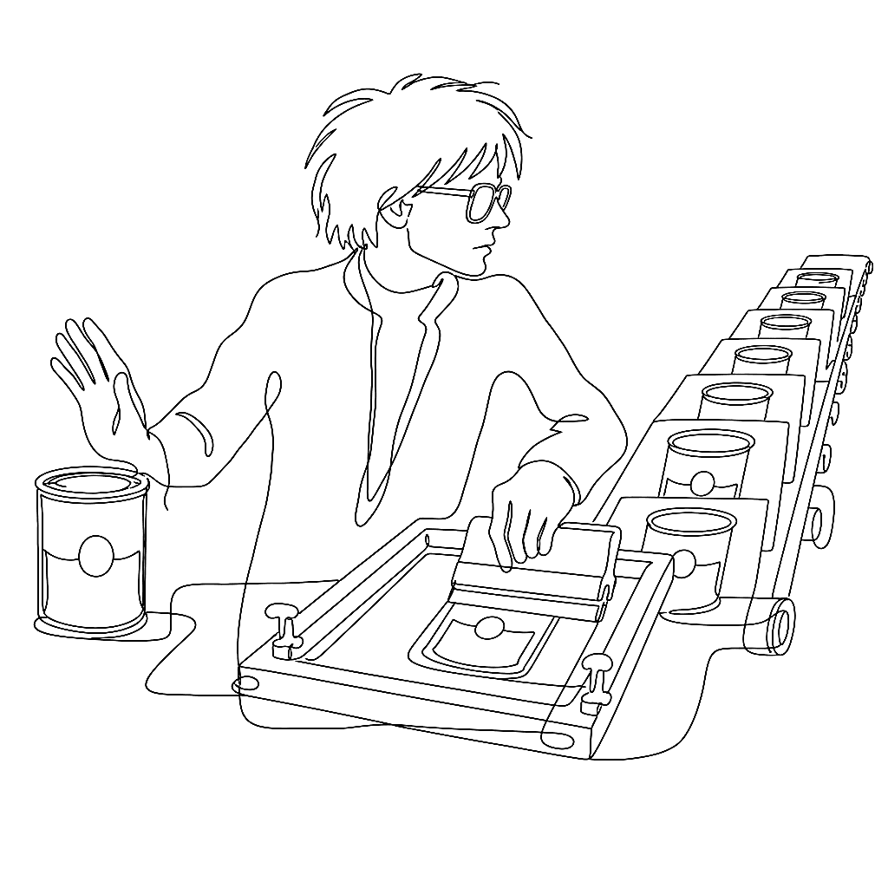

{.illu-thumb .illu-index}

Andy Warhol started screenprinting in August 1962. His explanation: “I wanted something
stronger that gave more of an assembly line effect.”

<!-- more -->

The explanation is a little too clean, which makes it probably true.
Warhol had been making paintings — hand-painted Campbell’s Soup cans, hand-traced comic
panels — and the hand was getting in the way.
Silkscreen removed it.
The image went through a mesh and arrived on the canvas without fingers.

Within weeks of Marilyn Monroe’s death that August, he produced the **Marilyn Diptych**:
fifty images of Monroe arranged in a grid, all derived from a single 1953 Gene Kornman
publicity still for *Niagara*. Half in colour, half in fading black and white — the
colour half vivid and off-register, the black-and-white half going pale.
The 1967 portfolio used Day-Glo fluorescent inks on ten 36 × 36-inch screens in an
edition of 250.

*Shot Sage Blue Marilyn* sold at Christie’s in May 2022 for **$195 million**.

What’s worth holding from a print-making angle is that Warhol’s silkscreen is a
technology of **registration error**. Each colour is a separate pass through a separate
screen. Each pass lands slightly off.
The slip is not a defect he tolerated; it is a texture he kept.
The eye reads four screens that don’t quite line up and assembles a face from the
difference.

Newspaper halftones had the same property by accident — the CMYK screens drifted a
little at press speed and the image acquired a visible grain.
Warhol made the drift intentional.
Once it was intentional, it was available to everyone as a method rather than a mistake.

All Warhol images remain © Andy Warhol Foundation/ARS. The Tate’s *Marilyn Diptych* page
(linked below) is the canonical public reference — do not reproduce the works.

## References

- [Marilyn Diptych — Tate Modern](https://www.tate.org.uk/art/artworks/warhol-marilyn-diptych-t03093)
- [Andy Warhol Museum](https://www.warhol.org)
- [Marilyn Diptych — Wikipedia](https://en.wikipedia.org/wiki/Marilyn_Diptych)
- [Vexy Lines — official](https://vexy.art/lines/)

[Read more →](https://vexy.art/lines/){ .fl-help-cta }
