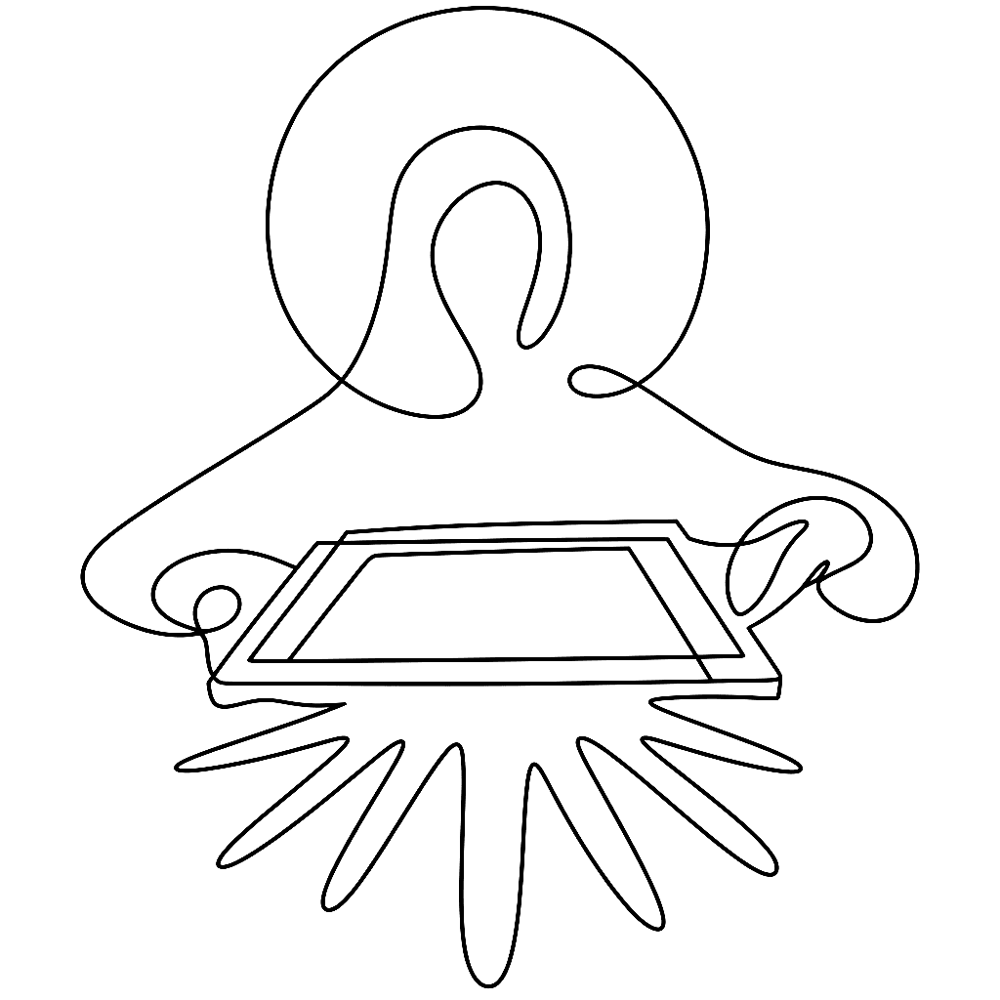

{.illu-thumb .illu-index}

Frances Kent took her students to see Warhol’s Campbell’s Soup show, came back to Immaculate Heart College, and turned supermarket packaging into devotional art.

<!-- more -->

Frances Elizabeth Kent (1918–1986) joined the Sisters of the Immaculate Heart of Mary in 1936, took the name Sister Mary Corita, and learned silkscreen in **1951** from Maria Sodi de Ramos Martínez. She was already teaching art at Immaculate Heart College in Los Angeles.

In **1962** — the same year Warhol started screenprinting in New York — she took her students to the Ferus Gallery to see Warhol’s Campbell’s Soup show. She walked back to campus and started lifting the visual grammar of supermarket packaging into prints that were formally devotional and grammatically commercial. The two registers were the point.

*The juiciest tomato of all* (1964) reads: “Mary mother is the juiciest tomato of all.” It borrows a Del Monte slogan to praise the Virgin. Cardinal James Francis McIntyre called the work “blasphemous.” She continued. She left the order in **1968**.

The public works are harder to ignore than the controversy. *Rainbow Swash* (1971) — six 150-foot vertical bands of paint on a Boston natural-gas tank — is sometimes described as “the largest copyrighted work of art in the world.” Her **1985 USPS Love stamp** sold over **700 million copies**. Neither required the silkscreen to be subtle.

What makes Kent relevant to anyone thinking about typography and tools is that she treated words as physical material. Text was cut, layered, screened, set in a hand that wasn’t quite trained, and deliberately misaligned. The discipline came from the medium. You couldn’t undo a silkscreen pass. You planned the misregistration or you lived with it.

Anyone working with variable fonts or vector fills today is in a similar position: the method shows, and showing the method is the design.

Works remain © Corita Art Center. The Hammer and Harvard collections (linked below) are the appropriate public references — do not reproduce the prints.

## References

- [Corita Kent — Hammer Museum](https://hammer.ucla.edu/collections/grunwald-center-collection/corita-kent/process)
- [Corita Kent — Harvard Art Museums](https://harvardartmuseums.org/exhibitions/4830)
- [Corita Art Center](https://corita.org/)
- [Vexy Lines — official](https://vexy.art/lines/)

[Read more →](https://vexy.art/lines/){ .fl-help-cta }
