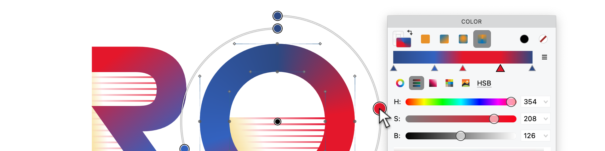

In 2013, color OpenType looked like a standards argument with four exits.
Apple had `sbix`. Google had `CBDT/CBLC`. Microsoft had `COLR/CPAL`. Adobe and Mozilla
had SVG-in-OpenType.
The question then was which proposal would win.

In 2026, the answer is less tidy and more useful: they all became real OpenType color
font formats, but they did not become equally useful everywhere.
For scalable color display type on the web, `COLR` v1 is now the format to understand
first. For Apple and many design-app workflows, SVG and bitmap flavors still matter.
For emoji and legacy platform compatibility, `sbix` and `CBDT/CBLC` are still in the
room, looking faintly pleased with themselves.

<!-- more -->



## What actually shipped

The four 2013 proposals are no longer merely proposals.
They are OpenType color glyph mechanisms with different strengths.

`COLR/CPAL` is the compact vector format.
`COLR` version 0 stacks outline glyphs as layers, each filled with a solid color from
`CPAL`. `COLR` version 1 keeps the outline-and-palette architecture but adds a paint
graph: linear, radial and sweep gradients, transforms, compositing, blending, reuse of
paint subgraphs, and variation data for the color construction itself.
The OpenType specification is explicit: `COLR` needs `CPAL`; without a `CPAL` table, the
`COLR` table is ignored.
See the OpenType `COLR` and `CPAL` specs, the Chrome COLRv1 implementation notes, and
the current Can I Use support data for the same shape of the story.

`SVG` is the rich vector-and-bitmap format.
An OpenType `SVG` table stores SVG 1.1 documents for glyphs.
Those documents can use gradients and can combine vector and raster artwork, but the
OpenType subset deliberately forbids or discourages several web-SVG freedoms: scripts,
links, `foreignObject`, many CSS mechanisms, interactivity, and other features that do
not belong in a text renderer.
SVG-in-OpenType can optionally use `CPAL`, but it does not get the same integration with
OpenType Font Variations that `COLR` v1 gets.

`sbix` is Apple’s bitmap graphics table.
It stores standard bitmap graphics such as PNG, JPEG or TIFF in size-specific strikes.
It can provide beautiful emoji-style glyphs when the target size is known, and it can
also store different artwork for different pixel densities.
It is not the format you choose for infinitely scalable display type.

`CBDT/CBLC` is Google’s color bitmap pair.
`CBDT` stores color bitmap glyph data; `CBLC` stores the locations and strike metadata.
The pair extends the older embedded bitmap tables used for monochrome and grayscale
bitmaps. It can store BGRA bitmap data or PNG images.
It remains important because Android and older emoji workflows used it heavily, but like
`sbix`, it is a bitmap strategy, not a scalable vector strategy.

## The important change: COLR v1

The old Microsoft `COLR` idea was clean and limited: stack outline layers, fill each
layer with one solid palette color, and rely on normal font rasterizers.
That limitation was also the problem.
Real display type wants gradients, shadows, highlights, depth, transparent overlays and
reusable parts.

`COLR` v1 is the practical compromise.
It keeps glyph outlines as the geometry, so the font remains compact and scalable.
It uses `CPAL` palettes, so colors are data rather than hard-coded pixels.
It adds the paint operations that designers actually need.
It also participates in variable fonts: in a `COLR` v1 variable font, not only the glyph
outlines but also alpha values, gradient stop positions, gradient placement and
transform arguments can vary.
By contrast, `COLR` v0 can vary the underlying outlines but not the color composition.

That last sentence is one of the big 2026 facts.
Variable color fonts are no longer a contradiction.
They are specifically designed into `COLR` v1. The OpenType spec describes the variation
store in the `COLR` table, Google Fonts’ color-font guidance treats variable COLRv1 and
SVG differently for exactly this reason, and FontLab 8 can export many variable COLRv1
fonts with gradients.

## Palettes are now a web feature

`CPAL` stores one or more palettes, each made of sRGB color records.
Palette 0 is the default.
Version 1 of `CPAL` can label palettes and mark them as usable on light or dark
backgrounds.

CSS caught up. The `font-palette` property lets a page choose a palette from a color
font. The `@font-palette-values` rule lets a page override palette entries or define a
new palette for a font family.
This does not magically make every color font format work in every browser.
It means palette selection has moved from wishful thinking into the CSS Fonts Level 4
model, and browser support for the CSS controls is now broad.

For production CSS, use feature queries and ordered fallbacks:

```css
@font-face {
  font-family: "Example Color";
  src:
    url("/fonts/example-colrv1.woff2") format("woff2") tech(color-COLRv1),
    url("/fonts/example-svg.woff2") format("woff2") tech(color-SVG),
    url("/fonts/example-regular.woff2") format("woff2");
}

@supports font-tech(color-COLRv1) {
  .headline {
    font-family: "Example Color", sans-serif;
    font-palette: dark;
  }
}
```

The exact fallback stack depends on the fonts you can ship.
The principle does not: declare the most capable source first, tag it with `tech()`, and
include a normal monochrome font that still reads correctly.

## Browser support as of 3 May 2026

The browser picture is better than it was, but it is still not one-format paradise.

| Environment | What to expect |
| --- | --- |
| Chrome and Chromium browsers | `COLR` v1 has been supported since Chrome 98. Edge follows the Chromium implementation line, and Can I Use lists Edge support from 98. |
| Firefox | `COLR` v1 is on by default from Firefox 107. Mozilla’s tracking bug and the Can I Use table agree on that point. |
| Safari and iOS Safari | `COLR` v1 is still not supported in Safari or iOS Safari in current Can I Use data. WebKit’s standards-position discussion remains the public place to watch. |
| CSS palette controls | `font-palette` and `@font-palette-values` have broad support: Chrome, Edge, Firefox, Safari and iOS Safari all support the CSS palette controls in current MDN and Can I Use data. |

This creates one mildly annoying rule: Safari can support palette CSS while still not
supporting `COLR` v1 glyph rendering.
Those are different layers of the stack.
Test the actual font technology, not only the CSS property.

## App and platform support

Application support is messier than browser support because most apps sit on top of a
text stack, an OS text API, a graphics engine, and their own export code.
Support for “color fonts” is therefore not one checkbox.

On Windows, DirectWrite exposes multiple glyph image formats, including `COLR`, SVG,
PNG, JPEG, TIFF and bitmap BGRA data.
That does not mean every Windows app renders every color-font flavor equally.
It means the platform API has a route for applications that use the relevant DirectWrite
interfaces and Windows build.

In FreeType-based stacks, the split is also important.
FreeType exposes `COLR` layer data and has convenience rendering for limited `COLR` v0
cases, but its own documentation says `COLR` v1 needs a dedicated graphics library such
as Skia or Cairo to draw the paint tree.
HarfBuzz now has paint APIs whose stated purpose is extracting and painting `COLR` v1
glyph layers. So a Linux or cross-platform app may be excellent, partial, or oblivious
depending on which versions and renderers it bundles.

Adobe support is app-by-app.
Photoshop’s official documentation describes OpenType-SVG support.
InDesign’s documentation also describes OpenType-SVG color fonts and emoji fonts.
Current Illustrator documentation lists both SVG fonts and COLR fonts, and describes
COLR fonts as supporting gradient-filled text styles.
That is useful, but it is not permission to skip app testing.
The font format may render; editing, exporting, PDF output and variable-axis behavior
can still differ between apps.

For Apple platform work, keep the distinction sharp.
`sbix` exists because Apple shipped bitmap color emoji early.
Safari still does not support `COLR` v1 as of this writing.
If Safari or iOS is the target, a COLRv1-only font is not enough.

## What FontLab 8 supports

FontLab 8 is built for this mixed reality.
You can paste, import and edit color vectors, gradients and images; assign solid colors
and linear, radial or conical gradients to elements; edit gradients visually; and build
layered chromatic fonts.

For export, FontLab 8 writes all relevant color OpenType flavors: OpenType+COLR,
OpenType+SVG, OpenType+sbix and OpenType+CBDT. The current FontLab 8 documentation says
FontLab 8.2 added OpenType COLRv1 support.
The format notes are more specific: solid-color elements export as `COLR` v0, gradient
elements export as `COLR` v1, the exported `CPAL` table can include an automatically
generated dark palette, and many variable color fonts can be exported in the COLRv1
flavor. The FontLab product page also lists Color OpenType import/export for TTF+SVG,
COLR v0/v1, CBDT and sbix.

In practice, that means you should design one source and export the flavors your target
environment needs. For a web display family in 2026, start with WOFF2 COLRv1 plus a
monochrome fallback.
If Safari matters, add an SVG flavor or another fallback strategy.
If emoji-style bitmap fidelity matters, consider `sbix` or `CBDT/CBLC`. If the font is
variable and color, prefer COLRv1 for the color construction.

## The 2013 lesson that still holds

The best color font format is not the most powerful one.
It is the format whose limits match the job.

Use `COLR` v1 when you need compact, scalable, palette-aware, variable-capable color
glyphs. Use SVG when your target app supports it and your artwork really needs SVG’s
richer model. Use `sbix` or `CBDT/CBLC` when bitmap artwork is the point, especially for
emoji-style glyphs or legacy environments.
Always include a readable monochrome fallback unless you control every renderer.

The dream of one color-font flavor everywhere is still premature.
The good news is that the source workflow no longer has to be premature.
FontLab 8 lets the designer work once, then ship the color formats the world actually
uses.

## Fact-check trail

The main claims above were checked against three independent kinds of source: the
OpenType specification, browser or rendering-engine documentation, and vendor
application documentation.

| Claim group | Sources checked |
| --- | --- |
| `COLR` v0/v1, `CPAL`, gradients, paint graphs and COLRv1 variation | [OpenType `COLR`](https://learn.microsoft.com/en-us/typography/opentype/spec/colr), [OpenType `CPAL`](https://learn.microsoft.com/en-us/typography/opentype/spec/cpal), [Chrome COLRv1 notes](https://developer.chrome.com/blog/colrv1-fonts), [FontLab 8 formats](https://help.fontlab.com/fontlab/8/whats-new/whats-new-11-formats/) |
| SVG-in-OpenType capabilities and limits | [OpenType `SVG`](https://learn.microsoft.com/en-us/typography/opentype/spec/svg), [OpenType `CPAL` relation to SVG](https://learn.microsoft.com/en-us/typography/opentype/spec/cpal), [Adobe OpenType-SVG help](https://helpx.adobe.com/fonts/using/ot-svg-color-fonts.html) |
| `sbix` and `CBDT/CBLC` bitmap behavior | [OpenType `sbix`](https://learn.microsoft.com/en-us/typography/opentype/spec/sbix), [OpenType `CBDT`](https://learn.microsoft.com/en-us/typography/opentype/spec/cbdt), [OpenType `CBLC`](https://learn.microsoft.com/en-us/typography/opentype/spec/cblc), [Noto Color Emoji notes](https://notofonts.github.io/noto-docs/specimen/NotoColorEmoji/) |
| Browser support for COLRv1 and palette CSS | [Can I Use COLRv1](https://caniuse.com/colr-v1), [Chrome COLRv1 notes](https://developer.chrome.com/blog/colrv1-fonts), [Mozilla COLRv1 bug 1791558](https://bugzilla.mozilla.org/show_bug.cgi?id=1791558), [WebKit COLRv1 standards position](https://github.com/WebKit/standards-positions/issues/415), [Can I Use font-palette](https://caniuse.com/css-font-palette), [MDN font-palette](https://developer.mozilla.org/en-US/docs/Web/CSS/font-palette) |
| App and renderer support | [DirectWrite glyph image formats](https://learn.microsoft.com/en-us/windows/win32/api/dcommon/ne-dcommon-dwrite_glyph_image_formats), [FreeType color layer management](https://freetype.org/freetype2/docs/reference/ft2-layer_management.html), [HarfBuzz paint API](https://harfbuzz.github.io/harfbuzz-hb-paint.html), [Adobe Illustrator supported fonts](https://helpx.adobe.com/illustrator/desktop/design-with-text/fonts-and-scripts/supported-fonts-in-illustrator.html), [Photoshop SVG fonts](https://helpx.adobe.com/photoshop/using/svg-fonts.html), [InDesign fonts](https://helpx.adobe.com/indesign/using/using-fonts.html) |
| FontLab 8 support | [FontLab 8 color features](https://help.fontlab.com/fontlab/8/whats-new/whats-new-09-color/), [FontLab 8 formats](https://help.fontlab.com/fontlab/8/whats-new/whats-new-11-formats/), [FontLab 8 color tutorial](https://help.fontlab.com/fontlab/8/tutorials/intro/8-days/day-8-color/), [FontLab 8 product page](https://www.fontlab.com/font-editor/fontlab/) |

[Read more →](https://help.fontlab.com/fontlab/8/manual/){ .fl-help-cta }
