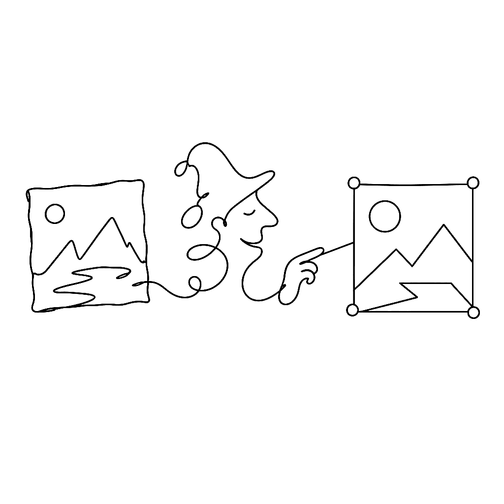
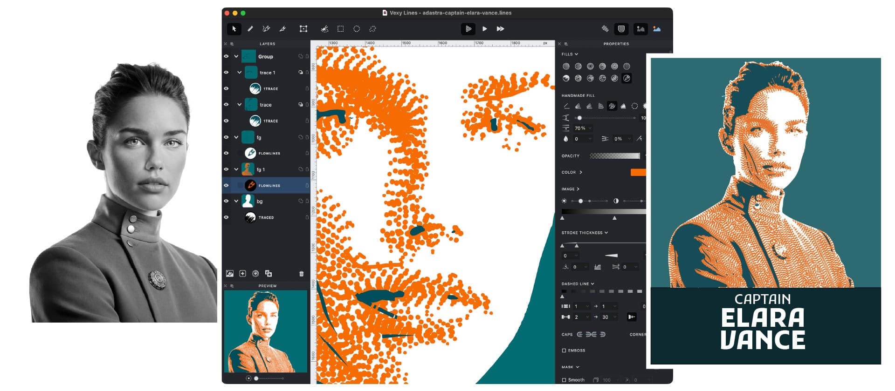
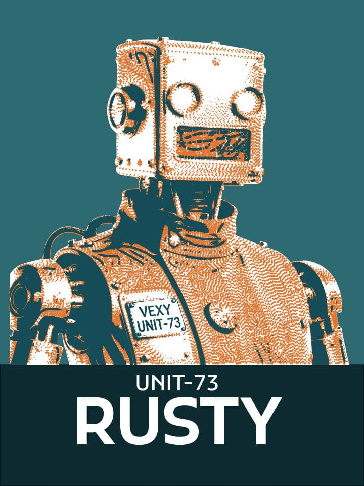
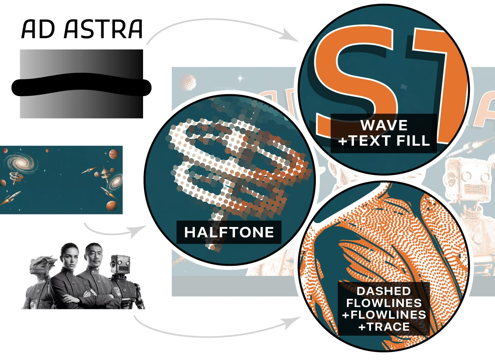
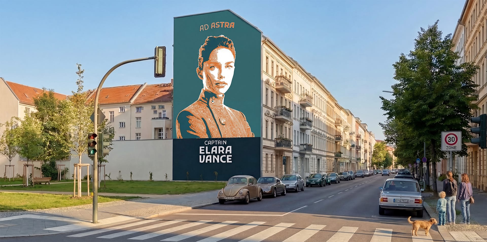

{.illu-thumb}

A photograph is not a vector.
A sketch is not a vector.
A scanned logo is definitely not a vector.
Vexy Lines exists to fix that, one image at a time.

<!-- more -->

The promise is simple: hand Vexy Lines a sketched drawing, a photograph, a scan, or
anything you generated with an AI tool, and it returns a scalable vector you can
actually use. SVG, EPS, PDF, PNG, JPG — take your pick.

The less simple part is everything that happens in between.
Vexy Lines does not just trace edges.
It applies halftone patterns, dithering effects, stipple designs and linear engraving
styles. The output looks deliberate, not mechanical.

That matters in practice.
Screen printers need artwork that separates cleanly.
Muralists need files that scale to a wall without going soft.
Tattoo artists need line work that holds at small sizes and prints well on skin.
None of these people want an auto-traced blob.
They want something that looks like it was drawn by someone who knew what they were
doing.

Vexy Lines also supports variable fonts for line-based fills.
Multicolor halftone and flowlines/trace fill round out the effect options.
If you have spent time in Illustrator trying to fake these looks manually, the appeal is
immediate.

The retrofuturistic use case is a good example of what the tool does well: take a
photograph and turn it into something that looks like a Wall Street Journal hedcut
portrait, or a 1970s technical illustration, or a letterpress-ready design.
The kind of aesthetic that takes hours to approximate by hand and seconds to miss.

Vexy Lines runs on Mac and Windows.
The price is US$99 — one payment, lifetime license, two devices.
There is a free trial if you want to see what it does to your own images before
committing.

The software is available now at [vexy.art/lines](https://www.vexy.art/lines/). You can
try it in the browser without installing anything via the
[online playground](https://www.vexy.art/lines/#play).

A bland image is, in the end, just a vector waiting for the right filter.

## References

- [Vexy Lines — product page](https://www.vexy.art/lines/)
- [Try Vexy Lines online](https://www.vexy.art/lines/#play)
- [Buy Vexy Lines (US$99)](https://www.vexy.art/lines/#buy)
- [Original Mailchimp campaign](https://us17.campaign-archive.com/?u=c154e78429d2d38aaae8383f7&id=113a96e4f4)

[Read more →](https://vexy.art/lines/){ .fl-help-cta }
