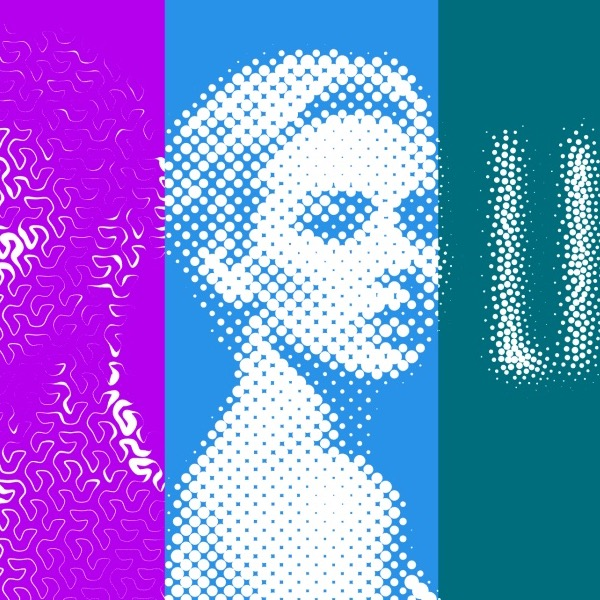
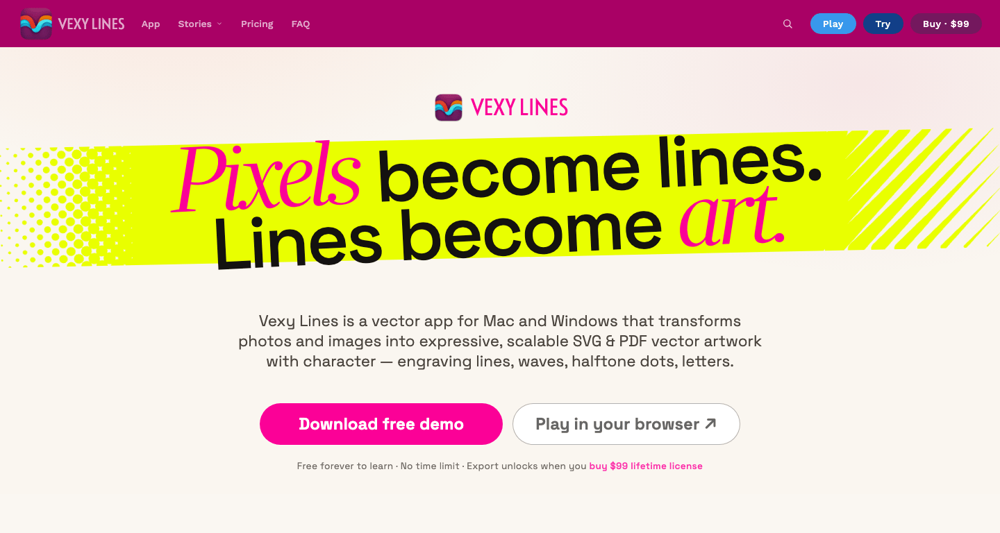

{ .illu-thumb .illu-front .illu-photo }

In October 2025, we launched Vexy Lines, a Mac & Windows app that redraws any photo as editable vector line art: engraving, halftone, stipple, wireframe, even live variable type that reads the image beneath it. We just revamped the [vexy.art/lines](https://www.vexy.art/lines/) website, which now includes real-life case studies.

<!-- more -->

[{ .rounded-lg .shadow-lg }](https://www.vexy.art/lines/)

A dozen vector fills helps in your creation: Linear engraving, Wave, Halftone, Scribble, Wireframe, Fractal, the image-reading Text fill. Add layers, masks, filters, mesh warps, and you get machinery that turns a one-click result into a considered piece.

[{ .rounded-lg .shadow-lg }](https://www.vexy.art/lines/)

On the page, you’ll find case studies that showcase Vexy Lines in real-life (or at least plausible!) scenarios: [team portraits](https://vexy.art/lines/case-portraits) with a sci-fi twist, pixel-driven [variable typography](https://vexy.art/lines/case-typography), [vector lettering](https://vexy.art/lines/case-lettering) that survives vinyl cutting, and a faithful, ultrasharp digital revival of a [retro poster](https://vexy.art/lines/case-retro-poster).

[Say hello to Vexy Lines! →](https://www.vexy.art/lines/){ .md-button .md-button--primary }
